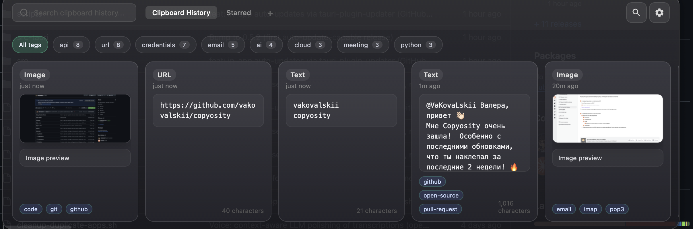

# Copyosity

A fast, native macOS clipboard manager with on-device intelligence.

Copyosity keeps a searchable history of everything you copy, reads text out of
copied images on-device, turns your voice into clean ready-to-paste text, and
exposes a small command palette for web search and quick actions — all from a
floating panel you summon with a hotkey. It runs as a menu-bar app and stays out
of your way until you need it.

**Apple Silicon and Intel Macs** — separate signed DMGs for `aarch64` (M-series) and `x86_64` (Intel).

Built with Tauri 2, Svelte 5, Rust, and SQLite.

## Screenshots



Context-aware voice polishing — speak, and the hub LLM cleans the transcription
(punctuation, filler, lists) and adapts it to the app you're pasting into:


## Features

- **Clipboard history** — every copy is captured and stored in a local SQLite
  database, with pinning, collections, and full‑text search.
- **App exclusions** — exclude specific apps (e.g. password managers) so their
  clipboard contents are never recorded.
- **On-device image OCR** — copied images are run through Apple's Vision
  framework (`VNRecognizeTextRequest`) so the text inside screenshots and photos
  becomes searchable. No image ever leaves your Mac for OCR.
- **Voice to text** — hold a global hotkey to record from any microphone; the
  audio is transcribed and the result is pasted into whatever app is frontmost.
- **Context-aware polishing** — raw transcription is cleaned into natural,
  typed‑style text, taking the target app into account so the output fits where
  it lands.
- **Automatic tagging** — clipboard entries (and images) are tagged with short,
  practical labels to make history easier to scan and filter.
- **Command / agent palette** — a separate palette for web search and a small
  personal assistant that can act on your Mac.
- **Native macOS actions** — the assistant can create Notes, create and list
  Reminders, and read upcoming Calendar events via AppleScript / Apple Events.
- **Local AI option** — optional Ollama integration for fully local tagging,
  with in‑app onboarding (install / start server / download‑model states).
- **Menu-bar native UI** — a transparent, non‑activating floating panel
  (`NSPanel`) that appears over your current app without stealing focus, plus a
  tray icon and global shortcuts.
- **Smart paste actions** — single click copies, double click or the paste
  button pastes into the active cursor; keyboard navigation with Enter and Escape.

## Install

Requires **macOS 12+** on **Apple Silicon** (M1 and later) or **Intel** (x86_64).

| Your Mac                      | Download                  |
| ----------------------------- | ------------------------- |
| Apple Silicon (M1, M2, M3, …) | `Copyosity_*_aarch64.dmg` |
| Intel                         | `Copyosity_*_x86_64.dmg`  |

1. Pick the DMG for your architecture from the [latest release](https://github.com/vakovalskii/copyosity/releases/latest) (for example `Copyosity_0.6.0_aarch64.dmg` or `Copyosity_0.6.0_x86_64.dmg`).
2. Open the DMG and drag **Copyosity** into **Applications**.
3. Launch it. On first run macOS will ask for **Accessibility** permission
   (needed to paste into other apps) and, depending on the features you use,
   **Microphone**, **Automation** (Notes/Reminders/Calendar), and screen access.

The build is signed with a Developer ID certificate and notarized + stapled by
Apple, so Gatekeeper opens it without warnings (and offline).

macOS will also ask for:

- **Accessibility** — needed for paste automation (Cmd+V simulation) and global shortcut. After rebuilding or reinstalling the app, remove Copyosity from the list and add it again if double-click paste stops working.
- **Input Monitoring** — may be required for reliable hotkey detection

## Platform support

Copyosity is **macOS only** (Apple Silicon and Intel). It is a macOS‑native
app built on `NSPanel`, `CGEvent`, the Vision framework, and Apple Events.
**Windows and Linux are not currently supported.**

### Local AI (Ollama)

For automatic clipboard tagging:

1. Install [Ollama](https://ollama.com/download)
2. Open Copyosity Settings — follow the step-by-step status panel
3. The app will start the server and download the model for you

## Keyboard shortcuts

| Action               | What it does                   |
| -------------------- | ------------------------------ |
| `Cmd + Shift + V`    | Open / close clipboard history |
| Single click on card | Copy to clipboard              |
| Double click on card | Paste into active cursor       |
| `Escape`             | Hide window                    |
| Arrow keys + Enter   | Navigate and paste             |
| Click paste button   | Paste into active cursor       |
| Click ★ button       | Star / unstar                  |
| Click gear icon      | Open Settings                  |

## Privacy

- All data stored locally in `~/Library/Application Support/com.vkovalskii.copyosity/`
- AI tagging runs on `127.0.0.1` via Ollama — nothing leaves your machine
- Exclude sensitive apps in Settings → Privacy
- Clear history anytime from Settings

## Build from source

Prerequisites:

- [Rust](https://www.rust-lang.org/tools/install) (stable toolchain)
- [Node.js](https://nodejs.org/) 22+
- macOS with Xcode command line tools

```bash
git clone <this-repo-url>
cd copyosity
npm install

# run in development (hot reload)
npm run tauri dev

# produce a release bundle (.app + .dmg)
npm run tauri build
```

The Tauri config (`src-tauri/tauri.conf.json`) drives the bundle. The frontend
is SvelteKit (static adapter); the backend is Rust via Tauri 2.

## NeuralDeep hub (optional)

Several cloud‑assisted features — model‑based tagging, web search, the assistant
agent, and transcription / polishing — can be powered by a **NeuralDeep hub**
endpoint. This is **entirely optional** and disabled until you configure it.

To enable it, open **Settings** in the app and provide:

- your **own** hub **base URL**, and
- your **own** API token (an `sk-...` style key).

These credentials are yours: you supply them, and they are stored locally in the
app's settings. **No tokens, keys, or endpoints are bundled with Copyosity.** If
you don't configure a hub, the app falls back to local behavior (e.g. local
tagging via Ollama and on‑device OCR) where available.

> Never commit your hub URL or token to a repository or share it publicly.

## Development workflow

After any code change, run the project checks before committing:

```bash
make check                    # frontend + backend (recommended)
# or:
npm run check                 # SvelteKit sync + svelte-check + lint + tests
cd src-tauri && cargo check   # Rust backend only
```

See `CLAUDE.md` and `AGENTS.md` for the full contributor workflow (branching,
commit discipline, and local‑AI onboarding rules).

### macOS paste pipeline

See [docs/architecture/macos-paste-pipeline.md](docs/architecture/macos-paste-pipeline.md).

### Release

```bash
make build-macos-intel   # Intel Mac .app + DMG → dist/macos/
make build-macos-arm     # Apple Silicon (on M-series or cross-target)
make build-macos         # Native arch for current Mac

make release-macos-intel # Signed + notarized Intel DMG (Developer ID)
make release-macos       # Signed + notarized, native arch
make notarize-info       # Check notarization status
```

Artifacts for local testing land in `dist/macos/` (for example `Copyosity_0.6.0_x86_64.dmg`).
