# Copyosity

[](https://github.com/vakovalskii/copyosity/releases/latest)
[](https://github.com/vakovalskii/copyosity/actions/workflows/ci.yml)
[](https://tauri.app/)
[](https://svelte.dev/)
[](https://www.rust-lang.org/)

A fast, native macOS clipboard manager with on-device intelligence.

Copyosity keeps a searchable history of everything you copy, reads text out of
copied images on-device, turns your voice into clean ready-to-paste text, and
exposes a command palette for web search and a research agent — all from a
floating panel you summon with a hotkey. It runs as a menu-bar app and stays out
of your way until you need it.

**🍎 Apple Silicon and Intel Macs** — separate signed DMGs for `aarch64` (M-series) and `x86_64` (Intel).

Built with Tauri 2, Svelte 5, Rust, and SQLite.

## 📑 Contents

- [Screenshots](#screenshots)
- [Features](#features)
- [Platform support](#platform-support)
- [Install](#install)
- [Keyboard shortcuts](#keyboard-shortcuts)
- [Privacy](#privacy)
- [Build from source](#build-from-source)
- [NeuralDeep hub (optional)](#neuraldeep-hub)
- [Development workflow](#development-workflow)

<a id="screenshots"></a>

## 📸 Screenshots

Clipboard history with search, History / Starred tabs, tag and format filters,
and image cards with OCR previews:

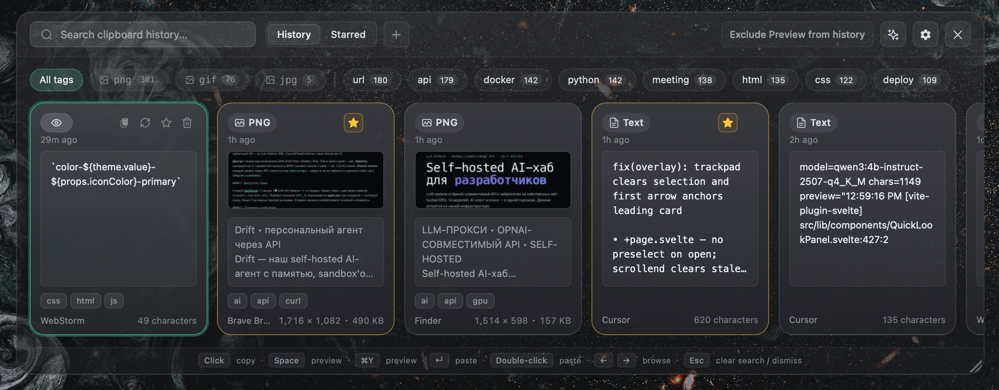

<details>
<summary><strong>More screenshots</strong> — overlay layouts, Quick Look, command palette, settings</summary>

### Overlay

Starred tab — pinned entries only, same search and filter bar:

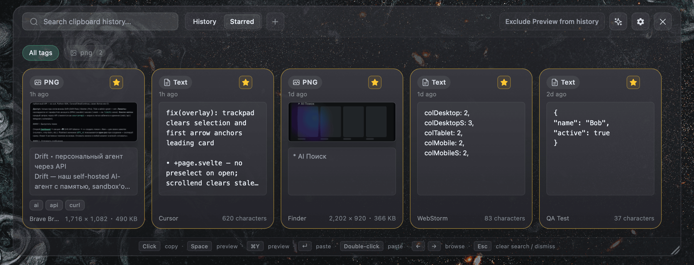

Vertical board layout — a single scrolling column instead of the horizontal grid:

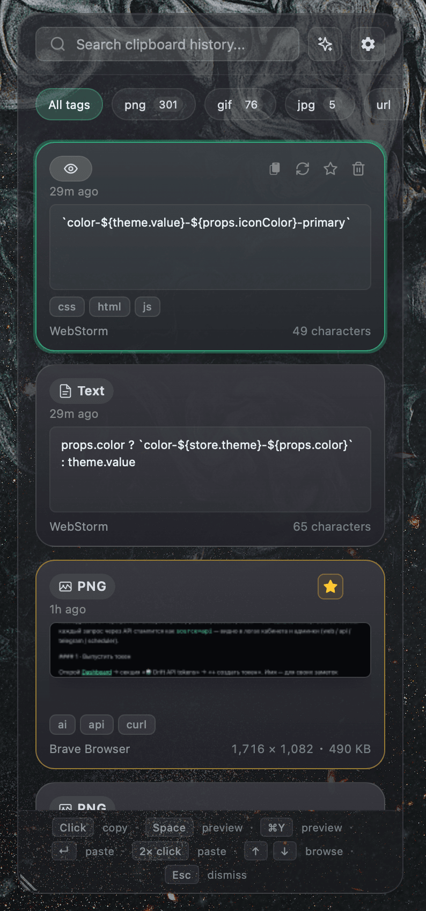

### Quick Look preview

`Space` or `⌘Y` on a selected card opens a larger, scrollable preview instead of pasting immediately:

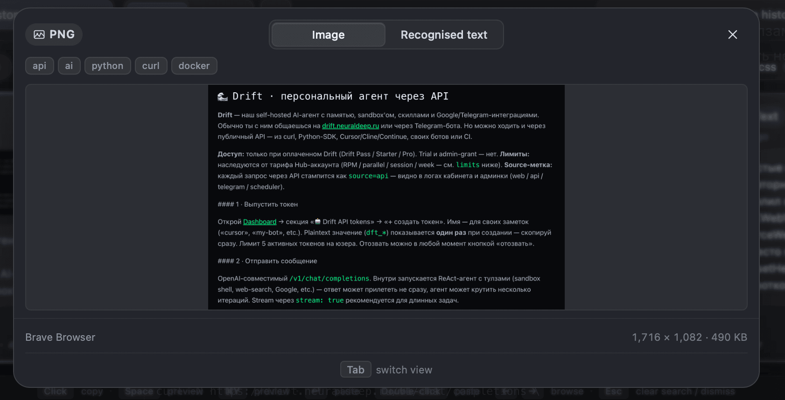

Image entries with recognised text get an **Image / Recognised text** toggle:

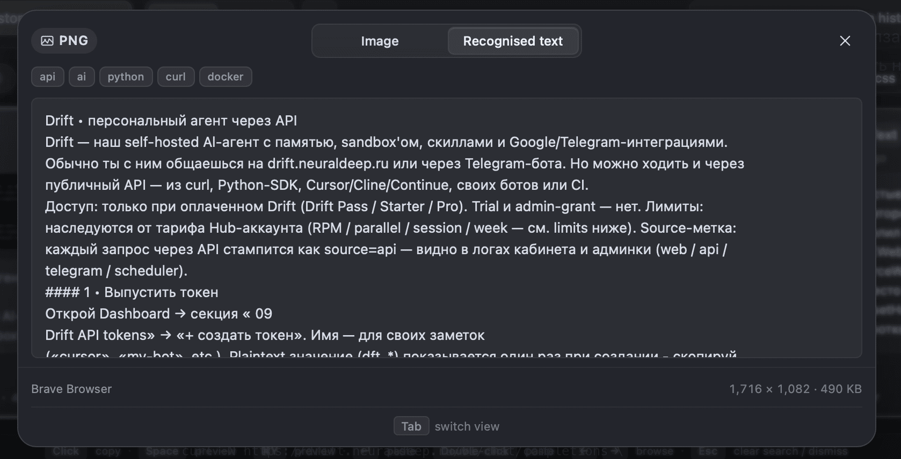

### Command / agent palette

Web search and a streaming research agent when NeuralDeep Hub is enabled
(`⌘⇧Space`, tray menu, or the sparkles button in the overlay):

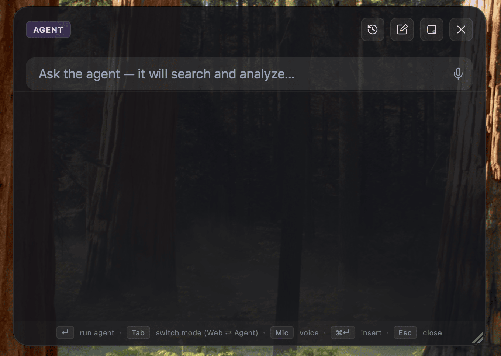

Web mode — quick lookups without leaving the palette:

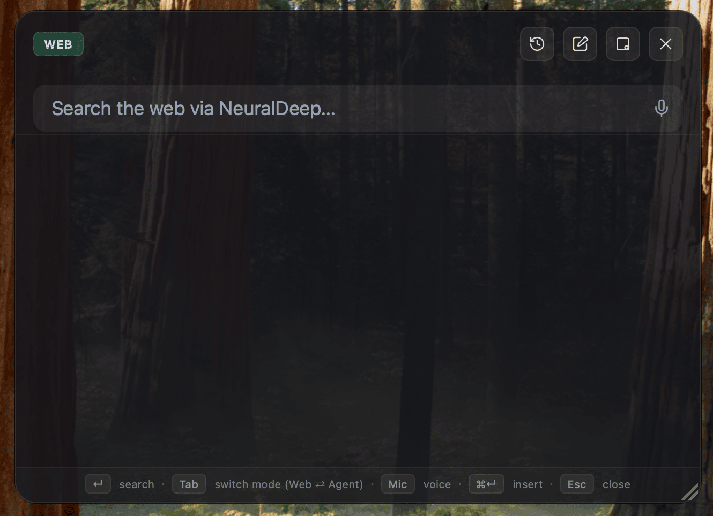

Minimize-to-dot — drag the palette out of the way without closing the session:


### Settings

NeuralDeep Hub settings — one master switch for tagging, transcription, web
search, and voice polishing; optional fallback to local Ollama for tagging:

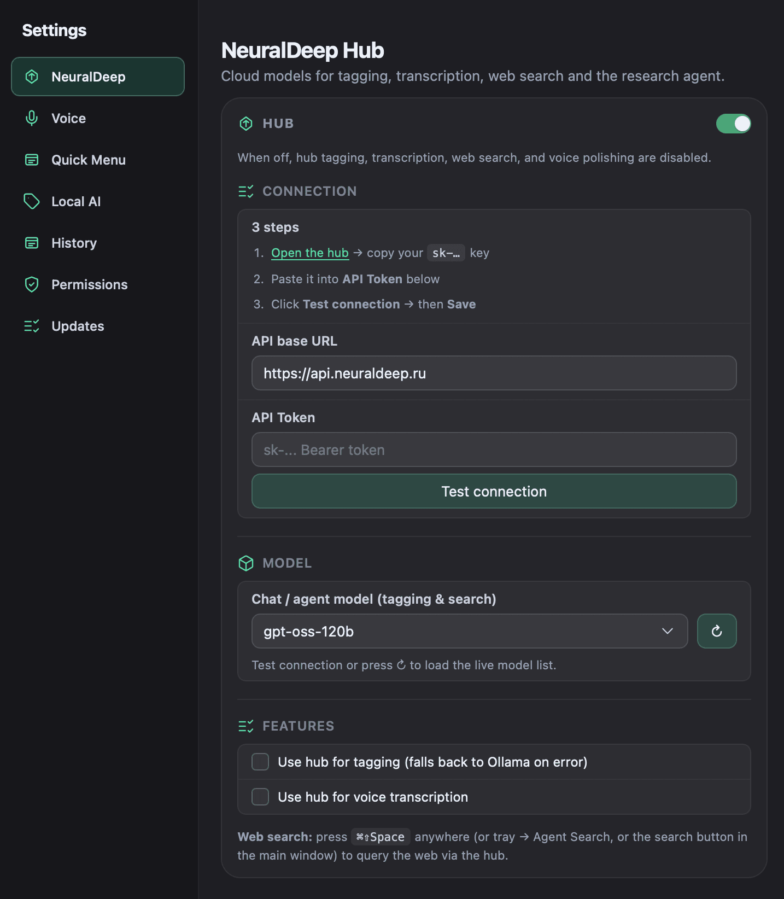

Context-aware voice polishing — hold a shortcut to dictate; the hub LLM cleans
the transcription (punctuation, filler, lists) and adapts it to the app
you're pasting into:

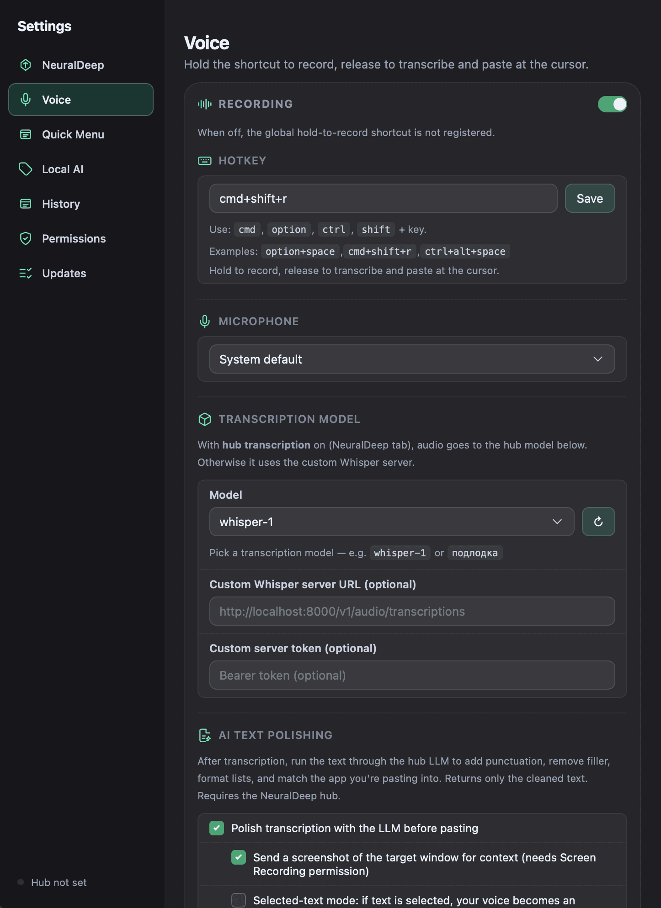

Quick Menu settings — configurable global hotkey (default `⌘⇧C`), collapsible
snippet folders with inline rename; the native Clipy-style menu lists recent
history and saved snippets for two-click paste without opening the overlay:

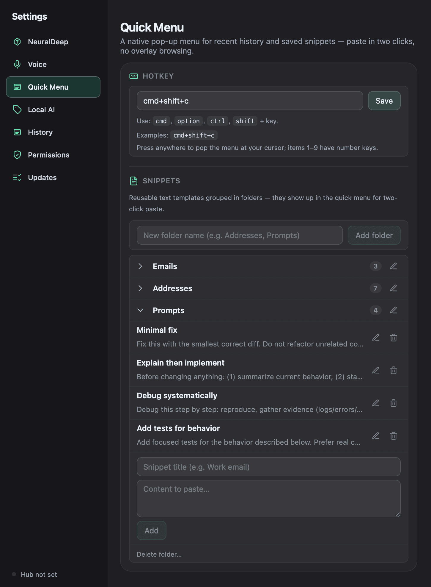

Local AI settings — step-by-step Ollama onboarding (install / start server /
download model / ready):

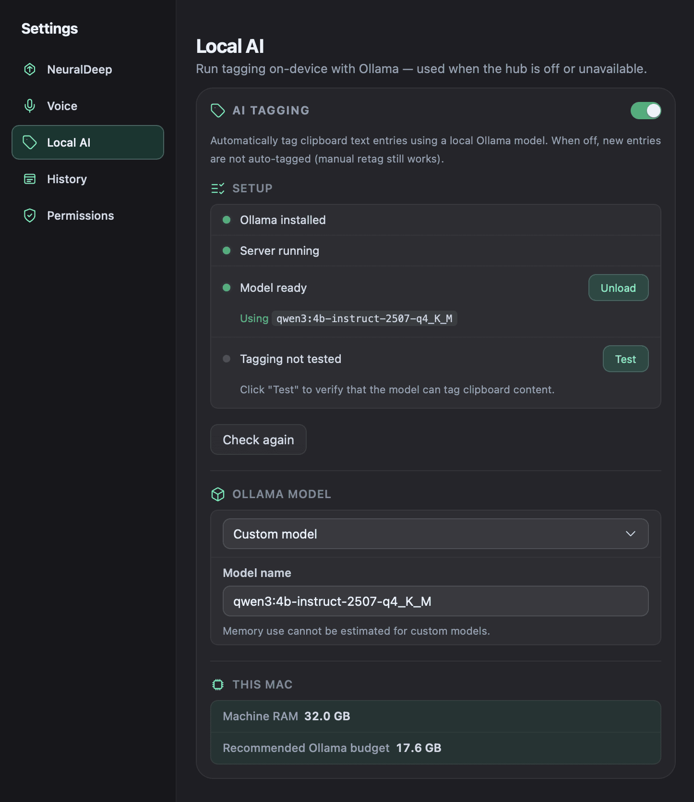

History settings — resizable overlay size, and clear-history controls with a
confirmation dialog:

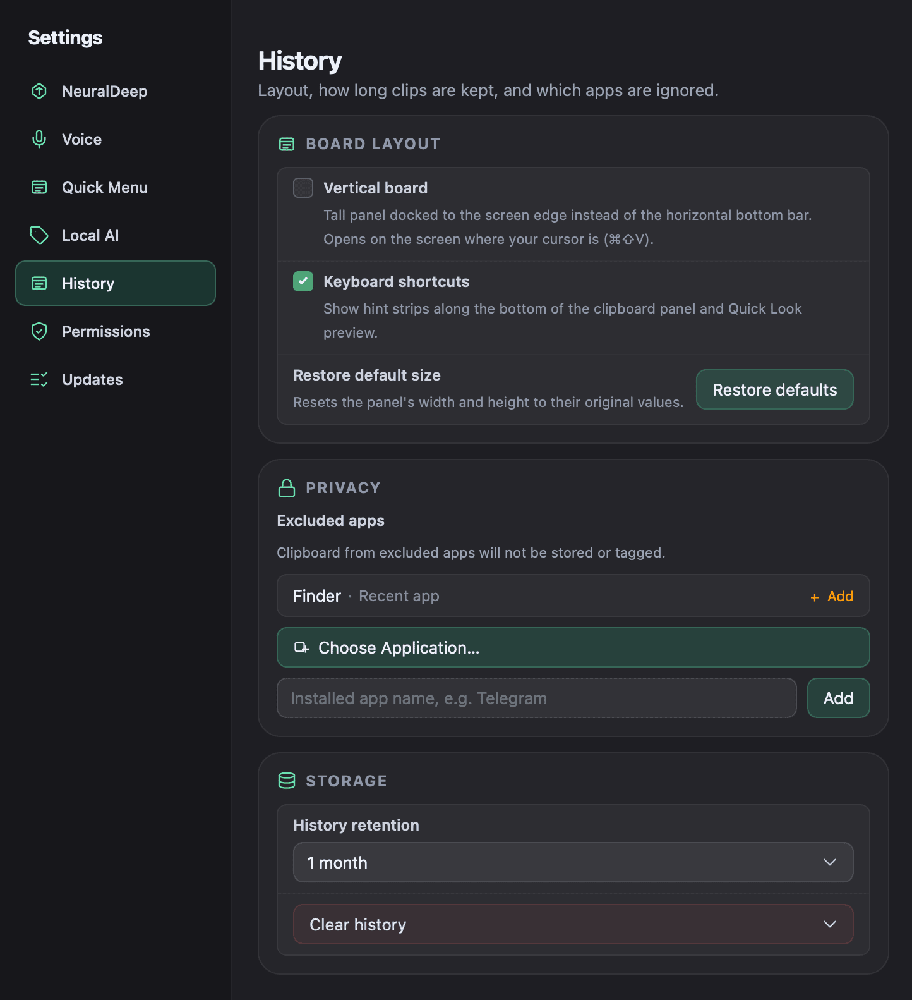
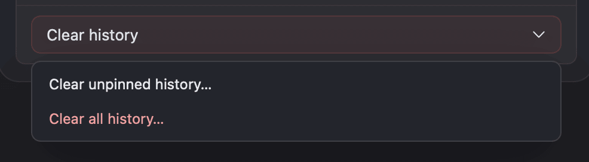
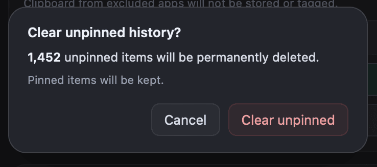
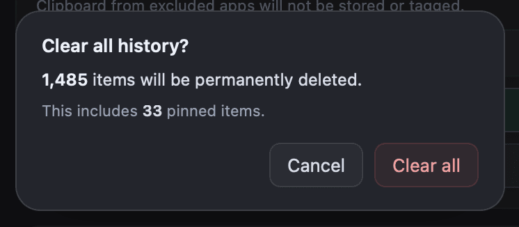

App permissions overview — Accessibility, Microphone, and Automation status
at a glance:

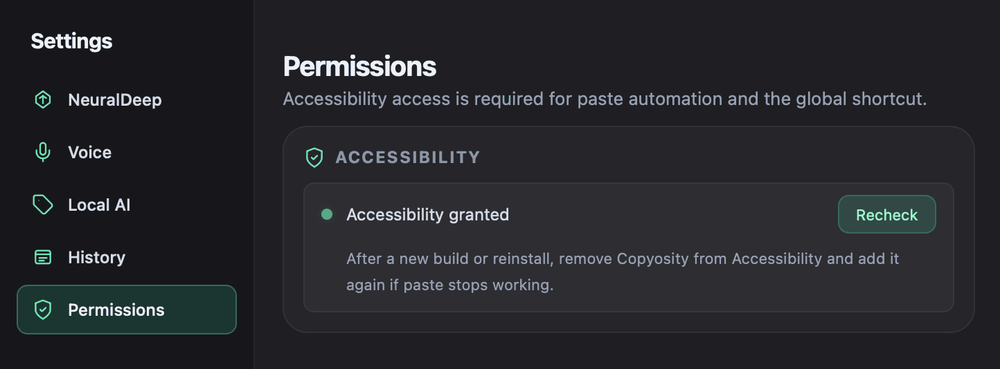

Updates — check for and install new releases from within the app:

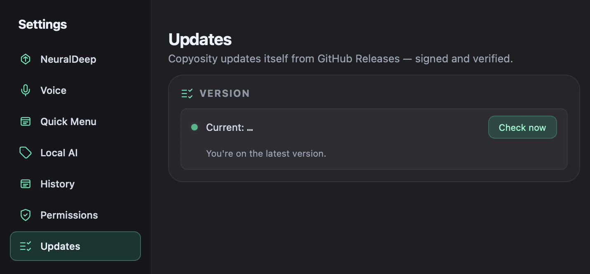

### Menu bar

Tray icon and menu — quick access without opening the overlay:

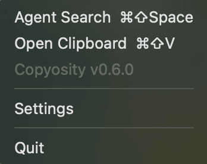

</details>

<a id="features"></a>

## ✨ Features

Shipped capabilities, grouped by area:

### 📋 Clipboard & overlay

- **Clipboard history** — every copy is captured and stored in a local SQLite
  database, with pinning, custom collections, and full‑text search (including
  OCR text on images).
- **Overlay search & filters** — `⌘F` or `/` to search; tag bar with format
  chips (PNG / GIF / JPG) and semantic AI tags; infinite scroll; contextual
  empty states per filter.
- **History / Starred tabs** — macOS segmented control for pinned vs unpinned
  entries; custom collection pills with color dots.
- **Image clipboard** — PNG, JPG, and GIF from the pasteboard or Finder (~20 MB);
  animated GIFs; format badges; dimensions and file size on cards; OCR preview
  under thumbnails.
- **Smart paste actions** — copy, paste into the frontmost app, and open a
  Quick Look preview without leaving the keyboard or reaching for the mouse
  — see [Keyboard shortcuts](#keyboard-shortcuts) for the full list.

### 🖼 On-device intelligence

- **On-device image OCR** — copied images are run through Apple's Vision
  framework (`VNRecognizeTextRequest`) so the text inside screenshots and photos
  becomes searchable. No image ever leaves your Mac for OCR.
- **Automatic tagging** — clipboard entries (and images) are tagged with short,
  practical labels via NeuralDeep Hub or local Ollama; manual **Retag** when
  tagging is ready.
- **Local AI option** — optional Ollama integration for fully local tagging,
  with in‑app onboarding (install / start server / download‑model / test
  states).

### 🎙 Voice

- **Voice to text** — hold a global hotkey to record from any microphone; the
  audio is transcribed and the result is pasted into whatever app is frontmost.
  Voice transcription is off by default until you enable it in Settings.
- **Context-aware polishing** — raw transcription is cleaned into natural,
  typed‑style text, taking the target app (and optionally a screenshot of the
  target window) into account so the output fits where it lands.

### ⚡ Quick access

- **Quick menu** — native Clipy-style pop-up at the cursor on a global hotkey
  (default `⌘⇧C`): recent clipboard history with number keys 1–9, overflow in
  submenus (up to 100 entries), and saved snippets grouped by folder; pick an
  item to paste into the app that was frontmost when the menu opened — two
  clicks, no overlay.
- **Snippets** — reusable text templates (email, address, prompts, …) in
  folders; edit them in **Settings → Quick Menu**; they appear in the quick menu
  for two-click paste; **Edit Snippets…** in the menu opens that settings pane.
- **Command / agent palette** — Agent and Web modes, session history, streaming
  agent progress, markdown answers, voice input, and Insert / Copy / Close
  actions; draggable, resizable window with minimize-to-dot.

### 🍎 macOS integration & trust

- **App exclusions** — native app picker for excluded apps (e.g. password
  managers); **Exclude [App]** from the overlay when a sensitive app is
  frontmost.
- **Native macOS actions** — the assistant can create Notes, create and list
  Reminders, and read upcoming Calendar events via AppleScript / Apple Events.
- **Menu-bar native UI** — a transparent, non‑activating floating panel
  (`NSPanel`) that appears over your current app without stealing focus, plus a
  tray icon and global shortcuts.
- **Privacy** — clear unpinned or all history with confirmation; concealed
  clipboard content is ignored; Copyosity's own copy/paste does not pollute
  history.
- **Accessibility** — focus-visible rings, roving keyboard navigation, voice HUD
  `aria-live` baseline, and support for reduced motion, transparency, and
  contrast preferences.

## Platform support

| Platform                             | Status           | Install / builds                                                                                                                                                                                  |
| ------------------------------------ | ---------------- | ------------------------------------------------------------------------------------------------------------------------------------------------------------------------------------------------- |
| 🍎 **macOS** (Apple Silicon & Intel) | ✅ Supported     | Signed, notarized DMGs + `*.app.tar.gz` updater bundles on [Releases](https://github.com/vakovalskii/copyosity/releases/latest)                                                                   |
| 🪟 **Windows** (x64)                 | ⚠️ Experimental  | `*_x64_en-US.msi` and `*_x64-setup.exe` on the same [Releases](https://github.com/vakovalskii/copyosity/releases/latest) page; built via [windows-build.yml](.github/workflows/windows-build.yml) |
| 🐧 **Linux**                         | ❌ Not supported | No CI builds or releases                                                                                                                                                                          |

Copyosity is a **macOS-native** app: `NSPanel` overlay, pasteboard monitoring,
`CGEvent` paste injection, Vision OCR, Apple Events, and menu-bar tray behavior
(see [macos-tray-menu.md](docs/architecture/macos-tray-menu.md)).

On Windows, macOS-only modules compile to **inert stubs** — the app may install
and launch, but clipboard capture, paste-into-other-apps, OCR, quick menu, and
most integrations do not work. CI also runs [`build-windows`](.github/workflows/ci.yml)
(`cargo check` on every PR, `continue-on-error`) to track compile health.
**Do not use Windows builds for daily work** until a real port ships.

Linux has no build pipeline; the same stubs would apply if it compiled, but
nothing is published or tested.

### 🦙 Local AI (Ollama)

For automatic clipboard tagging when the hub is off or unavailable:

1. Install [Ollama](https://ollama.com/download)
2. Open Copyosity Settings → **Local AI** — follow the step-by-step status panel
3. Enable **AI tagging**; the app can start the server and download the model for you

Expected onboarding states: `Ollama not installed` → `Ollama installed, server not running` → `Model not installed` → `Local AI ready`.

<a id="install"></a>

## ⬇️ Install

Downloads are on the [latest release](https://github.com/vakovalskii/copyosity/releases/latest) page. See [CHANGELOG.md](CHANGELOG.md) for release notes.

### 🍎 macOS

Requires **macOS 12+** on **Apple Silicon** (M1 and later) or **Intel** (x86_64).

| Your Mac                      | Download                  |
| ----------------------------- | ------------------------- |
| Apple Silicon (M1, M2, M3, …) | `Copyosity_*_aarch64.dmg` |
| Intel                         | `Copyosity_*_x64.dmg`     |

1. Pick the DMG for your architecture (for example `Copyosity_<version>_aarch64.dmg` or `Copyosity_<version>_x64.dmg`, where `<version>` is the latest release version).
2. Open the DMG and drag **Copyosity** into **Applications**.
3. Launch it. On first run macOS will ask for **Accessibility** permission
   (needed to paste into other apps) and, depending on the features you use,
   **Microphone**, **Automation** (Notes/Reminders/Calendar), and screen access.

The build is signed with a Developer ID certificate and notarized + stapled by
Apple, so Gatekeeper opens it without warnings (and offline).

macOS will also ask for:

- ⚠️ **Accessibility** — needed for paste automation (Cmd+V simulation) and global shortcuts. After rebuilding or reinstalling the app, remove Copyosity from the list and add it again if double-click paste stops working.
- **Input Monitoring** — may be required for reliable hotkey detection

### 🪟 Windows (experimental)

| Format | Download                    |
| ------ | --------------------------- |
| MSI    | `Copyosity_*_x64_en-US.msi` |
| Setup  | `Copyosity_*_x64-setup.exe` |

⚠️ Windows builds ship on the same release page but are **experimental** — see
[Platform support](#platform-support) above. Expect a hollow shell: the app
installs and launches, but most clipboard-manager features are not implemented yet.

<a id="keyboard-shortcuts"></a>

## ⌨️ Keyboard shortcuts

|     | Action                  | What it does                                                   |
| --- | ----------------------- | -------------------------------------------------------------- |
| 📂  | `Cmd + Shift + V`       | Open / close clipboard history                                 |
| ⚡  | `Cmd + Shift + C`       | Open quick menu at cursor (history + snippets)                 |
| ✨  | `Cmd + Shift + Space`   | Open command / agent palette (when hub is on)                  |
| 🔍  | `Cmd + F` or `/`        | Focus search in the overlay                                    |
| 👁  | `Space` or `⌘Y` on card | Quick Look preview (toggle); `⌘Y` from search                  |
| 👁  | Hover type chip · eye   | Open Quick Look preview                                        |
| 👁  | Right-click card        | Context menu → Preview (Alfred-style)                          |
| 🎙  | Hold voice shortcut     | Record voice (default `Option + Space`)                        |
| 📋  | Single click on card    | Copy to clipboard                                              |
| 📤  | Double click on card    | Paste into active cursor                                       |
| 📤  | `Enter` on card         | Paste selected entry                                           |
| ✖️  | `Escape`                | Close Quick Look if open, then clear search, then hide overlay |
| ⬇️  | `↓` from search         | Leave search and select first visible card                     |
| ⬅️  | Arrow keys              | Navigate cards                                                 |
| 📤  | Click paste button      | Paste into active cursor                                       |
| ⭐  | Click ★ button          | Star / unstar                                                  |
| ✨  | Click sparkles button   | Open command / agent palette                                   |
| ⚙️  | Click gear icon         | Open Settings                                                  |

<a id="privacy"></a>

## 🔒 Privacy

- All data stored locally in `~/Library/Application Support/com.vkovalskii.copyosity/`
- AI tagging runs on `127.0.0.1` via Ollama — nothing leaves your machine when the hub is off
- Exclude sensitive apps in Settings → Privacy, or from the overlay when that app is frontmost
- Clear unpinned or all history anytime from Settings → History

<a id="build-from-source"></a>

## 🛠 Build from source

Prerequisites:

- [Rust](https://www.rust-lang.org/tools/install) (stable toolchain)
- [Node.js](https://nodejs.org/) 22+
- macOS with Xcode command line tools

```bash
git clone <this-repo-url>
cd copyosity
npm install

# run in development (hot reload)
npm run tauri dev

# produce a release bundle (.app + .dmg)
npm run tauri build
```

The Tauri config (`src-tauri/tauri.conf.json`) drives the bundle. The frontend
is SvelteKit (static adapter); the backend is Rust via Tauri 2.

<a id="neuraldeep-hub"></a>

## ☁️ NeuralDeep hub (optional)

Several cloud‑assisted features — model‑based tagging, web search, the research
agent, and transcription / polishing — can be powered by a **NeuralDeep hub**
endpoint. This is **entirely optional** and disabled until you configure it.

To enable it, open **Settings → NeuralDeep** and provide:

- your **own** hub **base URL**, and
- your **own** API token (an `sk-...` style key).

Turn on the **NeuralDeep Hub** master switch to enable hub tagging,
transcription, web search, voice polishing, and the `⌘⇧Space` agent shortcut.

These credentials are yours: you supply them, and they are stored locally in the
app's settings. **No tokens, keys, or endpoints are bundled with Copyosity.** If
you don't configure a hub, the app falls back to local behavior (e.g. local
tagging via Ollama and on‑device OCR) where available.

> 🔒 **Privacy note:** Never commit your hub URL or token to a repository or share it publicly.

<a id="development-workflow"></a>

## 🔧 Development workflow

After any code change, run the project checks before committing:

```bash
make fix && make check          # auto-fix, then full gate (recommended)
# or narrower scopes:
make fix-frontend && make check-frontend
make fix-backend && make check-backend
```

See `CLAUDE.md` and `AGENTS.md` for the full contributor workflow (branching,
commit discipline, and local‑AI onboarding rules).

### macOS paste pipeline

See [docs/architecture/macos-paste-pipeline.md](docs/architecture/macos-paste-pipeline.md).

### Release

```bash
make build-macos-intel   # Intel Mac .app + DMG → dist/macos/
make build-macos-arm     # Apple Silicon (on M-series or cross-target)
make build-macos         # Native arch for current Mac

make release-macos-intel # Signed + notarized Intel DMG (Developer ID)
make release-macos       # Signed + notarized, native arch
make notarize-info       # Check notarization status
```

Artifacts for local testing land in `dist/macos/` (for example `Copyosity_<version>_x86_64.dmg`, where `<version>` is the current `package.json` version).
