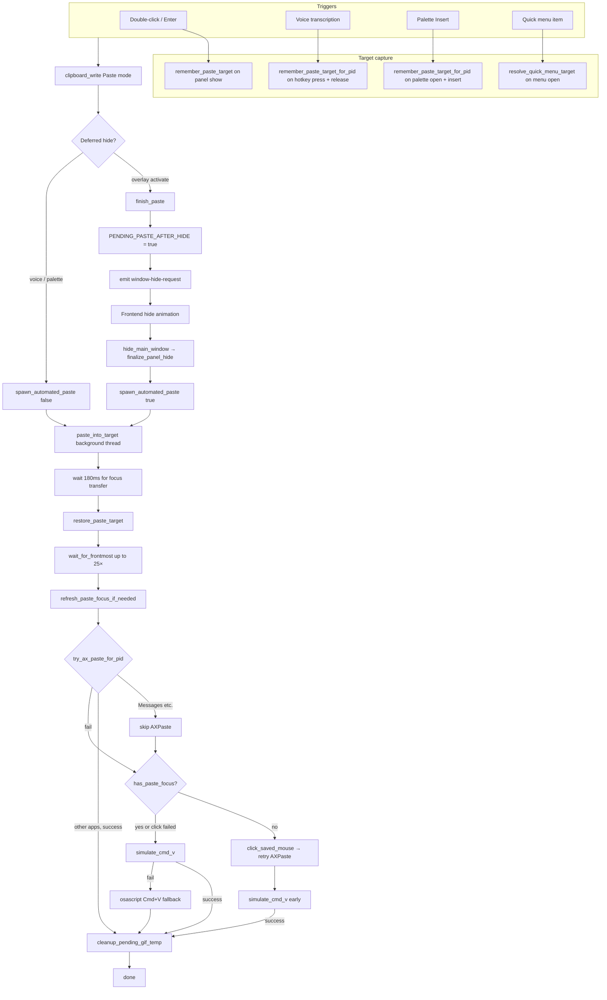

# macOS paste pipeline

How Copyosity writes to the system pasteboard and pastes into the target app on macOS.

Applies to **overlay activate**, **voice transcription**, **command palette insert**, and **native quick menu** (history + snippets) flows.

## End-to-end flow



### Triggers

| User action                  | Frontend                  | Backend                                                                   | Target capture moment                        | Panel hide before paste? | `spawn_automated_paste` |
| ---------------------------- | ------------------------- | ------------------------------------------------------------------------- | -------------------------------------------- | ------------------------ | ----------------------- |
| Double-click card            | `activateEntry`           | `commands::activate_entry`                                                | Panel show (`remember_paste_target`)         | Yes (`finish_paste`)     | `true` (may prompt AX)  |
| Enter on selected card       | `activateEntry`           | `commands::activate_entry`                                                | Panel show                                   | Yes                      | `true`                  |
| Voice transcription complete | —                         | `lib.rs` → `clipboard_write::write_text` + `spawn_automated_paste(false)` | Hotkey press + release (`VOICE_TARGET_PID`)  | No                       | `false`                 |
| Command palette Insert       | `palette/+page.svelte`    | `lib.rs` → `palette_insert`                                               | Palette open + insert (`PALETTE_TARGET_PID`) | Palette hide only        | `false`                 |
| Quick menu history / snippet | —                         | `commands::quick_menu_paste_*`                                            | Menu open (`resolve_quick_menu_target`)      | No                       | `false`                 |
| Legacy text paste API        | `pasteEntry` (deprecated) | `commands::paste_entry`                                                   | Panel show                                   | Yes                      | `true`                  |

**Copy-only** (`copy_entry` / card action menu) writes with `ClipboardWriteMode::Copy` and does **not** run the paste pipeline.

### Deferred paste (overlay only)

User-initiated overlay paste does not call `spawn_automated_paste` immediately. The panel must release focus before macOS will deliver events to the target app.

1. `finish_paste` sets `PENDING_PASTE_AFTER_HIDE` and emits `window-hide-request` (unless a hide is already scheduled).
2. The frontend plays the close animation, then calls `hide_main_window`.
3. `finalize_panel_hide` hides the native panel and, if the flag is set, calls `spawn_automated_paste(true)`.

Voice and palette paste skip this path: they write the pasteboard and spawn paste directly after hiding their own window (no accessibility prompt).

### Remember target

All macOS paste delivery goes through `PASTE_TARGET_PID` and optional AX focus / mouse position stored in `clipboard_macos/mod.rs`.

| API                                  | When to call                                                                                                   |
| ------------------------------------ | -------------------------------------------------------------------------------------------------------------- |
| `remember_paste_target()`            | Before overlay `show_and_make_key` — captures frontmost app excluding Copyosity                                |
| `remember_paste_target_for_pid(pid)` | Voice hotkey press/release, palette open/insert — explicit PID from `VOICE_TARGET_PID` or `PALETTE_TARGET_PID` |

Each remember call stores:

- Target app PID (`PASTE_TARGET_PID`)
- AX focused element (if available), with editable-role fallback search
- Mouse position (click fallback)
- App identity for the exclusion UI (`app_exclusion::remember_from_pid`)

`open_settings_window` also calls `remember_paste_target` before hiding the panel so settings can open without losing the paste target.

Call `remember_paste_target` **before** `show_and_make_key`, or focus capture points at Copyosity.

**Voice:** `VOICE_TARGET_PID` is captured when the voice hotkey is pressed (before the voice overlay appears). On transcription complete, `remember_paste_target_for_pid` refreshes the target from that PID, then `spawn_automated_paste(false)` runs the full pipeline. If no PID was captured (`pid <= 0`), `simulate_cmd_v` falls back to the session event tap (frontmost app).

**Palette:** `PALETTE_TARGET_PID` is captured when the command palette opens. On Insert, the target is refreshed and paste runs through the same `paste_into_target` path as voice.

### Panel hide paths (overlay motion)

| Path                                        | Rust                                           | Frontend event                                                 | CSS close animation?                                                      |
| ------------------------------------------- | ---------------------------------------------- | -------------------------------------------------------------- | ------------------------------------------------------------------------- |
| Esc, outside click, tray toggle             | `animated_hide_panel`                          | `window-hide-request` → `startVisualHide` → `hide_main_window` | Yes — `visible=false` while native panel still shown                      |
| Paste after activate                        | `finish_paste` → `window-hide-request`         | Same as above                                                  | Yes                                                                       |
| Open settings (panel must hide immediately) | `open_settings_window` → `finalize_panel_hide` | `window-hide` only (no `window-hide-request`)                  | No — native hide first; frontend snaps with `data-panel-motion="instant"` |

When settings (or any instant native hide) runs while the overlay is still `visible`, the frontend must snap the panel to its hidden pose without playing the close transition; otherwise the next open can double-jump. See `overlay-motion.ts` and `data-panel-motion` on `.app` in `+page.svelte`. Rust also reuses `remembered_overlay_height()` on show so the native panel is not repositioned to compact height before the frontend layout resize.

If the user reopens while an animated close is still pending (`requestNativeHide` without `hide_main_window` yet), `showWindow` calls `finalizePendingNativeHide()` first so native hide is not dropped when hide timers are superseded. Animated close uses `data-panel-motion="animate"`; instant snap uses `instant` and commits hide after `afterLayoutFlush()` instead of waiting for a missing CSS transition. Intermediate height animation frames call `resize_main_window` with `rememberHeight: false` so Rust only stores the final layout height.

## Source files

| File                                             | Role                                                                                                                                                         |
| ------------------------------------------------ | ------------------------------------------------------------------------------------------------------------------------------------------------------------ |
| `src-tauri/src/clipboard_macos/mod.rs`           | Pasteboard `changeCount`, concealed detection, GIF/file pasteboard reads, `remember_paste_target` / `remember_paste_target_for_pid` / `restore_paste_target` |
| `src-tauri/src/clipboard_macos/paste.rs`         | `paste_into_target`, `simulate_cmd_v`, `spawn_automated_paste`, osascript fallback, mouse click fallback, `wait_for_frontmost`, `cmd_v_uses_session_tap`     |
| `src-tauri/src/clipboard_macos/accessibility.rs` | AX focus capture/restore, `try_ax_paste`, `try_ax_paste_for_pid`, editable-role search, Accessibility trust                                                  |
| `src-tauri/src/clipboard_write.rs`               | Unified **Copy** / **Paste** write modes; marks own pasteboard writes; GIF temp files for Paste mode                                                         |
| `src-tauri/src/commands.rs`                      | `activate_entry`, `copy_entry`, `finish_paste`, `hide_main_window`                                                                                           |
| `src-tauri/src/lib.rs`                           | `toggle_window`, `finalize_panel_hide`, `PENDING_PASTE_AFTER_HIDE`, voice transcription paste, `palette_insert`                                              |
| `src-tauri/src/macos_app.rs`                     | Bundle ID lookup for keyboard-paste routing                                                                                                                  |
| `src-tauri/src/app_exclusion.rs`                 | Stores last frontmost app identity when the panel opens                                                                                                      |
| `src/routes/+page.svelte`                        | `window-hide-request` / `window-hide` listeners, hide animation, `data-panel-motion`, `hideMainWindow`                                                       |
| `src/routes/palette/+page.svelte`                | Agent answer UI; Insert invokes `palette_insert`                                                                                                             |
| `src/lib/overlay-motion.ts`                      | Instant-hide plan, transition epoch guard                                                                                                                    |

## Clipboard write modes

`ClipboardWriteMode` in `clipboard_write.rs` controls pasteboard semantics and history:

| Mode    | History                                            | macOS pasteboard                     |
| ------- | -------------------------------------------------- | ------------------------------------ |
| `Copy`  | Excluded (`exclude_from_history` / concealed type) | Used by `copy_entry`                 |
| `Paste` | Normal write, then `mark_own_clipboard_write`      | Used by activate/voice/palette flows |

After every write, `mark_own_clipboard_write` records the pasteboard `changeCount` so the clipboard monitor skips the app's own writes.

### GIF paste

For `ClipboardWriteMode::Paste`, animated GIFs prefer a temp file plus `file_list` on the pasteboard (more reliable in Telegram/Finder). On failure, raw GIF bytes are written via `write_gif_to_pasteboard`.

Temp files live under `$TMPDIR/copyosity-gif-paste/`. `paste_into_target` schedules `cleanup_pending_gif_temp` (60s delay) so the target app can read asynchronously. Stale files from prior sessions are swept on startup (`sweep_stale_gif_temp_files`, 24h max age).

## Paste strategy (`paste_into_target`)

Runs on a background thread after optional Accessibility prompt.

1. **Settle** — 180ms sleep so the main run loop finishes hiding Copyosity.
2. **Restore target** — `restore_paste_target`: activate PID (with retries), restore AX focus (system-wide first, then per-app).
3. **Wait for frontmost** — up to 25 attempts (`activate_pid` + incremental backoff) until the target PID is frontmost.
4. **Refresh focus** — if no element was remembered, re-walk the AX tree (`refresh_paste_focus_if_needed`).
5. **AXPaste** — `try_ax_paste_for_pid` unless the bundle is in `KEYBOARD_PASTE_BUNDLE_IDS`.
6. **Mouse click fallback** — when AX focus is missing, click the saved cursor position (HID tap), retry AXPaste, then try early `simulate_cmd_v`.
7. **Cmd+V** — `simulate_cmd_v` via CGEvent (session tap or `CGEventPostToPid`).
8. **osascript fallback** — System Events: by localized process name, by Unix PID, then generic frontmost key press.

CGEvent is preferred over osascript because System Events often misses Electron webviews.

All macOS synthetic Cmd+V goes through `clipboard_macos/paste.rs::simulate_cmd_v`. Non-macOS voice/palette use a platform stub in `lib.rs`.

## Design decisions

### Messages → keyboard paste, not AXPaste

`AXPaste` is unreliable in Messages (`com.apple.MobileSMS`, legacy `com.apple.iChat`). Those bundle IDs are listed in `KEYBOARD_PASTE_BUNDLE_IDS`; `try_ax_paste_for_pid` skips AX and goes straight to synthetic Cmd+V.

Chromium-based browsers (Brave, Chrome, Edge, …) are in the same list: `AXPaste` often returns success on `AXWebArea` without inserting into the focused web field.

### Frontmost target → session tap (one tap only)

When the target PID is frontmost after `wait_for_frontmost`, `simulate_cmd_v` posts to **`kCGSessionEventTap` only**.

- Native apps like Messages ignore `CGEventPostToPid`.
- Posting to **both** session and HID taps delivered **two** paste events (duplicate text/images). Use a single tap.

### Target not frontmost → `CGEventPostToPid`

If activation is still in progress, events go directly to the target process so they are not consumed by whichever app is temporarily frontmost.

### AX editable-role priority

When the focused element cannot be read, the AX tree walk picks the best editable role in the target app:

`AXTextArea` → `AXTextField` → `AXSearchField` → `AXComboBox` → `AXWebArea` → `AXScrollArea` (last resort).

`AXScrollArea` is deprioritized because Messages exposes the conversation list as a scroll area, not the compose field.

### Accessibility trust probe

`accessibility_trusted` uses `AXIsProcessTrusted` (TCC). A live AX probe on Copyosity's own element is not used for the Settings check because it can return `kAXErrorCannotComplete` while trust is already granted.

## Extending keyboard-paste apps

Add bundle IDs to `KEYBOARD_PASTE_BUNDLE_IDS` in `accessibility.rs`:

```rust
pub(crate) const KEYBOARD_PASTE_BUNDLE_IDS: &[&str] = &[
    "com.apple.MobileSMS",
    "com.apple.iChat",
    "com.brave.Browser",
    "com.google.Chrome",
    // …
];
```

Use `bundle_prefers_keyboard_paste(bundle_id)` in unit tests to verify matching. Prefer confirming in the real app that `AXPaste` fails or is a no-op before adding an ID.

### Quick menu target capture

The native quick menu remembers the paste target when it opens via `resolve_quick_menu_target()`:

1. Frontmost non-Copyosity app (hotkey path while another app is still frontmost).
2. `LAST_NON_SELF_FRONTMOST_PID` — updated on every non-self `NSWorkspace` activation, tray click Down (`remember_paste_target`), and any `remember_paste_target_for_pid` call.

When Copyosity is already frontmost (tray → **Open Snippets**), tier 2 supplies the app the user was in before the tray interaction.

## Debugging

Set `COPYOSITY_DEBUG_PASTE=1` (also `true`, `yes`, `on`) when running the app. Paste steps log to stderr with a `[paste]` prefix:

```bash
COPYOSITY_DEBUG_PASTE=1 npm run tauri dev
```

Typical log lines:

- Overlay: `remember pid=…`, `succeeded via AXPaste`, `sent Cmd+V (pid=…)`
- Voice: `remember pid=…` (from hotkey target), then same delivery lines
- Palette: `remember pid=…` (from palette target), then same delivery lines
- Messages: `target prefers keyboard paste`
- Fallback: `sent Cmd+V via osascript (fallback)`

## Permissions

- **Accessibility** — required for AX paste, synthetic Cmd+V, focus restore, and mouse click fallback. Settings offers a trust check and link to System Settings.
- User-initiated paste (`spawn_automated_paste(true)`) may prompt for Accessibility; voice/palette paste (`false`) skips the prompt and aborts if not granted.
- Paste without Accessibility still writes the pasteboard; the user can press Cmd+V manually.

## Related tests

Run `cargo test clipboard_macos::` and `cargo test clipboard_write::`.

| Test                                                           | Module                                  | Covers                               |
| -------------------------------------------------------------- | --------------------------------------- | ------------------------------------ |
| `remember_paste_target_for_pid_ignores_invalid_pids`           | `clipboard_macos::tests`                | PID store; ignores 0, negative, self |
| `remember_paste_target_for_pid_is_send_for_background_spawn`   | `clipboard_macos::tests`                | Sendability for voice/palette wiring |
| `paste_into_target_is_send_for_background_spawn`               | `clipboard_macos::tests`                | Background thread spawn              |
| `cmd_v_uses_session_tap_when_target_is_frontmost`              | `clipboard_macos::paste::tests`         | Messages / frontmost routing         |
| `cmd_v_uses_session_tap_when_pid_unknown`                      | `clipboard_macos::paste::tests`         | Session tap fallback                 |
| `cmd_v_uses_post_to_pid_when_target_not_frontmost`             | `clipboard_macos::paste::tests`         | Activation in progress               |
| `bundle_prefers_keyboard_paste_matches_messages`               | `clipboard_macos::accessibility::tests` | Skip AXPaste for SMS/iChat           |
| `bundle_prefers_keyboard_paste_matches_chromium_browsers`      | `clipboard_macos::accessibility::tests` | Skip AXPaste for Brave/Chrome/Edge   |
| `note_last_non_self_frontmost_ignores_self_and_invalid`        | `clipboard_macos::tests`                | Quick-menu fallback PID store        |
| `editable_role_priority_prefers_text_fields_over_scroll_areas` | `clipboard_macos::accessibility::tests` | Compose field discovery              |
| `own_clipboard_write_is_ignored_once`                          | `clipboard_macos::tests`                | Monitor skip after Paste write       |
| `write_temp_gif_file_round_trips_bytes`                        | `clipboard_write::tests`                | GIF temp path                        |
| `sweep_stale_gif_temp_files_removes_old_only`                  | `clipboard_write::tests`                | Temp cleanup                         |

## Validation checklist

Manual QA after pipeline changes. Run with `COPYOSITY_DEBUG_PASTE=1 npm run tauri dev` and watch stderr for `[paste]` lines.

### Overlay (`spawn_automated_paste(true)`)

| #   | Scenario                              | Expected                                                     |
| --- | ------------------------------------- | ------------------------------------------------------------ |
| 1   | Double-click / Enter → Cursor compose | `remember pid=…`, AXPaste or `sent Cmd+V`                    |
| 2   | Paste into Messages                   | `target prefers keyboard paste`, single paste (no duplicate) |
| 3   | Copy-only (action menu)               | Pasteboard updated; no paste pipeline                        |
| 4   | GIF entry → Telegram / Finder         | `file_list` temp path; target receives GIF                   |
| 5   | Esc / outside click                   | Hide only; no paste                                          |
| 6   | Open settings from overlay            | Instant hide; target preserved for return                    |

### Voice (`spawn_automated_paste(false)`)

| #   | Scenario                              | Expected                                                     |
| --- | ------------------------------------- | ------------------------------------------------------------ |
| 7   | Hotkey with no prior overlay          | Paste into frontmost app at hotkey press                     |
| 8   | Overlay in app A, then voice in app B | Paste into B (hotkey PID), not stale A                       |
| 9   | Accessibility denied                  | Pasteboard written; log `skipped: accessibility not granted` |
| 10  | Voice polish enabled                  | Polished text pasted, not raw transcription                  |

### Command palette (`spawn_automated_paste(false)`)

| #   | Scenario                          | Expected                                    |
| --- | --------------------------------- | ------------------------------------------- |
| 11  | Agent answer → Insert in Electron | Full pipeline; webview receives text        |
| 12  | Insert in Messages                | Session-tap Cmd+V; no double paste          |
| 13  | Hub disabled                      | Palette does not open (no paste regression) |

### Quick menu (`spawn_automated_paste(false)`)

| #   | Scenario                                     | Expected                                                    |
| --- | -------------------------------------------- | ----------------------------------------------------------- |
| 16  | Brave focused → hotkey → paste snippet       | `target prefers keyboard paste`, single insert in web field |
| 17  | Brave focused → tray → Open Snippets → paste | Same; target from `LAST_NON_SELF_FRONTMOST_PID` fallback    |
| 18  | Switch Brave → Notes → tray → Snippets       | Paste lands in Notes, not stale Brave PID                   |

### Cross-cutting

| #   | Scenario                             | Expected                                      |
| --- | ------------------------------------ | --------------------------------------------- |
| 14  | Reopen overlay during animated close | `finalizePendingNativeHide`; next paste works |
| 15  | `make fix && make check`             | All unit tests and lint pass                  |
