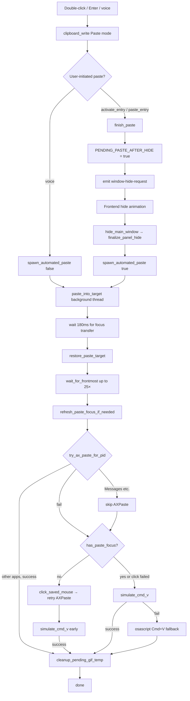

# macOS paste pipeline

How Copyosity writes to the system pasteboard and pastes into the app that was active before the panel opened.

Applies to **double-click**, **Enter**, and **voice transcription** flows on macOS.

## End-to-end flow



### Triggers

| User action                  | Frontend                  | Backend                                                                   | Panel hide before paste? |
| ---------------------------- | ------------------------- | ------------------------------------------------------------------------- | ------------------------ |
| Double-click card            | `activateEntry`           | `commands::activate_entry`                                                | Yes (`finish_paste`)     |
| Enter on selected card       | `activateEntry`           | `commands::activate_entry`                                                | Yes                      |
| Voice transcription complete | —                         | `lib.rs` → `clipboard_write::write_text` + `spawn_automated_paste(false)` | No                       |
| Legacy text paste API        | `pasteEntry` (deprecated) | `commands::paste_entry`                                                   | Yes                      |

**Copy-only** (`copy_entry` / card action menu) writes with `ClipboardWriteMode::Copy` and does **not** run the paste pipeline.

### Deferred paste (panel must hide first)

User-initiated paste does not call `spawn_automated_paste` immediately. The panel must release focus before macOS will deliver events to the target app.

1. `finish_paste` sets `PENDING_PASTE_AFTER_HIDE` and emits `window-hide-request` (unless a hide is already scheduled).
2. The frontend plays the close animation, then calls `hide_main_window`.
3. `finalize_panel_hide` hides the native panel and, if the flag is set, calls `spawn_automated_paste(true)`.

Voice paste skips this path: the clipboard panel is already closed, so transcription writes the pasteboard and spawns paste directly (no accessibility prompt).

### Remember target (before panel takes focus)

When the panel opens (`toggle_window` → show), `remember_paste_target` stores:

- Frontmost app PID (`PASTE_TARGET_PID`), excluding Copyosity itself
- AX focused element (if available), with editable-role fallback search
- Mouse position (click fallback)
- App identity for the exclusion UI (`app_exclusion::remember_from_pid`)

`open_settings_window` also calls `remember_paste_target` before hiding the panel so settings can open without losing the paste target.

Call `remember_paste_target` **before** `show_and_make_key`, or focus capture points at Copyosity.

Voice paste reuses the last remembered target. It does not call `remember_paste_target` on shortcut press; if no target was captured yet (`pid <= 0`), `simulate_cmd_v` falls back to the session event tap (frontmost app).

## Source files

| File                                             | Role                                                                                                                                       |
| ------------------------------------------------ | ------------------------------------------------------------------------------------------------------------------------------------------ |
| `src-tauri/src/clipboard_macos/mod.rs`           | Pasteboard `changeCount`, concealed detection, GIF/file pasteboard reads, `remember_paste_target` / `restore_paste_target`, module exports |
| `src-tauri/src/clipboard_macos/paste.rs`         | `paste_into_target`, `simulate_cmd_v`, osascript fallback, mouse click fallback, `wait_for_frontmost`, `cmd_v_uses_session_tap`            |
| `src-tauri/src/clipboard_macos/accessibility.rs` | AX focus capture/restore, `try_ax_paste`, `try_ax_paste_for_pid`, editable-role search, Accessibility trust                                |
| `src-tauri/src/clipboard_write.rs`               | Unified **Copy** / **Paste** write modes; marks own pasteboard writes; GIF temp files for Paste mode                                       |
| `src-tauri/src/commands.rs`                      | `activate_entry`, `copy_entry`, `finish_paste`, `hide_main_window`                                                                         |
| `src-tauri/src/lib.rs`                           | `toggle_window`, `finalize_panel_hide`, `PENDING_PASTE_AFTER_HIDE`, voice transcription paste                                              |
| `src-tauri/src/macos_app.rs`                     | Bundle ID lookup for keyboard-paste routing                                                                                                |
| `src-tauri/src/app_exclusion.rs`                 | Stores last frontmost app identity when the panel opens                                                                                    |
| `src/routes/+page.svelte`                        | `window-hide-request` listener, hide animation, `hideMainWindow`                                                                           |

## Clipboard write modes

`ClipboardWriteMode` in `clipboard_write.rs` controls pasteboard semantics and history:

| Mode    | History                                            | macOS pasteboard             |
| ------- | -------------------------------------------------- | ---------------------------- |
| `Copy`  | Excluded (`exclude_from_history` / concealed type) | Used by `copy_entry`         |
| `Paste` | Normal write, then `mark_own_clipboard_write`      | Used by activate/voice flows |

After every write, `mark_own_clipboard_write` records the pasteboard `changeCount` so the clipboard monitor skips the app's own writes.

### GIF paste

For `ClipboardWriteMode::Paste`, animated GIFs prefer a temp file plus `file_list` on the pasteboard (more reliable in Telegram/Finder). On failure, raw GIF bytes are written via `write_gif_to_pasteboard`.

Temp files live under `$TMPDIR/copyosity-gif-paste/`. `paste_into_target` schedules `cleanup_pending_gif_temp` (60s delay) so the target app can read asynchronously. Stale files from prior sessions are swept on startup (`sweep_stale_gif_temp_files`, 24h max age).

## Paste strategy (`paste_into_target`)

Runs on a background thread after optional Accessibility prompt.

1. **Settle** — 180ms sleep so the main run loop finishes hiding Copyosity.
2. **Restore target** — `restore_paste_target`: activate PID (with retries), restore AX focus (system-wide first, then per-app).
3. **Wait for frontmost** — up to 25 attempts (`activate_pid` + incremental backoff) until the target PID is frontmost.
4. **Refresh focus** — if no element was remembered, re-walk the AX tree (`refresh_paste_focus_if_needed`).
5. **AXPaste** — `try_ax_paste_for_pid` unless the bundle is in `KEYBOARD_PASTE_BUNDLE_IDS`.
6. **Mouse click fallback** — when AX focus is missing, click the saved cursor position (HID tap), retry AXPaste, then try early `simulate_cmd_v`.
7. **Cmd+V** — `simulate_cmd_v` via CGEvent (session tap or `CGEventPostToPid`).
8. **osascript fallback** — System Events: by localized process name, by Unix PID, then generic frontmost key press.

CGEvent is preferred over osascript because System Events often misses Electron webviews.

## Design decisions

### Messages → keyboard paste, not AXPaste

`AXPaste` is unreliable in Messages (`com.apple.MobileSMS`, legacy `com.apple.iChat`). Those bundle IDs are listed in `KEYBOARD_PASTE_BUNDLE_IDS`; `try_ax_paste_for_pid` skips AX and goes straight to synthetic Cmd+V.

### Frontmost target → session tap (one tap only)

When the target PID is frontmost after `wait_for_frontmost`, `simulate_cmd_v` posts to **`kCGSessionEventTap` only**.

- Native apps like Messages ignore `CGEventPostToPid`.
- Posting to **both** session and HID taps delivered **two** paste events (duplicate text/images). Use a single tap.

### Target not frontmost → `CGEventPostToPid`

If activation is still in progress, events go directly to the target process so they are not consumed by whichever app is temporarily frontmost.

### AX editable-role priority

When the focused element cannot be read, the AX tree walk picks the best editable role in the target app:

`AXTextArea` → `AXTextField` → `AXSearchField` → `AXComboBox` → `AXWebArea` → `AXScrollArea` (last resort).

`AXScrollArea` is deprioritized because Messages exposes the conversation list as a scroll area, not the compose field.

### Accessibility trust probe

`accessibility_trusted` uses `AXIsProcessTrusted` plus a live probe on Copyosity's own AX element (`probe_own_ax_access`). This avoids false negatives when an Electron app (e.g. Cursor) is frontmost but Copyosity already has Accessibility permission.

## Extending keyboard-paste apps

Add bundle IDs to `KEYBOARD_PASTE_BUNDLE_IDS` in `accessibility.rs`:

```rust
pub(crate) const KEYBOARD_PASTE_BUNDLE_IDS: &[&str] =
    &["com.apple.MobileSMS", "com.apple.iChat"];
```

Use `bundle_prefers_keyboard_paste(bundle_id)` in unit tests to verify matching. Prefer confirming in the real app that `AXPaste` fails or is a no-op before adding an ID.

## Debugging

Set `COPYOSITY_DEBUG_PASTE=1` (also `true`, `yes`, `on`) when running the app. Paste steps log to stderr with a `[paste]` prefix:

```bash
COPYOSITY_DEBUG_PASTE=1 npm run tauri dev
```

Typical log lines: `remember pid=…`, `target prefers keyboard paste`, `clicked saved mouse position`, `succeeded via AXPaste`, `sent Cmd+V (pid=…)`, `sent Cmd+V via osascript (fallback)`.

## Permissions

- **Accessibility** — required for AX paste, synthetic Cmd+V, focus restore, and mouse click fallback. Settings offers a trust check and link to System Settings.
- User-initiated paste (`spawn_automated_paste(true)`) may prompt for Accessibility; voice paste (`false`) skips the prompt and aborts if not granted.
- Paste without Accessibility still writes the pasteboard; the user can press Cmd+V manually.

## Related tests

`cargo test clipboard_macos::` — bundle keyboard-paste matching, session-tap routing, editable-role priority, paste target sendability.

`cargo test clipboard_write::` — GIF temp file round-trip, stale temp sweep.
