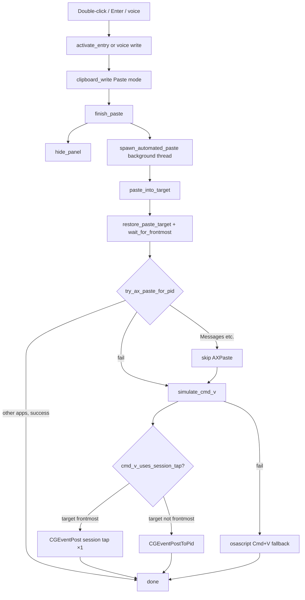

# macOS paste pipeline

How Copyosity writes to the system pasteboard and pastes into the app that was active before the panel opened.

Applies to **double-click**, **Enter**, and **voice transcription** flows on macOS.

## End-to-end flow



### Triggers

| User action                  | Frontend        | Backend                                                                   |
| ---------------------------- | --------------- | ------------------------------------------------------------------------- |
| Double-click card            | `activateEntry` | `commands::activate_entry`                                                |
| Enter on selected card       | `activateEntry` | `commands::activate_entry`                                                |
| Voice transcription complete | —               | `lib.rs` → `clipboard_write::write_text` + `spawn_automated_paste(false)` |

Shared path after the pasteboard is ready:

1. `finish_paste` — hides the panel (main thread must stay free so focus can return).
2. `spawn_automated_paste` — background thread; may prompt for Accessibility on user-initiated paste.
3. `paste_into_target` — restores the target app and performs the paste.

### Remember target (before panel takes focus)

When the panel opens (`toggle_window` → show), `remember_paste_target` stores:

- Frontmost app PID (`PASTE_TARGET_PID`)
- AX focused element (if available)
- Mouse position (click fallback)

Call this **before** `show_and_make_key`, or focus capture points at Copyosity.

## Source files

| File                                             | Role                                                                                                            |
| ------------------------------------------------ | --------------------------------------------------------------------------------------------------------------- |
| `src-tauri/src/clipboard_macos/mod.rs`           | Pasteboard `changeCount`, concealed detection, `remember_paste_target` / `restore_paste_target`, module exports |
| `src-tauri/src/clipboard_macos/paste.rs`         | `paste_into_target`, `simulate_cmd_v`, osascript fallback, mouse click fallback, `cmd_v_uses_session_tap`       |
| `src-tauri/src/clipboard_macos/accessibility.rs` | AX focus capture/restore, `try_ax_paste`, `try_ax_paste_for_pid`, editable-role search, Accessibility trust     |
| `src-tauri/src/clipboard_write.rs`               | Unified **Copy** / **Paste** write modes; marks own pasteboard writes so the monitor skips them                 |
| `src-tauri/src/commands.rs`                      | `activate_entry`, `finish_paste`, image/text paste entry points                                                 |

## Design decisions

### Messages → keyboard paste, not AXPaste

`AXPaste` is unreliable in Messages (`com.apple.MobileSMS`, legacy `com.apple.iChat`). Those bundle IDs are listed in `KEYBOARD_PASTE_BUNDLE_IDS`; `try_ax_paste_for_pid` skips AX and goes straight to synthetic Cmd+V.

### Frontmost target → session tap (one tap only)

When the target PID is frontmost after `wait_for_frontmost`, `simulate_cmd_v` posts to **`kCGSessionEventTap` only**.

- Native apps like Messages ignore `CGEventPostToPid`.
- Posting to **both** session and HID taps delivered **two** paste events (duplicate text/images). Use a single tap.

### Target not frontmost → `CGEventPostToPid`

If activation is still in progress, events go directly to the target process so they are not consumed by whichever app is temporarily frontmost.

### AX editable-role priority

When the focused element cannot be read, the AX tree walk picks the best editable role in the target app:

`AXTextArea` → `AXTextField` → `AXSearchField` → `AXComboBox` → `AXWebArea` → `AXScrollArea` (last resort).

`AXScrollArea` is deprioritized because Messages exposes the conversation list as a scroll area, not the compose field.

## Extending keyboard-paste apps

Add bundle IDs to `KEYBOARD_PASTE_BUNDLE_IDS` in `accessibility.rs`:

```rust
pub(crate) const KEYBOARD_PASTE_BUNDLE_IDS: &[&str] =
    &["com.apple.MobileSMS", "com.apple.iChat"];
```

Use `bundle_prefers_keyboard_paste(bundle_id)` in unit tests to verify matching. Prefer confirming in the real app that `AXPaste` fails or is a no-op before adding an ID.

## Debugging

Set `COPYOSITY_DEBUG_PASTE=1` when running the app. Paste steps log to stderr with a `[paste]` prefix, for example:

```bash
COPYOSITY_DEBUG_PASTE=1 npm run tauri dev
```

Typical log lines: `remember pid=…`, `target prefers keyboard paste`, `succeeded via AXPaste`, `sent Cmd+V (pid=…)`, `sent Cmd+V via osascript (fallback)`.

## Permissions

- **Accessibility** — required for AX paste, synthetic Cmd+V, and focus restore. Settings offers a trust check and link to System Settings.
- Paste without Accessibility still writes the pasteboard; the user can press Cmd+V manually.

## Related tests

`cargo test clipboard_macos::` — bundle keyboard-paste matching, session-tap routing, editable-role priority.
