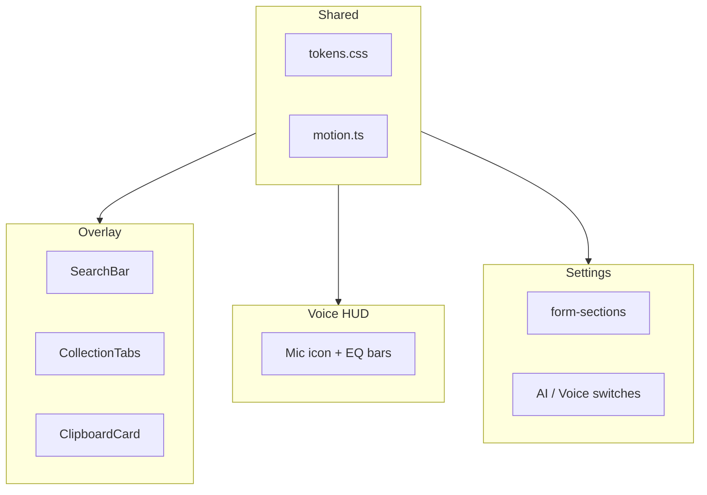
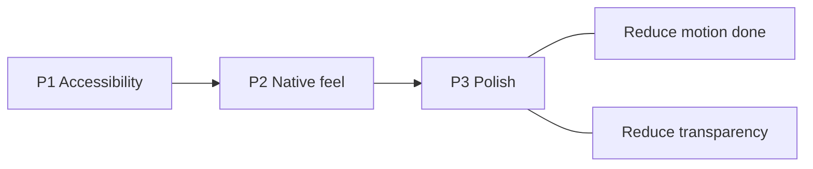

# Copyosity UI — аудит по Apple HIG

Глобальный аудит UI Copyosity по [Apple Human Interface Guidelines](https://developer.apple.com/design/human-interface-guidelines/): clipboard overlay, voice HUD, settings и shared design system. Один файл — общие пункты (motion, tokens, transparency) правятся и отмечаются один раз.

**Прогресс:** только чекбоксы в чеклисте и `✅` в детальных разделах. Без статусных подписей («отложено», «отдельный PR», даты review и т.п.) — всё в списке будет сделано, пункт за пунктом.

**Метки scope:** `[Overlay]` clipboard panel · `[Settings]` settings window · `[Voice]` voice HUD · `[Shared]` tokens / form-controls / button-interaction / motion helper

| Поверхность       | Файлы                                                                                                                                                                                                                                                                                                                                       |
| ----------------- | ------------------------------------------------------------------------------------------------------------------------------------------------------------------------------------------------------------------------------------------------------------------------------------------------------------------------------------------- |
| Clipboard overlay | `[+page.svelte](../../src/routes/+page.svelte)`, `[ClipboardCard.svelte](../../src/lib/components/ClipboardCard.svelte)`, `[TagFilterBar.svelte](../../src/lib/components/TagFilterBar.svelte)`, `[SearchBar.svelte](../../src/lib/components/SearchBar.svelte)`, `[CollectionTabs.svelte](../../src/lib/components/CollectionTabs.svelte)` |
| Voice HUD         | `[overlay/+page.svelte](../../src/routes/overlay/+page.svelte)`                                                                                                                                                                                                                                                                             |
| Settings          | `[settings/+page.svelte](../../src/routes/settings/+page.svelte)`, `[SectionIcon.svelte](../../src/lib/components/SectionIcon.svelte)`                                                                                                                                                                                                      |
| Shared            | `[tokens.css](../../src/lib/styles/tokens.css)`, `[form-controls.css](../../src/lib/styles/form-controls.css)`, `[button-interaction.css](../../src/lib/styles/button-interaction.css)`, `[motion.ts](../../src/lib/motion.ts)`                                                                                                             |

---

## Чеклист (roadmap)

### P1 — Accessibility

- [x] `[Overlay]` Search input в Tab order; focus ring через `:focus-within` на `.search-bar` (п. 4)
- [x] `[Overlay]` убрать global `outline: none`; `focus-visible` на карточки и non-button табы (п. 1)
- [x] `[Overlay]` Paste button на карточке — primary action вместо дублирующего Copy; `Space` на card `role="button"`; `aria-busy` при activate (п. 2, 19 partial)
- [x] `[Overlay]` hit target 28px+ — только search clear (28px); card actions 24px — осознанный trade-off (п. 3)
- [x] `[Overlay]` Search field — чуть менее прозрачный фон и placeholder для читаемости на vibrancy (п. 3)
- [x] `[Shared]` Контраст `--color-text-subtle` / `--color-text-faint`; `prefers-contrast: more` (п. 5)
- [x] `[Shared]` `form-input` / `form-select`: pointer vs keyboard focus rings через `input-modality` (п. 24)
- [x] `[Settings]` Custom model input без связанного `<label>` при preset `__custom__` (п. 26)
- [x] `[Voice]` Baseline live region на HUD при записи (п. 32 — partial)
- [ ] `[Voice]` Полный SR lifecycle (recording → processing → result) → [04-voice-hud-accessibility-full-cycle.md](04-voice-hud-accessibility-full-cycle.md)

### P2 — Native feel

- [x] `[Overlay]` `⌘F` / `/` → search; `←/→` зарезервированы под карточки (п. 4)
- [ ] `[Overlay]` Keyboard hints — контекстный hint в `SearchBar` + footer strip в `+page.svelte` (п. 19)
- [ ] `[Overlay]` Segmented control для History / Starred; tablist ARIA; упростить header (п. 8–9)
- [x] `[Overlay]` SF Pro для plain text, SF Mono только для code-like preview (п. 11)
- [x] `[Overlay]` Развести визуально filter chip (toolbar) и metadata badge (footer карточки) (п. 20)
- [x] `[Settings]` Toggle / section patterns вынести в `form-controls.css` (п. 27)

### P3 — Polish

- [x] `[Overlay]` Empty state fix (фильтр по тегу / search) (п. 18)
- [x] `[Overlay]` Убрать `title` tooltip с карточки (п. 14)
- [x] `[Overlay]` Delete без confirm — продуктовое решение (п. 12)
- [x] `[Overlay]` Фиксированный размер карточек в layout — продуктовое решение (п. 38)
- [x] `[Settings]` Clear history menu + confirm (п. 23)
- [x] `[Shared]` `prefers-reduced-motion` — полное покрытие (п. 21)
- [x] `[Shared]` `prefers-reduced-transparency` — blur fallback (п. 6, 22)
- [x] `[Overlay]` Image meta labels (dimensions вместо «Image preview») (п. 17)
- [x] `[Shared]` Убрать дублирование `title` + `aria-label` на toggles и list actions (п. 25)

### P4 — Native depth

- [ ] `[Shared]` SF Symbols вместо custom stroke SVG (п. 15)
- [ ] `[Shared]` Native vibrancy / light mode (`prefers-color-scheme: light`) (п. 7)
- [x] `[Overlay]` VoiceOver listbox — продуктовое решение, не делаем (п. 35)
- [x] `[Overlay]` Scroll affordances на tag bar (п. 10)

---

## Что уже хорошо

| Область               | Scope             | Реализация                                                                                         |
| --------------------- | ----------------- | -------------------------------------------------------------------------------------------------- |
| Panel / HUD           | Overlay, Voice    | Прозрачные NSPanel-окна, `alwaysOnTop`, без кражи фокуса                                           |
| Settings layout       | Settings          | Секции `form-section`, status steps, Ollama onboarding states по product policy                    |
| Системный шрифт       | Overlay, Settings | `-apple-system, BlinkMacSystemFont`                                                                |
| Семантические цвета   | Shared            | danger / warning / success / accent tokens                                                         |
| Focus ring на кнопках | Shared            | `button.app-btn:focus-visible`                                                                     |
| Form focus            | Shared            | `form-input:focus` ring (`--ring-accent-input`)                                                    |
| Clear history         | Settings          | `ActionMenu` + `ConfirmDialog`; live counts via `history-changed` / `clipboard-changed`            |
| Motion                | Shared            | Reduce Motion: panel, scroll, pulse, spinner, hover, copied, EQ bars, micro-transitions via tokens |
| Search field          | Overlay           | `role="search"`, clear button, `:focus-within` ring                                                |
| Empty state           | Overlay           | Контекстные сообщения, `role="status"`                                                             |
| Toggles a11y          | Settings          | `role="switch"`, `aria-label`, `focus-visible` ring на slider                                      |

---

## Clipboard overlay (п. 1–20)

### ✅ 1. Глобальное отключение outline `[Overlay]`

Убран global `outline: none` в `+page.svelte`; `focus-visible` ring на карточках (`ClipboardCard`) и div-табах коллекций (`CollectionTabs`).

### ✅ 2. Действия карточки при keyboard selection `[Overlay]`

`.card-actions` показываются при hover и при keyboard focus (`:focus-within` + `data-input-modality="keyboard"`); на pinned — звезда всегда видна. `selected` alone не раскрывает toolbar (mouse pin не залипает).

**Сделано в 0.4.0:** redundant Copy заменён на primary **Paste** (`activateEntry`, accent styling, `aria-busy` при activate); клик по карточке по-прежнему копирует; paste также через double-click, Enter, Space на card `role="button"`, и Paste toolbar button.

### ✅ 3. Hit targets и читаемость search `[Overlay]`

**HIG:** 28×28 pt minimum для интерактивных контролов; поля ввода должны оставаться читаемыми на vibrancy-фоне.

**Продуктовое решение (hit targets):** довести hit target до 28px **только** у clear в `SearchBar`. Card action buttons (24×24) и прочие плотные toolbar-контролы **не** раздуваем — узкая карточка (~220px) и плотный header не позволяют без потери layout; альтернативные пути (keyboard, клик/double-click по карточке) уже есть.

| Элемент                                  | Было     | Решение                                |
| ---------------------------------------- | -------- | -------------------------------------- |
| Search clear                             | 20×20 px | → 28×28 px (единственное место по HIG) |
| Card actions (paste, retag, pin, delete) | 24×24 px | Оставить; exception задокументирован   |

**Search readability:** `--surface-control` (6% white) на прозрачной панели давал «текст на текст» — placeholder и ввод плохо читались. Overlay search использует чуть более плотный `--surface-search` и усиленный placeholder; визуально по-прежнему glass, но контраст достаточный.

### ✅ 4. Поиск с клавиатуры `[Overlay]`

`⌘F`, `/`, `←/→`, `Escape`, Unicode search в БД.

**Follow-up:** стрелки в search не двигают курсор — нужны keyboard hints (п. 19).

### ✅ 5. Контраст вторичного текста `[Shared]` `[Overlay]`

`--color-text-subtle` / `--color-text-faint` осветлены; `@media (prefers-contrast: more)` в `tokens.css`.

### ✅ 6. Material / Vibrancy `[Overlay]` `[Voice]` `[Shared]`

| Слой           | Файл                   | Blur                          |
| -------------- | ---------------------- | ----------------------------- |
| Overlay panel  | `+page.svelte`         | `--panel-blur-visible` (34px) |
| Voice HUD      | `overlay/+page.svelte` | 12px                          |
| Copied overlay | `ClipboardCard.svelte` | 6px                           |

`prefers-reduced-transparency`: opaque token fallback, blur off. Settings (`--surface-page` 96% opaque) менее критичен.

### 7. Только Dark `[Shared]`

Нет light-токенов и `prefers-color-scheme: light`.

### 8. Tabs — не segmented control `[Overlay]`

`CollectionTabs.svelte`: нет `aria-selected` / `role="tablist"`; collection tabs — `
`; delete `×` только on hover.

### 9. Перегруженный header `[Overlay]`

Search + tabs + collections + Exclude + gear в одной строке. Exclude → overflow; search flex-grow.

### ✅ 10. Tag filter bar `[Overlay]`

Скрытый scrollbar; шрифт 12px; scroll fade. Filter chips — `.filter-chip` в `TagFilterBar`; отделены от metadata на карточке (п. 20).

### ✅ 11. Моноширинный шрифт для всего preview `[Overlay]`

SF Mono на всём тексте карточки. HIG: SF Pro для body, Mono только для code.

### ✅ 12. Delete без подтверждения `[Overlay]` — продуктовое решение

Одно нажатие X удаляет запись без dialog. Launcher-панель: точечное действие на явной кнопке delete; лишний confirm мешает скорости. Bulk clear — только в Settings с confirm (п. 23).

### ✅ 13. Selection vs Hover states `[Overlay]`

Selected — лёгкий accent fill (`--surface-card-selected`, ~5–7% opacity), ring + `--shadow-card-selected`. Roving `tabindex`: focus следует за `selectedIndex` (стрелки / клик); copied — только overlay, без второго ring.

### ✅ 14. Native tooltip на карточке `[Overlay]`

`title={entry.text_content}` — убрать; Quick Look по `Space` (future).

### 15. Иконография — не SF Symbols `[Shared]`

Custom stroke SVG в overlay и settings.

### ✅ 16. Search field styling `[Overlay]`

Clear button, `:focus-within` ring, `role="search"`, `aria-label`.

### ✅ 17. Image cards — redundant label `[Overlay]`

«Image preview» → dimensions / file size.

### ✅ 18. Empty state copy `[Overlay]`

Контекстные сообщения при search / tag filter; `role="status"`.

### 19. Discoverability paste model и keyboard shortcuts `[Overlay]`

**Сделано (partial):** Paste button на карточке — явный mouse affordance для вставки без double-click.

**Осталось:** footer shortcut strip в `+page.svelte` и контекстный hint в `SearchBar` при focus. Рекомендуемый copy:

| Зона         | Hint                                                                           |
| ------------ | ------------------------------------------------------------------------------ |
| Footer strip | `Click copy` · `↵ paste` · `Double-click paste` · `← → browse` · `Esc dismiss` |
| Search focus | `← → browse results` · `↵ paste selected`                                      |

Paste button в toolbar не дублировать в footer дословно — достаточно «↵ paste» / «Double-click paste», т.к. кнопка видна при hover/selection.

### ✅ 20. Filter chip vs metadata badge — конфликт ролей `[Overlay]` `[Shared]`

**Сделано:** разведены два визуальных слоя — toolbar filter vs card metadata.

| Слой        | Компонент       | Класс                        | Поведение                                                                                                                                                                |
| ----------- | --------------- | ---------------------------- | ------------------------------------------------------------------------------------------------------------------------------------------------------------------------ |
| Toolbar     | `TagFilterBar`  | `.filter-chip`               | `<button>`, pill + border, hover, `aria-pressed`, `.tag-count`                                                                                                           |
| Card footer | `ClipboardCard` | `.entry-tag` в `.entry-tags` | ``, neutral micro-badge (rounded rect, `--surface-entry-tag`, без hover/accent); отличается от plain meta (`source-app`, `char-count`) и от toolbar `.filter-chip` |

Токен `--color-entry-tag` в `tokens.css`. Общий `.tag-chip` между компонентами убран. Клик по тегу на карточке не добавлялся — фильтрация только из toolbar.

**Было:** одинаковые pill-chips (`api 2` вверху vs `api` внизу) — ложный affordance по HIG.

---

## Shared / Motion & Materials (п. 21–22)

### ✅ 21. `prefers-reduced-motion` `[Shared]`

| Область                  | Файл                     | Reduce Motion                                                   |
| ------------------------ | ------------------------ | --------------------------------------------------------------- |
| Micro-transitions        | `tokens.css`             | `--duration-fast/standard/micro/hud/stagger` → `0.01ms` / `0ms` |
| Panel open/close         | `+page.svelte`           | `transition-duration: 0.01ms` (+ tokens)                        |
| Scroll к карточке        | `motion.ts`              | `behavior: "auto"`                                              |
| Status dot checking      | `form-controls.css`      | статичный цвет                                                  |
| Tagging test spinner dot | `form-controls.css`      | то же (`.checking`)                                             |
| Voice mic pulse          | `overlay/+page.svelte`   | без animation                                                   |
| Voice EQ bars            | `overlay/+page.svelte`   | без stagger/wobble/height transition                            |
| Button spinner           | `button-interaction.css` | замедлен (`--duration-spinner-reduced`)                         |
| Settings toggles         | `settings/+page.svelte`  | `transition: none` на slider                                    |
| Card hover               | `ClipboardCard.svelte`   | без `translateY`                                                |
| Copied feedback          | `ClipboardCard.svelte`   | fade вместо scale                                               |

### ✅ 22. `prefers-reduced-transparency` `[Shared]`

Opaque surface tokens в `tokens.css`; `backdrop-filter: none` в `+page.svelte`, `overlay/+page.svelte`, `ClipboardCard.svelte`.

---

## Settings (п. 23–30)

### ✅ 23. Clear history — меню и confirm `[Settings]`

**Было:** одна кнопка без подтверждения. **Сделано:** `Clear history` с меню (unpinned / all…); `ConfirmDialog` со счётчиками; neutral confirm (пользователь уже выбрал действие в меню); success notice в action row; `clear_all_history` для pinned; меню disabled при пустой истории.

### ✅ 24. Form controls: pointer vs keyboard focus `[Shared]`

WebKit в Tauri часто показывает `:focus-visible` при клике мышью. Решение: `input-modality.ts` выставляет `data-input-modality` на `<html>`; `form-controls.css` даёт tight ring на `:focus`, а 3px keyboard halo — только при `[data-input-modality="keyboard"]`.

### ✅ 25. Дублирование `title` и `aria-label` `[Settings]` `[Overlay]`

Убран `title` там, где дублировал `aria-label`: overlay exclude button (`+page.svelte`), AI/Voice toggles, exclude list actions (`settings/+page.svelte`). Test button: `aria-describedby` при `modelDirty` (п. 40), `title` убран.

### ✅ 26. Custom model input `[Settings]`

При `__custom__` — `<label for="custom-ollama-model">` + связанный input.

### ✅ 27. Toggle styles локальны `[Settings]` `[Shared]`

`.toggle` / `.toggle-slider` вынесены в `form-controls.css` (рядом с `.toggle-section-body`); из `settings/+page.svelte` удалены. `border-radius` слайдера — `var(--radius-pill)`.

### ✅ 28. Ollama onboarding `[Settings]`

Status steps соответствуют product policy в `CLAUDE.md`. Spinner / checking dots покрыты Reduce Motion.

### ✅ 29. Settings selection chrome `[Settings]`

`ui-no-select` / `ui-selectable-text` в `form-controls.css`: chrome (секции, ряды, кнопки) не выделяется; текст — заголовки, лейблы, status lines, hints, meta, inputs — `fit-content`, без заливки паддинга. `.settings-page` несёт `ui-no-select`.

### ✅ 30. Danger / destructive actions pattern `[Settings]`

**Сделано:** `ConfirmDialog` только в Settings для bulk clear (п. 23); title — один `?`, message — declarative последствия с bold-счётчиками и `\u00A0`; `ActionMenu` (opaque dropdown, full-width в Storage). Overlay single delete — без confirm (п. 12). Единый паттерн `.inset-list` (разделители только между строками внутри группы); подсекции — `form-subsection` + `form-subsection-rule` с симметричным `--space-subsection`; Storage — `form-field-group` + inline notice без лишнего divider.

---

## Voice HUD (п. 31–33)

### ✅ 31. EQ bars и mic — live feedback `[Voice]`

Reduce Motion: mic без pulse; bars — uniform height по level, без wobble/stagger/height transition (`motion.ts` + CSS).

### 32. Accessibility при записи `[Voice]` (baseline)

**Сделано (baseline):** `role="status"` + `aria-live="polite"` на overlay root; декоративный контент в `aria-hidden` wrapper; sr-only «Recording voice».

**Остаётся:** полный screen-reader lifecycle (повторные сессии, processing, terminal states) — [04-voice-hud-accessibility-full-cycle.md](04-voice-hud-accessibility-full-cycle.md) (источник истины для voice a11y).

### ✅ 33. Blur без transparency fallback `[Voice]`

`prefers-reduced-transparency` — см. п. 6, 22.

---

## Низкий приоритет (п. 34–41)

### ✅ 34. Dynamic Type — фиксированные px `[Shared]`

Шкала `--font-size-*` в `rem` (от `html { font-size: 100% }`), spacing `--space-*` в `rem`, `@supports (font: -apple-system-body)` на `body` для системного шрифта. Типографика в overlay, settings и `form-controls.css` переведена на токены; размер карточки — `--card-width` / `--card-height` в rem. Радиусы и мелкие icon-hit chrome остаются в px.

**Ограничение:** rem-токены не следуют macOS Dynamic Type Text size slider — для полного следования нужен `em` от `body` или environment-based scale. Фиксированные `--card-width` / `--card-height` в layout — продуктовое решение (п. 38).

### ❌ 35. VoiceOver listbox / `aria-label` на карточках `[Overlay]` — продуктовое решение

Карточки в horizontal list без listbox-семантики; нет `aria-label` на уровне entry для SR. Затрагивает **только VoiceOver / screen reader** — на визуальный UI, мышь и текущую keyboard navigation (`←/→`, Enter, Space, Paste) не влияет. На данном этапе продуктово такие правки вносить не планируем: overlay уже закрывает P1 a11y (focus, actions, search); listbox — углубление под SR без изменения поведения для остальных пользователей.

**Отложенный объём работ (для ясности, от чего отказываемся):**

| Область                | Что предполагалось                                                                                                   |
| ---------------------- | -------------------------------------------------------------------------------------------------------------------- |
| `+page.svelte`         | `.grid-container` → `role="listbox"`, `aria-label`, `aria-orientation="horizontal"`, `aria-multiselectable="false"`  |
| `ClipboardCard.svelte` | `role="option"` вместо `role="button"`; `aria-selected`; `aria-posinset` / `aria-setsize`; стабильный `id` на option |
| Новый хелпер           | `buildEntryAriaLabel(entry)` — тип, укороченный preview, время, source app, pinned, теги                             |
| Мелочи                 | `alt=""` на thumb внутри карточки с `aria-label`; `.focus()` на выбранной карточке при `←/→` для следования VO       |
| Ограничение            | Вложенные action-кнопки (Paste / Pin / Delete) конфликтуют со строгим listbox — потребовал бы отдельного компромисса |

### ✅ 36. Pin indicator — только border-color `[Overlay]`

**Было:** pinned state только через полупрозрачный border. **Сделано:** warning border 50%; звезда всегда на кнопке Pin; selection (fill) отделён от keyboard focus ring (`data-input-modality`); после pointer-action — blur с карточки.

### 37. Horizontal scroll-snap `[Overlay]`

Scroll container карточек без `scroll-snap` для keyboard / trackpad navigation.

### ❌ 38. Card width fixed in layout `[Overlay]` — продуктовое решение

`--card-width` / `--card-height` в rem (≈220×288 при 16px root) — намеренно фиксированный размер карточки, не баг layout. Весь overlay (превью, типографика, actions, scroll, keyboard navigation) заточен под эту ширину и высоту; горизонтальный скролл — ожидаемый UX при большом числе записей. Адаптация карточек к ширине панели или числу items на экране не планируется. Не путать с п. 34 (типографика и rem-масштаб от root).

### 39. Collections color dot 8px `[Overlay]`

Color dot коллекции 8×8 px — ниже комфортного минимума для различимости.

### ✅ 40. Test button `disabled` без `aria-describedby` `[Settings]`

`aria-describedby="tagging-test-save-hint"` на Test при `modelDirty`; hint с `id`; `aria-label="Test tagging"`; `title` заменён на describedby.

### ✅ 41. Add-collection inline input — focus ring `[Overlay]`

`.add-form .form-input` в `CollectionTabs.svelte`: focus ring через `--ring-control-focus` / `--ring-accent-input` (keyboard modality); `aria-label="Collection name"`.

---

## Roadmap

| Приоритет | Задачи                                                                                                                              | Файлы                                                                                                                         |
| --------- | ----------------------------------------------------------------------------------------------------------------------------------- | ----------------------------------------------------------------------------------------------------------------------------- |
| **P1**    | focus visible, card actions, contrast, form focus-visible, voice a11y baseline; hit targets; voice SR full cycle                    | overlay components, `form-controls.css`, `overlay/+page.svelte`                                                               |
| **P2**    | keyboard hints, segmented tabs; font by type (п. 11); filter vs metadata badges (п. 20); toggle in form-controls (п. 27)            | `TagFilterBar.svelte`, `ClipboardCard.svelte`, `tokens.css`, overlay components, `settings/+page.svelte`, `form-controls.css` |
| **P3**    | settings clear confirm; empty state, card tooltip, image meta; reduce motion, reduce transparency; title + aria-label dedup (п. 25) | multiple                                                                                                                      |
| **P4**    | SF Symbols, light mode; scroll affordances на tag bar (п. 10) — done; VoiceOver listbox (п. 35) — не делаем                         | multiple                                                                                                                      |

---

## Референсы HIG

- [Materials](https://developer.apple.com/design/human-interface-guidelines/materials)
- [Accessibility](https://developer.apple.com/design/human-interface-guidelines/accessibility)
- [Buttons](https://developer.apple.com/design/human-interface-guidelines/buttons)
- [Labels](https://developer.apple.com/design/human-interface-guidelines/labels)
- [Search fields](https://developer.apple.com/design/human-interface-guidelines/search-fields)
- [Segmented controls](https://developer.apple.com/design/human-interface-guidelines/segmented-controls)
- [Typography](https://developer.apple.com/design/human-interface-guidelines/typography)

---

## Ограничение продукта

README: «never steals focus» — trade-off с HIG launcher pattern. Решение: type-to-search без auto-focus или shortcut-only focus (`⌘F` / `/`).
