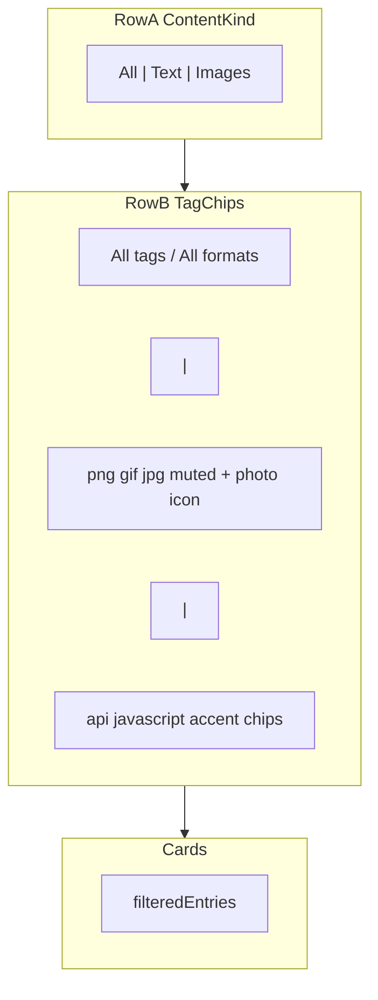
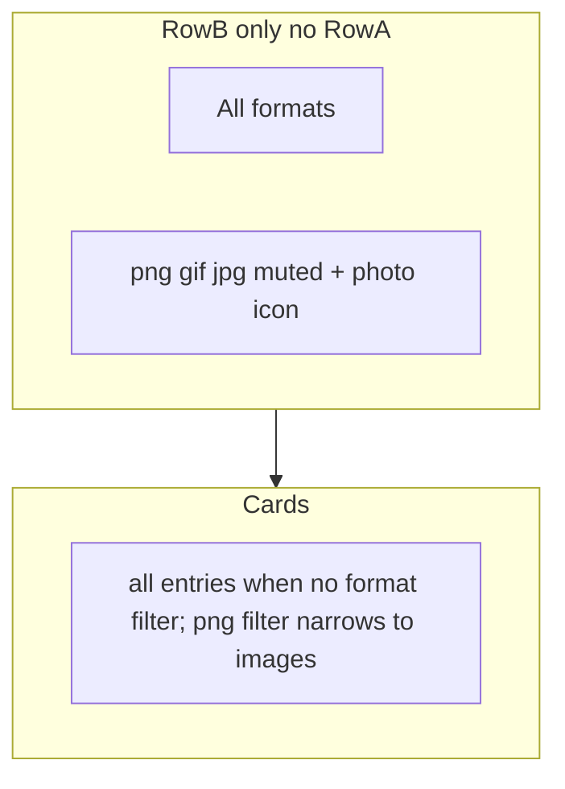

# Overlay — фильтры по типу контента и тегам

Два уровня фильтрации над карточками истории + правки image cards. Связанные пункты UI — в [02-hig-audit.md](02-hig-audit.md).

## Два уровня фильтров

| Уровень | UI | Что фильтрует | Пример |
| ------- | --- | ------------- | ------ |
| **1. Тип контента** | Row A — сегменты `All` / `Text` / `Images` | Показывает все записи, только текст или только картинки | `Images` → скрывает текстовые карточки |
| **2. Теги** | Row B — chips | Уточняет внутри выбранного типа | `png` → только PNG; `api` → текст с AI-тегом api |

**Row B — две группы chips** (в режиме `All`, когда AI включён):

- **Формат** — `png`, `gif`, `jpg` (метаданные картинки, приглушённый стиль + иконка)
- **AI-теги** — `api`, `javascript`, … (семантика текста, accent-стиль)
- Между группами — разделитель `│`

**Цепочка фильтрации:** collection / search → тип контента (Row A) → один активный chip (Row B) → карточки.

**AI tagging выключен в Settings:** Row A скрыт; Row B — только форматы картинок; теги на карточках не показываются.

**Дополнительно:** мета на image cards (`1920 × 1080 · 245 KB` вместо «Image preview»); высота панели по tier — compact 420 / medium 440 / full 480 px.

## Чеклист

- [x] **`overlay-filters.ts`** — `ContentKind`, `buildTagBarModel()`, AI on/off modes
- [x] **AI tagging sync** — `aiTaggingEnabled` из settings при reveal; отдельно от `retagAvailable` (`isTaggingReady`)
- [x] **`ContentKindSegment.svelte`** — Row A (скрыт при AI off)
- [x] **`TagFilterBar.svelte`** — Row B: format/AI chips, photo icon, divider, scroll fade
- [x] **`+page.svelte`** — filter pipeline, empty states, card footer gating
- [x] **Image meta backend** — `image_width`, `image_height`, `image_byte_size` + Rust tests
- [x] **Image meta frontend** — `image-meta.ts`, ClipboardCard; tags скрыты при AI off; mono by textKind; убрать `title`
- [x] **Panel height tiers** — compact 420 / medium 440 / full 480; `resize_main_window` + progressive filter rows
- [x] **Docs** — CHANGELOG; отметить п.10, п.11, п.14, п.17 в `02-hig-audit.md`

---

## Целевой UX — AI tagging **ON**



## Целевой UX — AI tagging **OFF**



Row A **скрыт полностью**. Row B — **только format chips** (как segment Images). Semantic AI chips и divider не рендерятся. На карточках **нет tag chips** (ни AI, ни format в footer).

**Filter pipeline** (один activeTag, без pop-up):

```
entries (API: collection + pinned + search)
  → kindPool (contentKind — только когда AI ON)
  → chip counts (из kindPool, без activeTag)
  → filteredEntries (kindPool + activeTag если задан)
```

| Mode | Row A | Row B | contentKind | Card footer tags |
| ---- | ----- | ----- | ----------- | ---------------- |
| **AI ON — All** | All \| Text \| Images | reset + format \| AI | `all` | AI tags on text; none on image |
| **AI ON — Text** | visible | reset + AI only | `text` | AI tags |
| **AI ON — Images** | visible | All formats + format | `image` | none |
| **AI OFF** | hidden | All formats + format only | implicit `all` | **none** (hide all tags) |

**Segment counts:** без badges на сегментах (счётчики только на chips).

---

## AI tagging enabled vs disabled (полный сценарий)

### Источник truth

- **`aiTaggingEnabled`** — `getAppSettings().ai_tagging_enabled` (только setting, без Ollama)
- **`retagAvailable`** — `isTaggingReady()` (setting + Ollama stack) — **только** для кнопки Retag на text cards

Загрузка `aiTaggingEnabled` при каждом reveal overlay (вместе с `syncRetagAvailability`). Если пользователь выключил AI в Settings и снова открыл panel — UI уже collapsed.

### AI OFF — поведение

1. **Row A** (`ContentKindSegment`) — `display: none`, не занимает место (filter zone ниже).
2. **Row B** — только format group + «All formats» reset; semantic chips и `│` divider не строятся.
3. **`contentKind`** — принудительно `'all'` (не храним Text/Images switch); `kindPool = entries` без kind filter.
4. **`activeTag`** — при переходе AI ON→OFF: сброс, если activeTag — semantic (не format); format tag можно оставить.
5. **При переходе AI OFF→ON**: `contentKind = 'all'`, `activeTag = null` (чистый старт full UI).
6. **Card footer**: `showTags = aiTaggingEnabled && displayTags.length > 0`; format tags на image cards **никогда** в footer (AI on или off).
7. **Retag button**: только `retagAvailable` (без изменений).
8. **DB stale tags**: записи могут содержать AI tags в БД — UI их **не показывает и не считает** при `aiTaggingEnabled === false`. `buildTagBarModel()` игнорирует non-format tags.

### Progressive disclosure — когда скрывать полосы

| Row | Показывать когда |
| --- | ---------------- |
| **Row A** | AI ON **и** в pool есть **и** text **и** image entries |
| **Row B** | Есть chips (format/semantic) **или** активный `activeTag` **или** выбран сегмент Text/Images при Row A |

При пустом результате фильтра полосы **не скрываем** (sticky `activeTag` / segment).

### Panel height tiers

| Tier | px | Когда |
| ---- | -- | ----- |
| **compact** | 420 | Нет filter rows (и нет settings notice) |
| **medium** | 440 | Одна полоса (Row B или notice) |
| **full** | 480 | Row A + Row B |

`resize_main_window` при reveal; плавный resize при смене tier с открытым overlay (Reduce Motion → instant).

---

## 1. Новые компоненты и shared constants

| Файл | Назначение |
| ---- | ---------- |
| [`src/lib/overlay-filters.ts`](../../src/lib/overlay-filters.ts) | Pure logic: `ContentKind`, matching, `buildTagBarModel({ entries, contentKind, aiTaggingEnabled, activeTag, ... })` → `{ showRowA, showRowB, resetLabel, formatChips, semanticChips, showDivider }` |
| [`src/lib/components/ContentKindSegment.svelte`](../../src/lib/components/ContentKindSegment.svelte) | Row A — только при `aiTaggingEnabled` |
| [`src/lib/components/TagFilterBar.svelte`](../../src/lib/components/TagFilterBar.svelte) | Row B |

**State в [`+page.svelte`](../../src/routes/+page.svelte):**

- `aiTaggingEnabled: boolean` — из settings
- `contentKind: 'all' | 'text' | 'image'` — только при AI ON
- `activeTag: string | null`
- При смене `contentKind`: сброс incompatible `activeTag`
- `contentKind` сохраняем в сессии при AI ON; сброс при AI OFF→ON

**Keyboard:**

- **←/→ только для карточек** — без изменений, global capture в `handleKeydown`.
- Segment controls: **нет** arrow navigation; только Tab + Enter/Space. Segment buttons не перехватывают ←/→.

---

## 2. Row A — Segmented control

- Высота ~28–32px, grouped background, selected segment elevated
- Padding: `12px 16px 8px`; font **13px**
- `:focus-visible` ring; `role="tablist"` / `role="tab"` / `aria-selected`
- Labels: `All`, `Text`, `Images`
- **Rendered only when `aiTaggingEnabled`**

---

## 3. Row B — Tag chips

- Font **12px**; scroll fade (mask gradient)
- **Format chips**: muted + mono + 12×12 photo SVG icon
- **AI chips**: accent (только AI ON + relevant segment)
- **Divider `│`**: только AI ON + segment All + обе группы непустые
- Reset label: «All tags» (AI ON) / «All formats» (Images segment или AI OFF)

---

## 4. Filter logic

```typescript
const kindPool = aiTaggingEnabled
  ? entries.filter((e) => entryMatchesKind(e, contentKind))
  : entries;

const filteredEntries = kindPool.filter(
  (e) => !activeTag || entryMatchesTag(e, activeTag),
);
```

**Empty states** — расширить для contentKind, format tags, AI OFF (no format match).

---

## 5. Image meta на карточках

### Backend

- Columns: `image_width`, `image_height`, `image_byte_size`
- Capture in [`clipboard_monitor.rs`](../../src-tauri/src/clipboard_monitor.rs); backfill batch; extend `get_entries` SELECT
- Rust unit tests for backfill + insert round-trip

### Frontend

- [`src/lib/image-meta.ts`](../../src/lib/image-meta.ts): `formatImageMeta()` → `1920 × 1080 · 245 KB`
- Replace «Image preview» in `.image-meta`
- Header badge `Image · PNG` сохраняем

---

## 6. Связанные пункты аудита (02-hig-audit)

| Audit | Действие |
| ----- | -------- |
| п.17 Image meta | dimensions + file size |
| п.10 Tag bar | 12px, scroll fade |
| п.14 Card tooltip | убрать `title={entry.text_content}` |
| п.11 Mono for code | font by `textKind` |
| п.18 Empty state | contentKind + format + AI modes |

**Не в scope:** п.8 History/Starred segmented, п.12 undo, п.19 hints, п.15 SF Symbols, Quick Look (остаётся только в audit п.14, **не** в CHANGELOG).

---

## 7. Tests

**Без новых JS test runners** — frontend filter logic покрывается manual QA; автотесты только Rust (image meta).

### Rust tests (extend `db.rs` / monitor tests)

- Insert image entry → width/height/byte_size persisted
- `get_entries` returns meta columns
- Backfill fills null meta from thumb b64

### Manual QA checklist (overlay-filters + AI modes)

**AI ON:**

- Segment All → format + semantic chips + divider when both exist
- Segment Text → semantic only, no format chips
- Segment Images → format only, reset = «All formats»
- Tap png → only PNG images; switch Text → semantic tag kept; switch Images → format tag cleared
- Hidden tags (`code`, `otp`) not in bar; visible on text card footer when AI ON
- ←/→ navigate cards (focus in search, segment, or body)

**AI OFF:**

- Row A hidden; Row B format chips only; no divider
- Row B hidden when no images in history
- No tag chips on any card footer (including stale DB tags)
- Toggle AI in Settings → reopen panel → UI matches mode
- Format filter still works (png/gif/jpg)

**Image meta:**

- Card shows `W × H · size`; no «Image preview»; no format chip in footer

---

## 8. Высота overlay

- Tiers: **420 / 440 / 480** — [`overlay-layout.ts`](../../src/lib/overlay-layout.ts), [`overlay-resize.ts`](../../src/lib/overlay-resize.ts), `resize_main_window` in Rust
- Default window height in [`tauri.conf.json`](../../src-tauri/tauri.conf.json): compact (420)

---

## 9. Verification

```bash
npm run check
cd src-tauri && cargo test
cd src-tauri && cargo check
```

---

## 10. Документация

- [02-hig-audit.md](02-hig-audit.md): mark п.10, п.11, п.14, п.17 done
- [CHANGELOG.md](../../CHANGELOG.md): overlay filters, AI-off mode, image meta, panel height (no Quick Look mention)
