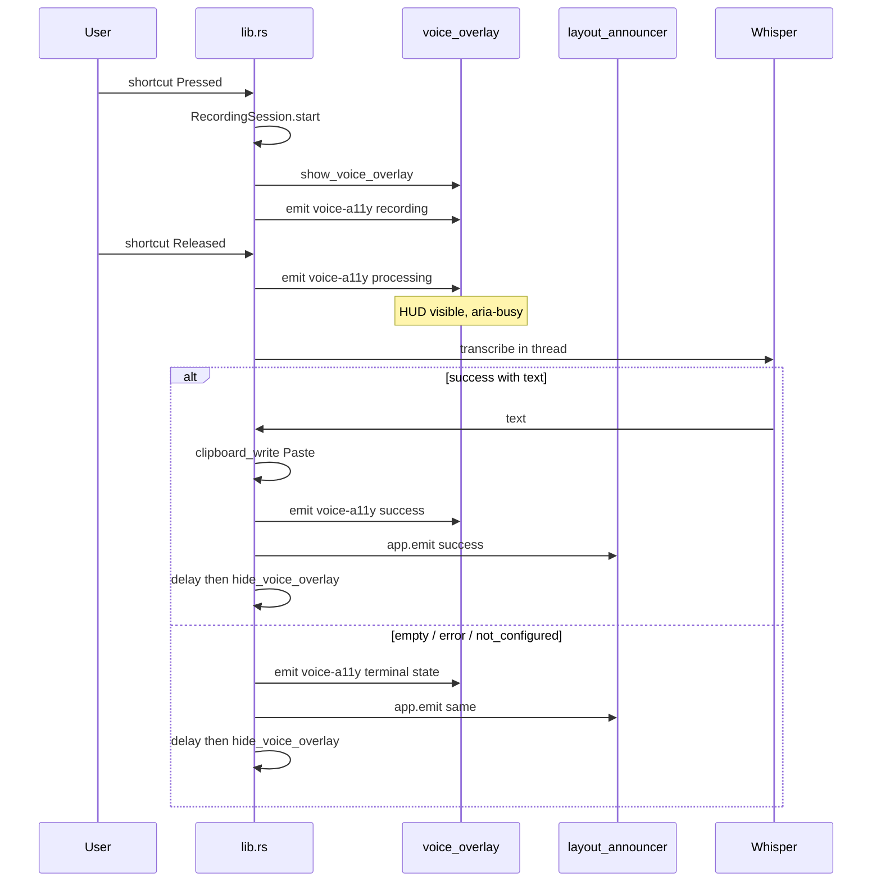
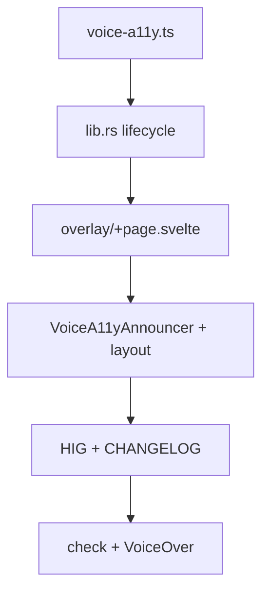

# Voice HUD — полный цикл accessibility

Полный screen-reader lifecycle для Voice HUD: start → processing → terminal (success / empty / error / not configured). Baseline HUD (статичный live region) — в [02-hig-audit.md](02-hig-audit.md) п. 32; **этот план — источник истины** для полного цикла.

**Принято:** HUD **остаётся видимым** во время транскрипции (не скрывать сразу при отпускании shortcut).

| Поверхность          | Файлы                                                                                                                                  |
| -------------------- | -------------------------------------------------------------------------------------------------------------------------------------- |
| Voice HUD            | `[overlay/+page.svelte](../../src/routes/overlay/+page.svelte)`                                                                        |
| Глобальный announcer | `[VoiceA11yAnnouncer.svelte](../../src/lib/components/VoiceA11yAnnouncer.svelte)`, `[+layout.svelte](../../src/routes/+layout.svelte)` |
| Shared types         | `[voice-a11y.ts](../../src/lib/voice-a11y.ts)`                                                                                         |
| Backend lifecycle    | `[lib.rs](../../src-tauri/src/lib.rs)`                                                                                                 |

---

## Проблема

Сейчас `[overlay/+page.svelte](../../src/routes/overlay/+page.svelte)` объявляет статичное «Recording voice», но:

- на macOS панель `voice_overlay` **не уничтожается** при `hide()` — повторная запись не переозвучивается;
- при `Released` HUD **скрывается сразу** (`[hide_voice_overlay](../../src-tauri/src/lib.rs)`) — screen reader не слышит processing / result;
- `audio-level` (каждые ~60 ms) **нельзя** класть в live region (спам, против HIG).

## Цель

Полный цикл для screen readers без спама уровнем звука:

1. **Recording** — «Recording voice», `aria-busy`
2. **Processing** — «Processing speech», HUD видим
3. **Terminal** — success / empty / error / not configured → озвучка → задержка → hide

### Ограничение (не в scope)

Web live regions работают в webview Copyosity. Когда все окна скрыты и фокус в другом приложении, VoiceOver может не получить финальное объявление. Follow-up: нативные AX announcements (`NSAccessibilityPostNotification`) — отдельная итерация.

---

## Чеклист

- [ ] `**voice-a11y.ts`\*\* — типы, константы сообщений, `subscribeVoiceA11y`, helpers дедупа
- [ ] **Rust `lib.rs`** — `voice-a11y` events, seq, HUD visible до конца транскрипции, delayed hide
- [ ] `**overlay/+page.svelte**` — phase state machine, `aria-busy`, processing visuals
- [ ] `**VoiceA11yAnnouncer.svelte**` — глобальный sr-only announcer
- [ ] `**+layout.svelte**` — mount announcer (main + settings + overlay routes)
- [ ] **Permissions** — описание в `voice-overlay-commands.toml`
- [x] **HIG audit** — п. 32 baseline в [02-hig-audit.md](02-hig-audit.md); полный цикл — этот план
- [ ] **CHANGELOG** — Unreleased: voice a11y lifecycle
- [ ] **Верификация** — `npm run check`, `cargo check`, ручный VoiceOver pass

---

## Архитектура



---

## Единый payload (Rust + TypeScript)

```ts
type VoiceA11yPhase =
  | "recording"
  | "processing"
  | "success"
  | "empty"
  | "error"
  | "not_configured"
  | "idle";

type VoiceA11yEvent = {
  phase: VoiceA11yPhase;
  message: string; // user-facing English (как весь UI)
  seq: number; // монотонный id — дедуп между webviews
};
```

### Сообщения

| phase          | message                       |
| -------------- | ----------------------------- |
| recording      | Recording voice               |
| processing     | Processing speech             |
| success        | Text copied to clipboard      |
| empty          | No speech detected            |
| error          | Voice transcription failed    |
| not_configured | Whisper server not configured |
| idle           | (пустая строка — сброс)       |

Дополнительно при ошибке старта микрофона: `Could not start microphone`.

Для `error` после транскрипции — в UI только generic message; детали только в `eprintln!` (без URL/token в live region).

---

## Backend — `[src-tauri/src/lib.rs](../../src-tauri/src/lib.rs)`

### Новые хелперы

- `static VOICE_A11Y_SEQ: AtomicU64`
- `enum VoiceA11yTarget { Overlay, All }`
- `fn emit_voice_a11y(app, target, phase, message)`:
  - `Overlay` → `app.emit_to("voice_overlay", "voice-a11y", payload)`
  - `All` → `app.emit("voice-a11y", payload)`

### `handle_voice_event` — Pressed

После успешного `RecordingSession::start`:

1. `show_voice_overlay(app)`
2. `emit_voice_a11y(app, Overlay, "recording", "Recording voice")`
3. audio-level thread — без изменений

При ошибке старта микрофона:

- `emit_voice_a11y(app, All, "error", "Could not start microphone")`
- HUD не показывать

### `handle_voice_event` — Released

1. `session = recording_mutex().take()`; если `None` — return
2. `**hide_voice_overlay` не вызывать\*\*
3. `emit_voice_a11y(app, Overlay, "processing", "Processing speech")`
4. `spawn` transcription thread (существующая логика), внутри:

- `whisper_server_url.is_empty()` → `not_configured` → emit Overlay + All → `sleep(400ms)` → `hide_voice_overlay` → `idle`
- `transcribe_audio` Ok + non-empty → paste → `success` → emit Overlay + All → `sleep(400ms)` → hide → `idle`
- Ok empty → `empty` → emit → delay → hide → `idle`
- Err → `error` → emit → delay → hide → `idle`

**Задержка ~400 ms** после terminal phase — SR успевает озвучить; HUD показывает terminal state через overlay.

### Non-macOS

`hide_voice_overlay` закрывает окно — при следующем `show` webview remount → re-announce. Lifecycle тот же.

---

## Frontend — shared `[src/lib/voice-a11y.ts](../../src/lib/voice-a11y.ts)`

- Экспорт `VoiceA11yPhase`, `VoiceA11yEvent`
- `VOICE_A11Y_MESSAGES` — константы
- `shouldAnnounceGlobally(phase)` — terminal phases + error на старте
- `shouldAnnounceInOverlay(phase)` — recording, processing, terminal
- `subscribeVoiceA11y(handler)` — `listen("voice-a11y", ...)`

---

## Frontend — overlay `[overlay/+page.svelte](../../src/routes/overlay/+page.svelte)`

State: `phase`, `statusMessage`, `busy`.

```svelte
<div class="overlay" role="status" aria-live="polite" aria-atomic="true" aria-busy={busy}>
  {#if statusMessage}
    <span class="sr-only">{statusMessage}</span>
  {/if}
  <div class="content" aria-hidden="true">
    <!-- mic + eq -->
  </div>
</div>
```

- `onMount`: слушать `voice-a11y`, обновлять state (`shouldAnnounceInOverlay`)
- При `processing` / terminal: mic без pulse, bars static (reuse reduced-motion path)
- `audio-level` listener — **не** трогать live region

---

## Frontend — глобальный announcer

### `[VoiceA11yAnnouncer.svelte](../../src/lib/components/VoiceA11yAnnouncer.svelte)`

- sr-only `role="status" aria-live="polite" aria-atomic="true"`
- Слушает `voice-a11y` если `shouldAnnounceGlobally(phase)` **и** `document.visibilityState === "visible"`
- Дедуп по `seq` (пропуск повторов между webviews)
- Terminal message → показать → через ~3 s сброс в `""`

### `[+layout.svelte](../../src/routes/+layout.svelte)`

- `<VoiceA11yAnnouncer />` рядом с `{@render children()}`

---

## Capabilities

- `[voice-overlay-commands.toml](../../src-tauri/permissions/voice-overlay-commands.toml)` — обновить description: audio-level + voice-a11y
- `core:event:default` уже в `main.json` / `voice_overlay.json` — новых ACL не нужно

---

## HIG audit

Обновить [02-hig-audit.md](02-hig-audit.md) п. 32:

- Полный lifecycle recording → processing → terminal
- HUD visible during processing
- `aria-busy` на overlay
- Глобальный announcer в layout (fallback при открытых settings)
- audio-level не в live region
- Ограничение web-only announcements

---

## CHANGELOG

В Unreleased `[CHANGELOG.md](../../CHANGELOG.md)`:

- Voice: full screen-reader lifecycle for recording HUD
- Voice: HUD stays visible during transcription

---

## Тест-план (ручной)

1. **VoiceOver + запись:** hold shortcut → «Recording voice»; release → «Processing speech»; success → «Text copied to clipboard»; HUD скрывается.
2. **Повторная запись** (macOS): каждый цикл озвучивается (`seq` меняется).
3. **Пустой Whisper URL** → «Whisper server not configured».
4. **Пустая транскрипция** → «No speech detected».
5. **Settings открыты, main скрыт:** announcer в settings webview (`visibilityState === visible`).
6. **Reduce Motion:** bars static при processing.
7. `npm run check` + `cd src-tauri && cargo check`.

---

## Порядок реализации



1. `voice-a11y.ts` + типы
2. Rust: seq + emit helpers + refactor `handle_voice_event`
3. `overlay/+page.svelte` state machine + processing visuals
4. `VoiceA11yAnnouncer.svelte` + `+layout.svelte`
5. HIG audit + CHANGELOG
6. Compile checks + manual VoiceOver pass
