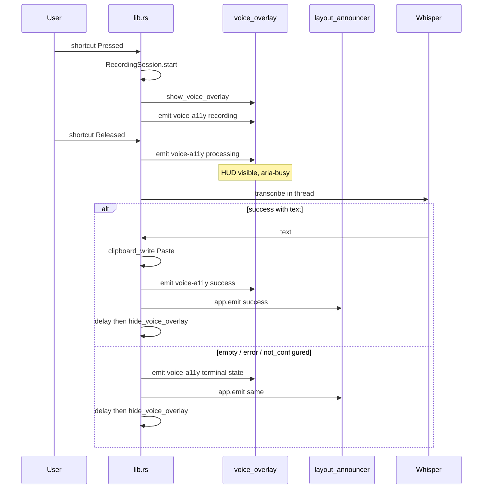
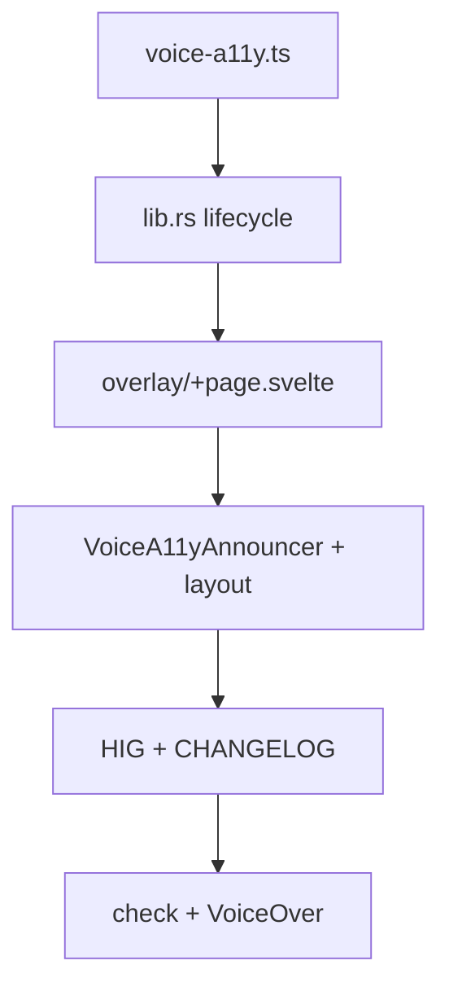

# Voice HUD — full accessibility lifecycle

Full screen-reader lifecycle for Voice HUD: start → processing → terminal (success / empty / error / not configured). Baseline HUD (static live region) — in [02-hig-audit.md](02-hig-audit.md) item 32; **this plan is the source of truth** for the full cycle. Backlog 0.4.0 — [03-new-features-and-improvements.md](03-new-features-and-improvements.md).

**Decided:** HUD **stays visible** during transcription (do not hide immediately on shortcut release).

| Surface           | Files                                                                                                                                  |
| ----------------- | -------------------------------------------------------------------------------------------------------------------------------------- |
| Voice HUD         | `[overlay/+page.svelte](../../src/routes/overlay/+page.svelte)`                                                                        |
| Global announcer  | `[VoiceA11yAnnouncer.svelte](../../src/lib/components/VoiceA11yAnnouncer.svelte)`, `[+layout.svelte](../../src/routes/+layout.svelte)` |
| Shared types      | `[voice-a11y.ts](../../src/lib/voice-a11y.ts)`                                                                                         |
| Backend lifecycle | `[lib.rs](../../src-tauri/src/lib.rs)`                                                                                                 |

---

## Problem

Currently `[overlay/+page.svelte](../../src/routes/overlay/+page.svelte)` announces static "Recording voice", but:

- on macOS the `voice_overlay` panel is **not destroyed** on `hide()` — repeated recordings are not re-announced;
- on `Released` the HUD **hides immediately** (`[hide_voice_overlay](../../src-tauri/src/lib.rs)`) — screen reader does not hear processing / result;
- `audio-level` (every ~60 ms) **must not** go into the live region (spam, against HIG).

## Goal

Full cycle for screen readers without audio-level spam:

1. **Recording** — "Recording voice", `aria-busy`
2. **Processing** — "Processing speech", HUD visible
3. **Terminal** — success / empty / error / not configured → announce → delay → hide

### Limitation (out of scope)

Web live regions work in the Copyosity webview. When all windows are hidden and focus is in another app, VoiceOver may not receive the final announcement. Follow-up: native AX announcements (`NSAccessibilityPostNotification`) — separate iteration.

---

## Checklist

- [ ] `**voice-a11y.ts`\*\* — types, message constants, `subscribeVoiceA11y`, dedup helpers
- [ ] **Rust `lib.rs`** — `voice-a11y` events, seq, HUD visible until transcription ends, delayed hide
- [ ] `**overlay/+page.svelte**` — phase state machine, `aria-busy`, processing visuals
- [ ] `**VoiceA11yAnnouncer.svelte**` — global sr-only announcer
- [ ] `**+layout.svelte**` — mount announcer (main + settings + overlay routes)
- [ ] **Permissions** — description in `voice-overlay-commands.toml`
- [x] **HIG audit** — item 32 baseline in [02-hig-audit.md](02-hig-audit.md); full cycle — this plan
- [ ] **CHANGELOG** — Unreleased: voice a11y lifecycle
- [ ] **Verification** — `npm run check`, `cargo check`, manual VoiceOver pass

---

## Architecture



---

## Unified payload (Rust + TypeScript)

```ts
type VoiceA11yPhase =
  | "recording"
  | "processing"
  | "success"
  | "empty"
  | "error"
  | "not_configured"
  | "idle";

type VoiceA11yEvent = {
  phase: VoiceA11yPhase;
  message: string; // user-facing English (like the rest of the UI)
  seq: number; // monotonic id — dedup across webviews
};
```

### Messages

| phase          | message                       |
| -------------- | ----------------------------- |
| recording      | Recording voice               |
| processing     | Processing speech             |
| success        | Text copied to clipboard      |
| empty          | No speech detected            |
| error          | Voice transcription failed    |
| not_configured | Whisper server not configured |
| idle           | (empty string — reset)        |

Additionally on microphone start error: `Could not start microphone`.

For `error` after transcription — generic message only in UI; details only in `eprintln!` (no URL/token in live region).

---

## Backend — `[src-tauri/src/lib.rs](../../src-tauri/src/lib.rs)`

### New helpers

- `static VOICE_A11Y_SEQ: AtomicU64`
- `enum VoiceA11yTarget { Overlay, All }`
- `fn emit_voice_a11y(app, target, phase, message)`:
  - `Overlay` → `app.emit_to("voice_overlay", "voice-a11y", payload)`
  - `All` → `app.emit("voice-a11y", payload)`

### `handle_voice_event` — Pressed

After successful `RecordingSession::start`:

1. `show_voice_overlay(app)`
2. `emit_voice_a11y(app, Overlay, "recording", "Recording voice")`
3. audio-level thread — unchanged

On microphone start error:

- `emit_voice_a11y(app, All, "error", "Could not start microphone")`
- do not show HUD

### `handle_voice_event` — Released

1. `session = recording_mutex().take()`; if `None` — return
2. `**hide_voice_overlay` must not be called\*\*
3. `emit_voice_a11y(app, Overlay, "processing", "Processing speech")`
4. `spawn` transcription thread (existing logic), inside:

- `whisper_server_url.is_empty()` → `not_configured` → emit Overlay + All → `sleep(400ms)` → `hide_voice_overlay` → `idle`
- `transcribe_audio` Ok + non-empty → paste → `success` → emit Overlay + All → `sleep(400ms)` → hide → `idle`
- Ok empty → `empty` → emit → delay → hide → `idle`
- Err → `error` → emit → delay → hide → `idle`

**~400 ms delay** after terminal phase — SR has time to announce; HUD shows terminal state via overlay.

### Non-macOS

`hide_voice_overlay` closes the window — on next `show` webview remounts → re-announce. Same lifecycle.

---

## Frontend — shared `[src/lib/voice-a11y.ts](../../src/lib/voice-a11y.ts)`

- Export `VoiceA11yPhase`, `VoiceA11yEvent`
- `VOICE_A11Y_MESSAGES` — constants
- `shouldAnnounceGlobally(phase)` — terminal phases + error on start
- `shouldAnnounceInOverlay(phase)` — recording, processing, terminal
- `subscribeVoiceA11y(handler)` — `listen("voice-a11y", ...)`

---

## Frontend — overlay `[overlay/+page.svelte](../../src/routes/overlay/+page.svelte)`

State: `phase`, `statusMessage`, `busy`.

```svelte
<div class="overlay" role="status" aria-live="polite" aria-atomic="true" aria-busy={busy}>
  {#if statusMessage}
    <span class="sr-only">{statusMessage}</span>
  {/if}
  <div class="content" aria-hidden="true">
    <!-- mic + eq -->
  </div>
</div>
```

- `onMount`: listen to `voice-a11y`, update state (`shouldAnnounceInOverlay`)
- On `processing` / terminal: mic without pulse, bars static (reuse reduced-motion path)
- `audio-level` listener — **do not** touch live region

---

## Frontend — global announcer

### `[VoiceA11yAnnouncer.svelte](../../src/lib/components/VoiceA11yAnnouncer.svelte)`

- sr-only `role="status" aria-live="polite" aria-atomic="true"`
- Listens to `voice-a11y` if `shouldAnnounceGlobally(phase)` **and** `document.visibilityState === "visible"`
- Dedup by `seq` (skip repeats across webviews)
- Terminal message → show → reset to `""` after ~3 s

### `[+layout.svelte](../../src/routes/+layout.svelte)`

- `<VoiceA11yAnnouncer />` next to `{@render children()}`

---

## Capabilities

- `[voice-overlay-commands.toml](../../src-tauri/permissions/voice-overlay-commands.toml)` — update description: audio-level + voice-a11y
- `core:event:default` already in `main.json` / `voice_overlay.json` — no new ACL needed

---

## HIG audit

Update [02-hig-audit.md](02-hig-audit.md) item 32:

- Full lifecycle recording → processing → terminal
- HUD visible during processing
- `aria-busy` on overlay
- Global announcer in layout (fallback when settings are open)
- audio-level not in live region
- Web-only announcements limitation

---

## CHANGELOG

In Unreleased `[CHANGELOG.md](../../CHANGELOG.md)`:

- Voice: full screen-reader lifecycle for recording HUD
- Voice: HUD stays visible during transcription

---

## Test plan (manual)

1. **VoiceOver + recording:** hold shortcut → "Recording voice"; release → "Processing speech"; success → "Text copied to clipboard"; HUD hides.
2. **Repeated recording** (macOS): each cycle is announced (`seq` changes).
3. **Empty Whisper URL** → "Whisper server not configured".
4. **Empty transcription** → "No speech detected".
5. **Settings open, main hidden:** announcer in settings webview (`visibilityState === visible`).
6. **Reduce Motion:** bars static during processing.
7. `npm run check` + `cd src-tauri && cargo check`.

---

## Implementation order



1. `voice-a11y.ts` + types
2. Rust: seq + emit helpers + refactor `handle_voice_event`
3. `overlay/+page.svelte` state machine + processing visuals
4. `VoiceA11yAnnouncer.svelte` + `+layout.svelte`
5. HIG audit + CHANGELOG
6. Compile checks + manual VoiceOver pass
