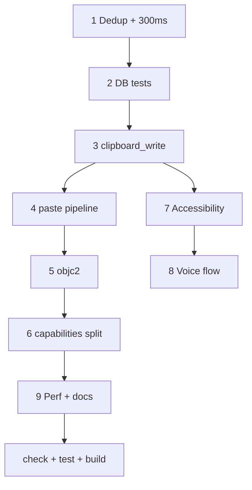

# macOS Intel — план фиксов перед релизом

Фиксы и подготовка проекта к релизу с поддержкой **сборки под Intel (x86_64)** и сопутствующими улучшениями macOS (буфер, вставка, права окон, тесты).  
Опирается на сделанное в [01-macos-intel-build-improvements.md](01-macos-intel-build-improvements.md).

## Принятые решения

| Тема                | Решение                                                                                             |
| ------------------- | --------------------------------------------------------------------------------------------------- |
| Дубликаты в истории | Как на `main`: одинаковый контент не плодит записи; copy/paste из приложения не попадают в историю  |
| Интервал монитора   | **300 ms**; `changeCount` только триггер опроса, не часть hash                                      |
| Clipboard write     | Единый [`clipboard_write.rs`](../../src-tauri/src/clipboard_write.rs) — режимы **Copy** / **Paste** |
| Tauri ACL           | Отдельные capabilities для `main` / `settings` / `voice_overlay`                                    |
| objc                | Миграция [`clipboard_macos.rs`](../../src-tauri/src/clipboard_macos.rs) на **objc2** в этом же PR   |
| Объём               | Всё ниже — один PR / релизный коммит, без отложенного follow-up                                     |

**paste_entry (согласовано):** общий `paste_text_into_target`; `paste_entry` — обёртка как на `main`; текстовый `activate_entry` — тот же pipeline; Enter в UI — `activateEntry`.

---

## Чеклист

- [x] **Дедуп истории** — `content_hash` = только base hash; на macOS `last_content_hash` при смене `changeCount`; сброс hash при опустошении unpinned-истории; `mark_own` / `exclude` без изменений
- [x] **Unit-тесты БД** — починить `update_settings`; тесты частичного update (Whisper/voice/mic не затираются)
- [x] **Accessibility** — без prompt в `finish_paste`; `check_accessibility(prompt)` — prompt только с кнопки Request
- [x] **clipboard_write unified** — Copy/Paste; voice, copy, activate, paste через один модуль
- [x] **paste pipeline** — `paste_text_into_target`; `paste_entry` + текстовый `activate_entry`
- [x] **Монитор 300 ms** — `changeCount` только как событие
- [x] **objc2** — переписать `clipboard_macos`; убрать `objc` crate где возможно (включая AX в `commands.rs`)
- [x] **Capabilities split** — `main.json` / `settings.json` / `voice_overlay.json`; явные `allow-*`; обновить AGENTS.md
- [x] **Security hardening** — валидация имени Ollama-модели (allowlist/regex) перед `ollama pull`; `cargo audit` в release CI
- [x] **Perf** — один `get_frontmost_app` в цикле `file_list`; лимит размера image-файла (~20 MB)
- [x] **Docs / PR** — README, AGENTS, Makefile; test plan в описании PR
- [x] **Верификация** — `make check`, `cargo test`, `make build-macos-intel` зелёные

---

## 1. Дедуп истории

Сейчас `content_hash = "{base}:{changeCount}"` ломает дедуп в `insert_entry`.

**Целевое поведение (macOS):**

1. `content_hash` = только **base_hash** (текст / raster / файл).
2. При новом `changeCount` — probe hash контента; если совпадает с `last_content_hash` → не писать в БД.
3. Сохранить `mark_own_clipboard_write`, `should_ignore_capture`, `is_concealed`.
4. Сброс `last_content_hash` при опустошении unpinned-истории: `clear_history` и удаление последней unpinned записи (`notify_history_cleared`) — иначе повторное копирование того же файла после очистки не попадает в историю.

**Тесты:** повторный `content_hash` → `insert_entry` возвращает `is_new == false`; `history_clear_allows_recapture_of_same_hash`; `delete_last_unpinned_entry_reports_empty_history`.

---

## 2. Unit-тесты БД

Исправить вызов `update_app_settings` (7 аргументов). Усилить:

- Частичный update не затирает whisper / voice / mic.
- Отдельный тест update только `whisper_server_url`.

Без пустых `None` там, где нужно проверить сохранение — явные значения в helper.

---

## 3. Accessibility UX

- `finish_paste`: без прав — hide + буфер готов, **без** системного prompt на каждый paste.
- `check_accessibility(prompt: bool)`: mount/recheck с `false`, «Request» с `true`.

---

## 4. Единый `clipboard_write`

```text
enum ClipboardWriteMode {
  Copy,   // exclude_from_history + mark_own
  Paste,  // pasteboard для target app + mark_own
}
```

- Убрать `write_clipboard_for_paste` из `commands.rs`.
- `copy_entry`, `activate_entry`, voice (`lib.rs`), `paste_entry` — через модуль.
- Voice: `restore_paste_target` перед Cmd+V, как у `activate_entry`.

---

## 5. Paste pipeline (`paste_entry` / Enter)

| Действие                             | Реализация                                  |
| ------------------------------------ | ------------------------------------------- |
| Один клик                            | `copy_entry` / `Copy`                       |
| Двойной клик                         | `activate_entry`                            |
| Enter + текст (раньше `paste_entry`) | `activate_entry` → `paste_text_into_target` |
| Enter + image                        | `activate_entry` (новое, старое не ломаем)  |

```rust
fn paste_text_into_target(app: &AppHandle, text: String) -> Result<(), String> { ... }

pub fn paste_entry(app: AppHandle, text: String) -> Result<(), String> {
    paste_text_into_target(&app, text)
}
```

Enter в [`+page.svelte`](../../src/routes/+page.svelte) — `activateEntry`; `pasteEntry` в api.ts — thin invoke или `@deprecated`.

---

## 6. Монитор: 300 ms + changeCount

В [`clipboard_monitor.rs`](../../src-tauri/src/clipboard_monitor.rs): `sleep(300ms)`; `changeCount` = «буфер изменился»; дедуп через `last_content_hash`; `notify_history_cleared` при `clear_history` и когда удалена последняя unpinned запись.

---

## 7. Миграция `clipboard_macos` на objc2

- NSPasteboard, changeCount, concealed — objc2 + foundation/app-kit.
- NSWorkspace / NSRunningApplication — objc2.
- Cmd+V — CoreGraphics FFI (как сейчас) или отдельный модуль.
- Убрать `objc = "0.2"` из Cargo.toml после переноса AX-проверки в `commands.rs`.

---

## 8. Права команд по окнам (Tauri capabilities)

Заменить общий `core:default` на:

| Файл                              | Окно            | Команды (примерно)                                                  |
| --------------------------------- | --------------- | ------------------------------------------------------------------- |
| `capabilities/main.json`          | `main`          | entries, copy, activate, hide, events                               |
| `capabilities/settings.json`      | `settings`      | settings, excluded apps, clear_history, ollama, check_accessibility |
| `capabilities/voice_overlay.json` | `voice_overlay` | минимум (events)                                                    |

Проверить `tauri dev` / `tauri build`. Закрыть TODO в AGENTS.md про scoping:

- `settings` не получает `paste_entry`
- `voice_overlay` не получает `clear_history`, `start_ollama_server`

---

## 9. Прочее в том же PR

- Один `get_frontmost_app()` на batch `file_list`.
- Лимит ~20 MB для `encode_image_file`.
- Согласованность Makefile, README, `.vscode`, `package.json` cookie override.
- PR / release notes: Intel build, дедуп, paste, Finder images, a11y, voice, capabilities.

---

## Порядок реализации



---

## PR / release notes (черновик)

**Summary:** релиз с macOS Intel build; фиксы буфера и вставки; дедуп истории; objc2; права команд по окнам; тесты.

**Test plan:** `make check`; `cd src-tauri && cargo test`; `make build-macos-intel`; дважды Cmd+C один текст — одна запись; Finder image file; single-click без истории; double-click/Enter paste; voice без записи в истории; settings не вызывает paste-команды; `cargo audit` в release CI.
