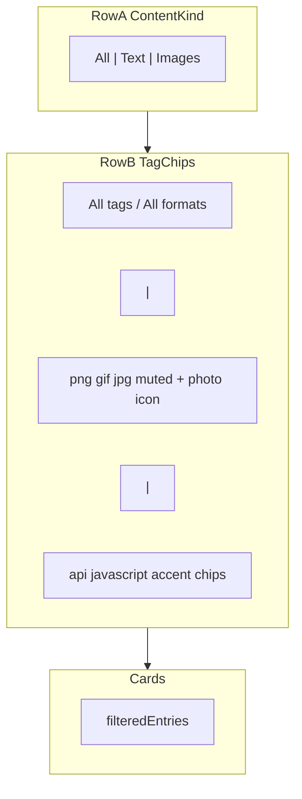
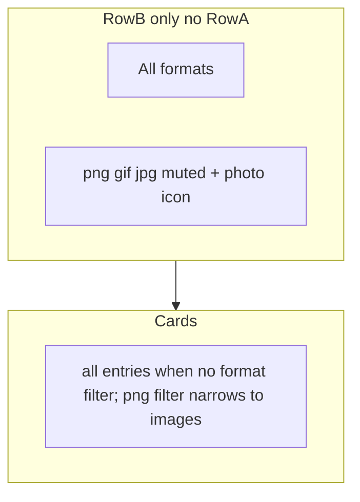

# Overlay — content-type and tag filters

Two levels of filtering over history cards + image card fixes. **Status: WIP** — base scope closed, additional ideas in progress. Related UI items — in [02-hig-audit.md](02-hig-audit.md). Backlog 0.4.0 — [03-new-features-and-improvements.md](03-new-features-and-improvements.md).

## Two filter levels

| Level               | UI                                         | What it filters                              | Example                                        |
| ------------------- | ------------------------------------------ | -------------------------------------------- | ---------------------------------------------- |
| **1. Content type** | Row A — segments `All` / `Text` / `Images` | Shows all entries, text only, or images only | `Images` → hides text cards                    |
| **2. Tags**         | Row B — chips                              | Narrows within the selected type             | `png` → PNG only; `api` → text with AI tag api |

**Row B — two chip groups** (in `All` mode when AI is enabled):

- **Format** — `png`, `gif`, `jpg` (image metadata, muted style + icon)
- **AI tags** — `api`, `javascript`, … (text semantics, accent style)
- Between groups — divider `│`

**Filter chain:** collection / search → content type (Row A) → one active chip (Row B) → cards.

**AI tagging disabled in Settings:** Row A hidden; Row B — image formats only; tags not shown on cards.

**Additionally:** meta on image cards (`1920 × 1080 · 245 KB` instead of "Image preview"); panel height by tier — compact 420 / medium 440 / full 480 px.

## Checklist

- [x] **`overlay-filters.ts`** — `ContentKind`, `buildTagBarModel()`, AI on/off modes
- [x] **AI tagging sync** — `aiTaggingEnabled` from settings on reveal; separate from `retagAvailable` (`isTaggingReady`)
- [x] **`ContentKindSegment.svelte`** — Row A (hidden when AI off)
- [x] **`TagFilterBar.svelte`** — Row B: format/AI chips, photo icon, divider, scroll fade
- [x] **`+page.svelte`** — filter pipeline, empty states, card footer gating
- [x] **Image meta backend** — `image_width`, `image_height`, `image_byte_size` + Rust tests
- [x] **Image meta frontend** — `image-meta.ts`, ClipboardCard; tags hidden when AI off; mono by textKind; remove `title`
- [x] **Panel height tiers** — compact 420 / medium 440 / full 480; `resize_main_window` + progressive filter rows
- [x] **Docs** — CHANGELOG; mark items 10, 11, 14, 17 in `02-hig-audit.md`

---

## Target UX — AI tagging **ON**



## Target UX — AI tagging **OFF**



Row A **fully hidden**. Row B — **format chips only** (like Images segment). Semantic AI chips and divider are not rendered. Cards have **no tag chips** (neither AI nor format in footer).

**Filter pipeline** (one activeTag, no pop-up):

```
entries (API: collection + pinned + search)
  → kindPool (contentKind — only when AI ON)
  → chip counts (from kindPool, without activeTag)
  → filteredEntries (kindPool + activeTag if set)
```

| Mode               | Row A                 | Row B                     | contentKind    | Card footer tags               |
| ------------------ | --------------------- | ------------------------- | -------------- | ------------------------------ |
| **AI ON — All**    | All \| Text \| Images | reset + format \| AI      | `all`          | AI tags on text; none on image |
| **AI ON — Text**   | visible               | reset + AI only           | `text`         | AI tags                        |
| **AI ON — Images** | visible               | All formats + format      | `image`        | none                           |
| **AI OFF**         | hidden                | All formats + format only | implicit `all` | **none** (hide all tags)       |

**Segment counts:** no badges on segments (counts only on chips).

---

## AI tagging enabled vs disabled (full scenario)

### Source of truth

- **`aiTaggingEnabled`** — `getAppSettings().ai_tagging_enabled` (setting only, no Ollama)
- **`retagAvailable`** — `isTaggingReady()` (setting + Ollama stack) — **only** for Retag button on text cards

Load `aiTaggingEnabled` on each overlay reveal (together with `syncRetagAvailability`). If the user disabled AI in Settings and reopened the panel — UI is already collapsed.

### AI OFF — behavior

1. **Row A** (`ContentKindSegment`) — `display: none`, takes no space (filter zone lower).
2. **Row B** — format group + "All formats" reset only; semantic chips and `│` divider are not built.
3. **`contentKind`** — forced to `'all'` (do not store Text/Images switch); `kindPool = entries` without kind filter.
4. **`activeTag`** — on AI ON→OFF transition: reset if activeTag is semantic (not format); format tag may remain.
5. **On AI OFF→ON transition**: `contentKind = 'all'`, `activeTag = null` (clean start for full UI).
6. **Card footer**: `showTags = aiTaggingEnabled && displayTags.length > 0`; format tags on image cards **never** in footer (AI on or off).
7. **Retag button**: `retagAvailable` only (unchanged).
8. **DB stale tags**: entries may contain AI tags in DB — UI **does not show or count them** when `aiTaggingEnabled === false`. `buildTagBarModel()` ignores non-format tags.

### Progressive disclosure — when to hide bars

| Row       | Show when                                                                                              |
| --------- | ------------------------------------------------------------------------------------------------------ |
| **Row A** | AI ON **and** pool has **both** text **and** image entries                                             |
| **Row B** | Chips exist (format/semantic) **or** active `activeTag` **or** Text/Images segment selected with Row A |

Do **not** hide bars on empty filter result (sticky `activeTag` / segment).

### Panel height tiers

| Tier        | px  | When                                    |
| ----------- | --- | --------------------------------------- |
| **compact** | 420 | No filter rows (and no settings notice) |
| **medium**  | 440 | One bar (Row B or notice)               |
| **full**    | 480 | Row A + Row B                           |

`resize_main_window` on reveal; smooth resize on tier change with overlay open (Reduce Motion → instant).

---

## 1. New components and shared constants

| File                                                                                                 | Purpose                                                                                                                                                                                             |
| ---------------------------------------------------------------------------------------------------- | --------------------------------------------------------------------------------------------------------------------------------------------------------------------------------------------------- |
| [`src/lib/overlay-filters.ts`](../../src/lib/overlay-filters.ts)                                     | Pure logic: `ContentKind`, matching, `buildTagBarModel({ entries, contentKind, aiTaggingEnabled, activeTag, ... })` → `{ showRowA, showRowB, resetLabel, formatChips, semanticChips, showDivider }` |
| [`src/lib/components/ContentKindSegment.svelte`](../../src/lib/components/ContentKindSegment.svelte) | Row A — only when `aiTaggingEnabled`                                                                                                                                                                |
| [`src/lib/components/TagFilterBar.svelte`](../../src/lib/components/TagFilterBar.svelte)             | Row B                                                                                                                                                                                               |

**State in [`+page.svelte`](../../src/routes/+page.svelte):**

- `aiTaggingEnabled: boolean` — from settings
- `contentKind: 'all' | 'text' | 'image'` — only when AI ON
- `activeTag: string | null`
- On `contentKind` change: reset incompatible `activeTag`
- Persist `contentKind` in session when AI ON; reset on AI OFF→ON

**Keyboard:**

- **←/→ for cards only** — unchanged, global capture in `handleKeydown`.
- Segment controls: **no** arrow navigation; Tab + Enter/Space only. Segment buttons do not capture ←/→.

---

## 2. Row A — Segmented control

- Height ~28–32px, grouped background, selected segment elevated
- Padding: `12px 16px 8px`; font **13px**
- `:focus-visible` ring; `role="tablist"` / `role="tab"` / `aria-selected`
- Labels: `All`, `Text`, `Images`
- **Rendered only when `aiTaggingEnabled`**

---

## 3. Row B — Tag chips

- Font **12px**; scroll fade (mask gradient)
- **Format chips**: muted + mono + 12×12 photo SVG icon
- **AI chips**: accent (AI ON + relevant segment only)
- **Divider `│`**: AI ON + All segment + both groups non-empty
- Reset label: "All tags" (AI ON) / "All formats" (Images segment or AI OFF)

---

## 4. Filter logic

```typescript
const kindPool = aiTaggingEnabled
  ? entries.filter((e) => entryMatchesKind(e, contentKind))
  : entries;

const filteredEntries = kindPool.filter((e) => !activeTag || entryMatchesTag(e, activeTag));
```

**Empty states** — extend for contentKind, format tags, AI OFF (no format match).

---

## 5. Image meta on cards

### Backend

- Columns: `image_width`, `image_height`, `image_byte_size`
- Capture in [`clipboard_monitor.rs`](../../src-tauri/src/clipboard_monitor.rs); backfill batch; extend `get_entries` SELECT
- Rust unit tests for backfill + insert round-trip

### Frontend

- [`src/lib/image-meta.ts`](../../src/lib/image-meta.ts): `formatImageMeta()` → `1920 × 1080 · 245 KB`
- Replace "Image preview" in `.image-meta`
- Keep header badge `Image · PNG`

---

## 6. Related audit items (02-hig-audit)

| Audit                 | Action                              |
| --------------------- | ----------------------------------- |
| item 17 Image meta    | dimensions + file size              |
| item 10 Tag bar       | 12px, scroll fade                   |
| item 14 Card tooltip  | remove `title={entry.text_content}` |
| item 11 Mono for code | font by `textKind`                  |
| item 18 Empty state   | contentKind + format + AI modes     |

**Out of scope:** item 8 History/Starred segmented, item 12 undo, item 19 hints, item 15 SF Symbols, Quick Look (remains in audit item 14 only, **not** in CHANGELOG).

---

## 7. Tests

**No new JS test runners** — frontend filter logic covered by manual QA; automated tests Rust only (image meta).

### Rust tests (extend `db.rs` / monitor tests)

- Insert image entry → width/height/byte_size persisted
- `get_entries` returns meta columns
- Backfill fills null meta from thumb b64

### Manual QA checklist (overlay-filters + AI modes)

**AI ON:**

- Segment All → format + semantic chips + divider when both exist
- Segment Text → semantic only, no format chips
- Segment Images → format only, reset = "All formats"
- Tap png → only PNG images; switch Text → semantic tag kept; switch Images → format tag cleared
- Hidden tags (`code`, `otp`) not in bar; visible on text card footer when AI ON
- ←/→ navigate cards (focus in search, segment, or body)

**AI OFF:**

- Row A hidden; Row B format chips only; no divider
- Row B hidden when no images in history
- No tag chips on any card footer (including stale DB tags)
- Toggle AI in Settings → reopen panel → UI matches mode
- Format filter still works (png/gif/jpg)

**Image meta:**

- Card shows `W × H · size`; no "Image preview"; no format chip in footer

---

## 8. Overlay height

- Tiers: **420 / 440 / 480** — [`overlay-layout.ts`](../../src/lib/overlay-layout.ts), [`overlay-resize.ts`](../../src/lib/overlay-resize.ts), `resize_main_window` in Rust
- Default window height in [`tauri.conf.json`](../../src-tauri/tauri.conf.json): compact (420)

---

## 9. Verification

```bash
npm run check
cd src-tauri && cargo test
cd src-tauri && cargo check
```

---

## 10. Documentation

- [02-hig-audit.md](02-hig-audit.md): mark items 10, 11, 14, 17 done
- [CHANGELOG.md](../../CHANGELOG.md): overlay filters, AI-off mode, image meta, panel height (no Quick Look mention)
