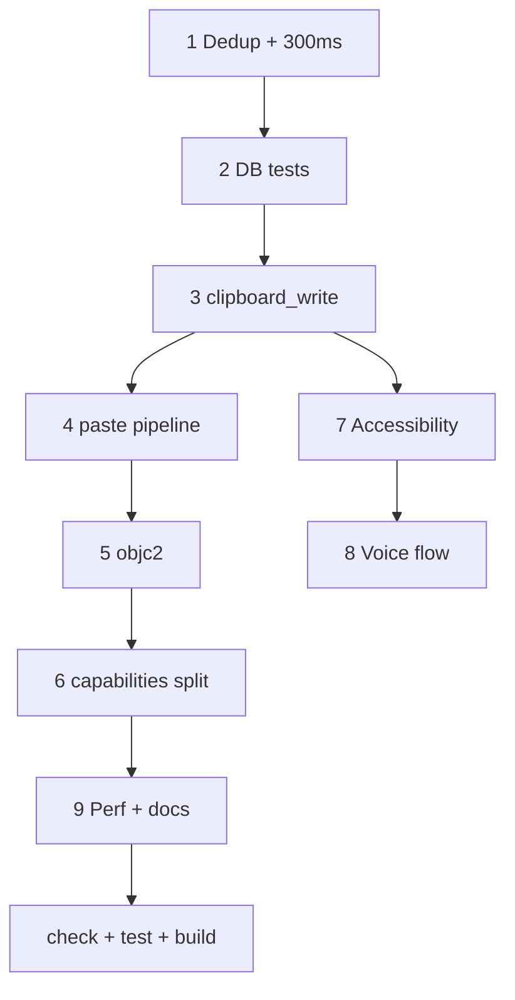

# macOS Intel — pre-release fix plan

Fixes and project preparation for release with **Intel (x86_64) build** support and related macOS improvements (clipboard, paste, window permissions, tests).  
Builds on work done in [01-macos-intel-build-improvements.md](01-macos-intel-build-improvements.md).

## Decisions

| Topic              | Decision                                                                                             |
| ------------------ | ---------------------------------------------------------------------------------------------------- |
| History duplicates | As on `main`: identical content does not spawn entries; copy/paste from the app do not enter history |
| Monitor interval   | **300 ms**; `changeCount` only triggers polling, not part of hash                                    |
| Clipboard write    | Unified [`clipboard_write.rs`](../../src-tauri/src/clipboard_write.rs) — **Copy** / **Paste** modes  |
| Tauri ACL          | Separate capabilities for `main` / `settings` / `voice_overlay`                                      |
| objc               | Migrate [`clipboard_macos.rs`](../../src-tauri/src/clipboard_macos.rs) to **objc2** in this PR       |
| Scope              | Everything below — one PR / release commit, no deferred follow-up                                    |

**paste_entry (agreed):** shared `paste_text_into_target`; `paste_entry` — wrapper as on `main`; text `activate_entry` — same pipeline; Enter in UI — `activateEntry`.

---

## Checklist

- [x] **History dedup** — `content_hash` = base hash only; on macOS `last_content_hash` on `changeCount` change; hash reset when unpinned history is emptied; `mark_own` / `exclude` unchanged
- [x] **DB unit tests** — fix `update_settings`; partial update tests (Whisper/voice/mic not overwritten)
- [x] **Accessibility** — no prompt in `finish_paste`; `check_accessibility(prompt)` — prompt only from Request button
- [x] **clipboard_write unified** — Copy/Paste; voice, copy, activate, paste via one module
- [x] **paste pipeline** — `paste_text_into_target`; `paste_entry` + text `activate_entry`
- [x] **Monitor 300 ms** — `changeCount` only as event
- [x] **objc2** — rewrite `clipboard_macos`; remove `objc` crate where possible (including AX in `commands.rs`)
- [x] **Capabilities split** — `main.json` / `settings.json` / `voice_overlay.json`; explicit `allow-*`; update AGENTS.md
- [x] **Security hardening** — Ollama model name validation (allowlist/regex) before `ollama pull`; `cargo audit` in release CI
- [x] **Perf** — single `get_frontmost_app` in `file_list` loop; image file size limit (~20 MB)
- [x] **Docs / PR** — README, AGENTS, Makefile; test plan in PR description
- [x] **Verification** — `make check`, `cargo test`, `make build-macos-intel` green

---

## 1. History dedup

Currently `content_hash = "{base}:{changeCount}"` breaks dedup in `insert_entry`.

**Target behavior (macOS):**

1. `content_hash` = **base_hash** only (text / raster / file).
2. On new `changeCount` — probe content hash; if it matches `last_content_hash` → do not write to DB.
3. Keep `mark_own_clipboard_write`, `should_ignore_capture`, `is_concealed`.
4. Reset `last_content_hash` when unpinned history is emptied: `clear_history` and deleting the last unpinned entry (`notify_history_cleared`) — otherwise re-copying the same file after clear does not enter history.

**Tests:** repeated `content_hash` → `insert_entry` returns `is_new == false`; `history_clear_allows_recapture_of_same_hash`; `delete_last_unpinned_entry_reports_empty_history`.

---

## 2. DB unit tests

Fix `update_app_settings` call (7 arguments). Strengthen:

- Partial update does not overwrite whisper / voice / mic.
- Separate test for update of `whisper_server_url` only.

No empty `None` where persistence must be verified — explicit values in helper.

---

## 3. Accessibility UX

- `finish_paste`: without permissions — hide + clipboard ready, **no** system prompt on every paste.
- `check_accessibility(prompt: bool)`: mount/recheck with `false`, Request with `true`.

---

## 4. Unified `clipboard_write`

```text
enum ClipboardWriteMode {
  Copy,   // exclude_from_history + mark_own
  Paste,  // pasteboard for target app + mark_own
}
```

- Remove `write_clipboard_for_paste` from `commands.rs`.
- `copy_entry`, `activate_entry`, voice (`lib.rs`), `paste_entry` — via module.
- Voice: `restore_paste_target` before Cmd+V, as in `activate_entry`.

---

## 5. Paste pipeline (`paste_entry` / Enter)

| Action                                | Implementation                              |
| ------------------------------------- | ------------------------------------------- |
| Single click                          | `copy_entry` / `Copy`                       |
| Double click                          | `activate_entry`                            |
| Enter + text (formerly `paste_entry`) | `activate_entry` → `paste_text_into_target` |
| Enter + image                         | `activate_entry` (new, does not break old)  |

```rust
fn paste_text_into_target(app: &AppHandle, text: String) -> Result<(), String> { ... }

pub fn paste_entry(app: AppHandle, text: String) -> Result<(), String> {
    paste_text_into_target(&app, text)
}
```

Enter in [`+page.svelte`](../../src/routes/+page.svelte) — `activateEntry`; `pasteEntry` in api.ts — thin invoke or `@deprecated`.

---

## 6. Monitor: 300 ms + changeCount

In [`clipboard_monitor.rs`](../../src-tauri/src/clipboard_monitor.rs): `sleep(300ms)`; `changeCount` = clipboard changed; dedup via `last_content_hash`; `notify_history_cleared` on `clear_history` and when last unpinned entry is deleted.

---

## 7. Migrate `clipboard_macos` to objc2

- NSPasteboard, changeCount, concealed — objc2 + foundation/app-kit.
- NSWorkspace / NSRunningApplication — objc2.
- Cmd+V — CoreGraphics FFI (as now) or separate module.
- Remove `objc = "0.2"` from Cargo.toml after moving AX check in `commands.rs`.

---

## 8. Per-window command permissions (Tauri capabilities)

Replace shared `core:default` with:

| File                              | Window          | Commands (approx.)                                                  |
| --------------------------------- | --------------- | ------------------------------------------------------------------- |
| `capabilities/main.json`          | `main`          | entries, copy, activate, hide, events                               |
| `capabilities/settings.json`      | `settings`      | settings, excluded apps, clear_history, ollama, check_accessibility |
| `capabilities/voice_overlay.json` | `voice_overlay` | minimum (events)                                                    |

Verify `tauri dev` / `tauri build`. Close TODO in AGENTS.md on scoping:

- `settings` does not get `paste_entry`
- `voice_overlay` does not get `clear_history`, `start_ollama_server`

---

## 9. Other in same PR

- Single `get_frontmost_app()` per `file_list` batch.
- ~20 MB limit for `encode_image_file`.
- Consistency of Makefile, README, `.vscode`, `package.json` cookie override.
- PR / release notes: Intel build, dedup, paste, Finder images, a11y, voice, capabilities.

---

## Implementation order



---

## PR / release notes (draft)

**Summary:** release with macOS Intel build; clipboard and paste fixes; history dedup; objc2; per-window command permissions; tests.

**Test plan:** `make check`; `cd src-tauri && cargo test`; `make build-macos-intel`; twice Cmd+C same text — one entry; Finder image file; single-click without history; double-click/Enter paste; voice without history entry; settings does not call paste commands; `cargo audit` in release CI.
