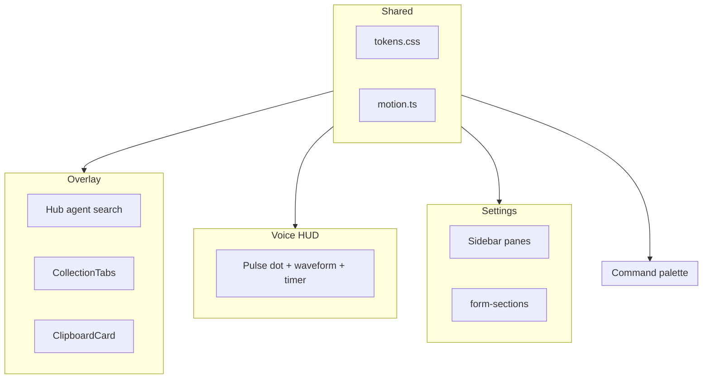
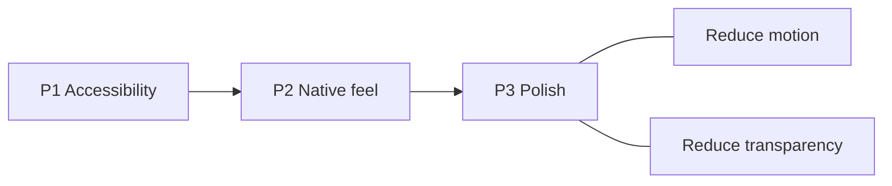

# Copyosity UI — Apple HIG Audit

Global UI audit of Copyosity against [Apple Human Interface Guidelines](https://developer.apple.com/design/human-interface-guidelines/): clipboard overlay, voice HUD, settings, and shared design system. One file — shared items (motion, tokens, transparency) are fixed and checked off once.

**Related plans:** overlay filters (items 10, 11, 14, 17, 20) — [feature-overlay-content-tag-filters.md](feature-overlay-content-tag-filters.md) · voice HUD a11y — [feature-voice-hud-accessibility.md](feature-voice-hud-accessibility.md) · appearance / light mode (item 7) — [feature-appearance-theme.md](feature-appearance-theme.md) · backlog — [features-backlog.md](features-backlog.md)

**Progress:** checkboxes in the checklist and `✅` in detailed sections for shipped work. **`Done` comments** — only when one part is shipped and another is explicitly declined or deferred (link to follow-up plan if any). Fully closed items get no extra status text.

**Scope labels:** `[Overlay]` clipboard panel · `[Settings]` settings window · `[Voice]` voice HUD capsule · `[Palette]` command palette · `[Shared]` tokens / form-controls / button-interaction / motion helper

| Surface           | Files                                                                                                                                                                                                                                                                                                                                       |
| ----------------- | ------------------------------------------------------------------------------------------------------------------------------------------------------------------------------------------------------------------------------------------------------------------------------------------------------------------------------------------- |
| Clipboard overlay | `[+page.svelte](../../src/routes/+page.svelte)`, `[ClipboardCard.svelte](../../src/lib/components/ClipboardCard.svelte)`, `[TagFilterBar.svelte](../../src/lib/components/TagFilterBar.svelte)`, `[SearchBar.svelte](../../src/lib/components/SearchBar.svelte)`, `[CollectionTabs.svelte](../../src/lib/components/CollectionTabs.svelte)` |
| Voice HUD         | `[overlay/+page.svelte](../../src/routes/overlay/+page.svelte)` — recording capsule (pulse dot, scrolling waveform, duration)                                                                                                                                                                                                               |
| Command palette   | `[palette/+page.svelte](../../src/routes/palette/+page.svelte)`                                                                                                                                                                                                                                                                             |
| Settings          | `[settings/+page.svelte](../../src/routes/settings/+page.svelte)`, `[SectionIcon.svelte](../../src/lib/components/SectionIcon.svelte)` — sidebar panes: NeuralDeep, Voice, Local AI, History, Permissions                                                                                                                                   |
| Shared            | `[tokens.css](../../src/lib/styles/tokens.css)`, `[form-controls.css](../../src/lib/styles/form-controls.css)`, `[button-interaction.css](../../src/lib/styles/button-interaction.css)`, `[ChevronDown.svelte](../../src/lib/components/ChevronDown.svelte)`, `[motion.ts](../../src/lib/motion.ts)`                                        |

---

## Checklist (roadmap)

### P1 — Accessibility

- [x] `[Overlay]` Search input in Tab order; focus ring via `:focus-within` on `.search-bar` (item 4)
- [x] `[Overlay]` remove global `outline: none`; `focus-visible` on cards and non-button tabs (item 1)
- [x] `[Overlay]` Paste button on card — primary action instead of duplicate Copy; `Space` on card `role="button"`; `aria-busy` on activate (items 2, 19 partial)
- [x] `[Overlay]` hit target 28px+ — search clear only (28px); card actions 24px — intentional trade-off (item 3)
- [x] `[Overlay]` Search field — slightly less transparent background and placeholder for readability on vibrancy (item 3)
- [x] `[Shared]` Contrast `--color-text-subtle` / `--color-text-faint`; `prefers-contrast: more` (item 5)
- [x] `[Shared]` `form-input` / `form-select`: pointer vs keyboard focus rings via `input-modality` (item 24)
- [x] `[Settings]` Custom model input without associated `<label>` when preset is `__custom__` (item 26)
- [x] `[Voice]` Baseline live region on HUD while recording (item 32 — partial)
- [ ] `[Voice]` Full SR lifecycle (recording → processing → result) → [feature-voice-hud-accessibility.md](feature-voice-hud-accessibility.md)

### P2 — Native feel

- [x] `[Overlay]` `⌘F` / `/` → search; `←/→` reserved for cards (item 4)
- [x] `[Overlay]` Keyboard hints — footer strip in `+page.svelte` (item 19)
- [x] `[Overlay]` Segmented control for History / Starred; tablist ARIA (item 8)
- [x] `[Overlay]` Simplify header — product decision, not doing (item 9)
- [x] `[Overlay]` SF Pro for plain text, SF Mono only for code-like preview (item 11)
- [x] `[Overlay]` Visually separate filter chip (toolbar) and metadata badge (card footer) (item 20)
- [x] `[Settings]` Toggle / section patterns moved to `form-controls.css` (item 27)

### P3 — Polish

- [x] `[Overlay]` Empty state fix (tag filter / search) (item 18)
- [x] `[Overlay]` Remove `title` tooltip from card (item 14)
- [x] `[Overlay]` Delete without confirm — product decision (item 12)
- [x] `[Overlay]` Fixed card size in layout — product decision (item 38)
- [x] `[Settings]` Clear history menu + confirm (item 23)
- [x] `[Shared]` `prefers-reduced-motion` — full coverage (item 21)
- [x] `[Shared]` `prefers-reduced-transparency` — blur fallback (items 6, 22)
- [x] `[Overlay]` Image meta labels (dimensions instead of “Image preview”) (item 17)
- [x] `[Shared]` Remove duplicate `title` + `aria-label` on toggles and list actions (item 25)

### P4 — Native depth

- [ ] `[Shared]` Native vibrancy / light mode (`prefers-color-scheme: light`) (item 7) → [feature-appearance-theme.md](feature-appearance-theme.md)
- [x] `[Overlay]` VoiceOver listbox — product decision, not doing (item 35)
- [x] `[Overlay]` Scroll affordances on tag bar (item 10)

---

## What’s already good

| Area                  | Scope                    | Implementation                                                                                  |
| --------------------- | ------------------------ | ----------------------------------------------------------------------------------------------- |
| Panel / HUD           | Overlay, Voice, Palette  | Transparent NSPanel windows, `alwaysOnTop`, palette takes focus when open                       |
| Settings layout       | Settings                 | Sidebar panes (NeuralDeep, Voice, Local AI, History, Permissions); dirty-state save bar         |
| System font           | Overlay, Settings        | `-apple-system, BlinkMacSystemFont`                                                             |
| Semantic colors       | Shared                   | danger / warning / success / accent tokens (upstream emerald accent `#10b981`)                  |
| Focus ring on buttons | Shared                   | `button.app-btn:focus-visible`                                                                  |
| Form focus            | Shared                   | `form-input:focus` ring (`--ring-accent-input`)                                                 |
| Clear history         | Settings                 | `ActionMenu` + `ConfirmDialog`; live counts via `history-changed` / `clipboard-changed`         |
| Motion                | Shared                   | Reduce Motion: panel, scroll, pulse, spinner, hover, copied, voice waveform, micro-transitions  |
| Search field          | Overlay                  | `role="search"`, clear button, `:focus-within` ring; DB search includes `ocr_text` on images    |
| Empty state           | Overlay                  | Contextual messages, `role="status"`                                                            |
| Toggles a11y          | Settings                 | `role="switch"`, `aria-label`, `focus-visible` ring on slider                                   |
| Vertical board        | Overlay                  | Optional docked-right list (`board_vertical`); compact cards; `↑/↓` browse hints                |
| Icons                 | Overlay, Settings, Cards | Inline stroke SVG (`SectionIcon`, `ChevronDown`, component-local paths); `--icon-size-*` tokens |

---

## Clipboard overlay (items 1–20)

### ✅ 1. Global outline disabled `[Overlay]`

Removed global `outline: none` in `+page.svelte`; `focus-visible` ring on cards (`ClipboardCard`) and collection tabs (`CollectionTabs`).

### ✅ 2. Card actions on keyboard selection `[Overlay]`

`.card-actions` shown on hover and on keyboard focus (`:focus-within` + `data-input-modality="keyboard"`); on pinned cards — star always visible. `selected` alone does not reveal toolbar (mouse pin does not stick).

Redundant Copy replaced with primary **Paste** (`activateEntry`, accent styling, `aria-busy` on activate); card click still copies; paste also via double-click, Enter, Space on card `role="button"`, and Paste toolbar button.

### ✅ 3. Hit targets and search readability `[Overlay]`

**HIG:** 28×28 pt minimum for interactive controls; input fields must remain readable on vibrancy backgrounds.

**Done:** search clear → 28×28 px; search field readability (`--surface-search`, stronger placeholder).

**Not doing:** 28px hit targets on card toolbar buttons (24×24) and other dense header controls — narrow card (~220px) and dense header do not allow it without layout loss; alternative paths (keyboard, click/double-click on card) already exist.

| Element                                  | Before   | Resolution                      |
| ---------------------------------------- | -------- | ------------------------------- |
| Search clear                             | 20×20 px | → 28×28 px (only place per HIG) |
| Card actions (paste, retag, pin, delete) | 24×24 px | Keep; exception documented      |

**Search readability:** `--surface-control` (6% white) on transparent panel caused “text on text” — placeholder and input were hard to read. Overlay search uses slightly denser `--surface-search` and stronger placeholder; still looks glassy, but contrast is sufficient.

### ✅ 4. Keyboard search `[Overlay]`

`⌘F`, `/`, `←/→`, `Escape`, Unicode search in DB.

**Follow-up:** arrows in search do not move cursor — browse/paste shortcuts documented in footer strip (item 19).

### ✅ 5. Secondary text contrast `[Shared]` `[Overlay]`

`--color-text-subtle` / `--color-text-faint` lightened; `@media (prefers-contrast: more)` in `tokens.css`.

### ✅ 6. Material / Vibrancy `[Overlay]` `[Voice]` `[Shared]`

| Layer          | File                   | Blur                          |
| -------------- | ---------------------- | ----------------------------- |
| Overlay panel  | `+page.svelte`         | `--panel-blur-visible` (34px) |
| Voice HUD      | `overlay/+page.svelte` | 16px                          |
| Copied overlay | `ClipboardCard.svelte` | 6px                           |

**Done:** blur layers per surface; `prefers-reduced-transparency` → opaque token fallback, blur off.

**Future:** light mode / `prefers-color-scheme: light` — item 7 → [feature-appearance-theme.md](feature-appearance-theme.md). Settings (`--surface-page` 96% opaque) less critical for transparency.

### 7. Dark only `[Shared]`

No light tokens and no `prefers-color-scheme: light`. Full spec: [feature-appearance-theme.md](feature-appearance-theme.md).

### ✅ 8. Tabs — segmented control `[Overlay]`

`CollectionTabs.svelte`: History / Starred — macOS segmented control (`role="tablist"` / `role="tab"` / `aria-selected`, `aria-label="Clipboard view"`); custom collections — `role="group"` + `aria-pressed` pills (same pattern as `ContentKindSegment`); delete `×` and add `+` live outside the tablist; horizontal scroll only on custom collections; delete `×` — subtle default opacity, full on hover / focus-within; 28px delete hit target; truncated names use `title`; labels shortened to History / Starred.

### ❌ 9. Overloaded header `[Overlay]` — product decision

Originally: search `flex-grow`, Exclude → `⋯` overflow. **Intentionally not doing** after review (2026-06): current header kept as-is.

| Declined change    | Rationale                                                                                                                                                          |
| ------------------ | ------------------------------------------------------------------------------------------------------------------------------------------------------------------ |
| Exclude → overflow | Inline Exclude + subdued/caution hover is enough; status hint (`… excluded from history`) should stay visible without opening a menu — HIG status vs action split. |
| Search `flex-grow` | Fixed-width search (`280px`) is acceptable; tabs/collections scroll independently (item 8 follow-up).                                                              |

Revisit only if narrow overlay width or many collections make the header unusable in practice.

### ✅ 10. Tag filter bar `[Overlay]`

Hidden scrollbar; 12px font; scroll fade. Filter chips — `.filter-chip` in `TagFilterBar`; separated from card metadata (item 20).

### ✅ 11. Monospace font for entire preview `[Overlay]`

SF Mono on all card text. HIG: SF Pro for body, Mono only for code.

### ✅ 12. Delete without confirmation `[Overlay]` — product decision

Single X press deletes entry without dialog. Launcher panel: targeted action on explicit delete button; extra confirm hurts speed. Bulk clear — Settings only with confirm (item 23).

### ✅ 13. Selection vs Hover states `[Overlay]`

Selected — light accent fill (`--surface-card-selected`, ~5–7% opacity), ring + `--shadow-card-selected`. Roving `tabindex`: focus follows `selectedIndex` (arrows / click); copied — overlay only, no second ring.

### ✅ 14. Native tooltip on card `[Overlay]`

**Done:** removed `title={entry.text_content}` from card.

**Future:** Quick Look preview on `Space` — [feature-quick-look-preview.md](feature-quick-look-preview.md).

### ✅ 16. Search field styling `[Overlay]`

Clear button, `:focus-within` ring, `role="search"`, `aria-label`.

### ✅ 17. Image cards — redundant label `[Overlay]`

“Image preview” → dimensions / file size.

### ✅ 18. Empty state copy `[Overlay]`

Contextual messages for search / tag filter; `role="status"`.

### ✅ 19. Paste model discoverability and keyboard shortcuts `[Overlay]`

Paste button on card — explicit mouse affordance for paste without double-click. Footer shortcut strip in `+page.svelte` (`KeyboardHints.svelte`); optional via **Settings → History → Keyboard shortcuts** (default on). Overlay height +35 px when hints are on (`OVERLAY_HINTS_EXTRA_HEIGHT`; base **415** px).

| Layout     | Hint                                                                                          |
| ---------- | --------------------------------------------------------------------------------------------- |
| Horizontal | `Click copy` · `↵ paste` · `Double-click paste` · `← → browse` · `Esc clear search / dismiss` |
| Vertical   | `Click copy` · `↵ paste` · `2× click paste` · `↑ ↓ browse` · `Esc dismiss`                    |

Do not duplicate Paste toolbar button verbatim in footer — “↵ paste” / “Double-click paste” is enough, since the button is visible on hover/selection.

### ✅ 20. Filter chip vs metadata badge — role conflict `[Overlay]` `[Shared]`

Two visual layers separated — toolbar filter vs card metadata.

| Layer       | Component       | Class                         | Behavior                                                                                                                                                               |
| ----------- | --------------- | ----------------------------- | ---------------------------------------------------------------------------------------------------------------------------------------------------------------------- |
| Toolbar     | `TagFilterBar`  | `.filter-chip`                | `<button>`, pill + border, hover, `aria-pressed`, `.tag-count`                                                                                                         |
| Card footer | `ClipboardCard` | `.entry-tag` in `.entry-tags` | ``, neutral micro-badge (rounded rect, `--surface-entry-tag`, no hover/accent); distinct from plain meta (`source-app`, `char-count`) and toolbar `.filter-chip` |

**Done:** toolbar `.filter-chip` vs card `.entry-tag` — distinct visuals and roles; token `--color-entry-tag`; shared `.tag-chip` removed.

**Not doing:** tag click on card for filtering — toolbar only.

**Before:** identical pill-chips (`api 2` top vs `api` bottom) — false affordance per HIG.

---

## Shared / Motion & Materials (items 21–22)

### ✅ 21. `prefers-reduced-motion` `[Shared]`

| Area                     | File                     | Reduce Motion                                                   |
| ------------------------ | ------------------------ | --------------------------------------------------------------- |
| Micro-transitions        | `tokens.css`             | `--duration-fast/standard/micro/hud/stagger` → `0.01ms` / `0ms` |
| Panel open/close         | `+page.svelte`           | `transition-duration: 0.01ms` (+ tokens)                        |
| Scroll to card           | `motion.ts`              | `behavior: "auto"`                                              |
| Status dot checking      | `form-controls.css`      | static color                                                    |
| Tagging test spinner dot | `form-controls.css`      | same (`.checking`)                                              |
| Voice pulse dot          | `overlay/+page.svelte`   | static when Reduce Motion                                       |
| Voice waveform bars      | `overlay/+page.svelte`   | no height transition when Reduce Motion                         |
| Button spinner           | `button-interaction.css` | slowed (`--duration-spinner-reduced`)                           |
| Settings toggles         | `settings/+page.svelte`  | `transition: none` on slider                                    |
| Card hover               | `ClipboardCard.svelte`   | no `translateY`                                                 |
| Copied feedback          | `ClipboardCard.svelte`   | fade instead of scale                                           |

### ✅ 22. `prefers-reduced-transparency` `[Shared]`

Opaque surface tokens in `tokens.css`; `backdrop-filter: none` in `+page.svelte`, `overlay/+page.svelte`, `ClipboardCard.svelte`.

---

## Settings (items 23–30)

### ✅ 23. Clear history — menu and confirm `[Settings]`

**Before:** single button without confirmation. `Clear history` with menu (unpinned / all…); `ConfirmDialog` with counts; neutral confirm (user already chose action in menu); success notice in action row; `clear_all_history` for pinned; menu disabled when history empty.

### ✅ 24. Form controls: pointer vs keyboard focus `[Shared]`

WebKit in Tauri often shows `:focus-visible` on mouse click. Solution: `input-modality.ts` sets `data-input-modality` on `<html>`; `form-controls.css` gives tight ring on `:focus`, and 3px keyboard halo only with `[data-input-modality="keyboard"]`.

### ✅ 25. Duplicate `title` and `aria-label` `[Settings]` `[Overlay]`

Removed `title` where it duplicated `aria-label`: overlay exclude button (`+page.svelte`), AI/Voice toggles, exclude list actions (`settings/+page.svelte`). Test button: `aria-describedby` when `modelDirty` (item 40), `title` removed.

### ✅ 26. Custom model input `[Settings]`

When `__custom__` — `<label for="custom-ollama-model">` + associated input.

### ✅ 27. Toggle styles local `[Settings]` `[Shared]`

`.toggle` / `.toggle-slider` moved to `form-controls.css` (next to `.toggle-section-body`); removed from `settings/+page.svelte`. Slider `border-radius` — `var(--radius-pill)`.

### ✅ 28. Ollama onboarding `[Settings]`

Status steps match product policy in [docs/product/ollama-onboarding.md](../product/ollama-onboarding.md). Spinner / checking dots covered by Reduce Motion.

### ✅ 29. Settings selection chrome `[Settings]`

`ui-no-select` / `ui-selectable-text` in `form-controls.css`: chrome (sections, rows, buttons) not selectable; text — headings, labels, status lines, hints, meta, inputs — `fit-content`, no padding fill. `.settings-page` carries `ui-no-select`.

### ✅ 30. Danger / destructive actions pattern `[Settings]`

`ConfirmDialog` only in Settings for bulk clear (item 23); title — single `?`, message — declarative consequences with bold counts and `\u00A0`; `ActionMenu` (opaque dropdown, full-width in Storage). Overlay single delete — no confirm (item 12). Unified `.inset-list` pattern (dividers only between rows inside group); subsections — `form-subsection` + `form-subsection-rule` with symmetric `--space-subsection`; Storage — `form-field-group` + inline notice without extra divider.

---

## Voice HUD (items 31–33)

### ✅ 31. EQ bars and mic — live feedback `[Voice]`

Reduce Motion: mic without pulse; bars — uniform height by level, no wobble/stagger/height transition (`motion.ts` + CSS).

### ✅ 32. Accessibility while recording `[Voice]` (baseline)

**Done (baseline):** `role="status"` + `aria-live="polite"` on overlay root; decorative content in `aria-hidden` wrapper; sr-only “Recording voice”.

**Future:** full screen-reader lifecycle (repeat sessions, processing, terminal states) — [feature-voice-hud-accessibility.md](feature-voice-hud-accessibility.md).

### ✅ 33. Blur without transparency fallback `[Voice]`

`prefers-reduced-transparency` — see items 6, 22.

---

## Low priority (items 34–41)

### ✅ 34. Dynamic Type — fixed px `[Shared]`

**Done:** scale `--font-size-*` and `--space-*` in `rem`; `@supports (font: -apple-system-body)` on `body`; typography in overlay, settings, and `form-controls.css` on tokens; card size in rem. Radii and small icon-hit chrome remain in px.

**Future / not doing:** rem tokens do not follow macOS Dynamic Type Text size slider — full compliance needs `em` from `body` or environment-based scale. Fixed `--card-width` / `--card-height` in layout — product decision (item 38).

### ❌ 35. VoiceOver listbox / `aria-label` on cards `[Overlay]` — product decision

Cards in horizontal list without listbox semantics; no `aria-label` at entry level for SR. Affects **VoiceOver / screen reader only** — no impact on visual UI, mouse, or current keyboard navigation (`←/→`, Enter, Space, Paste). At this stage we do not plan such changes: overlay already covers P1 a11y (focus, actions, search); listbox is SR depth without behavior change for other users.

**Deferred scope (for clarity, what we’re declining):**

| Area                   | What was envisioned                                                                                                  |
| ---------------------- | -------------------------------------------------------------------------------------------------------------------- |
| `+page.svelte`         | `.grid-container` → `role="listbox"`, `aria-label`, `aria-orientation="horizontal"`, `aria-multiselectable="false"`  |
| `ClipboardCard.svelte` | `role="option"` instead of `role="button"`; `aria-selected`; `aria-posinset` / `aria-setsize`; stable `id` on option |
| New helper             | `buildEntryAriaLabel(entry)` — type, shortened preview, time, source app, pinned, tags                               |
| Details                | `alt=""` on thumb inside card with `aria-label`; `.focus()` on selected card on `←/→` for VO follow                  |
| Constraint             | Nested action buttons (Paste / Pin / Delete) conflict with strict listbox — would need separate compromise           |

### ✅ 36. Pin indicator — border-color only `[Overlay]`

**Before:** pinned state only via semi-transparent border. Warning border 50%; star always on Pin button; selection (fill) separated from keyboard focus ring (`data-input-modality`); after pointer action — blur from card.

### ✅ 37. Horizontal scroll-snap `[Overlay]`

`.grid-container` — `scroll-snap-type: x mandatory` in horizontal mode (pairs with existing `scroll-padding-inline`); `.card-wrapper` — `scroll-snap-align: start`. **Vertical board** (`board_vertical`): docked-right list, compact cards (`--card-max-height-vertical`), `↑/↓` keyboard browse, vertical tag chips in header. Trackpad / momentum scroll stops on whole cards in horizontal mode. On `scrollend` (or 120ms idle fallback), `selectedIndex` syncs to the leading visible card (`overlay-grid-scroll.ts` geometry, `overlay-browse-sync.ts` sync policy) so keyboard arrows continue from the current viewport; programmatic scroll suppresses one sync pass (`suppressLeadingSync`, default on). **Keyboard anchor policy (product):** arrows re-anchor to leading only when selection is unset, wrapper missing, or fully off-screen — not when leading ≠ selected while the card is still visible (`shouldAnchorKeyboardSelectionBeforeArrow` + tests); anchoring on every leading mismatch breaks rapid key repeat.

### ❌ 38. Card width fixed in layout `[Overlay]` — product decision

`--card-width` / `--card-height` in rem (≈220×288 at 16px root) — intentionally fixed card size, not a layout bug. Entire overlay (preview, typography, actions, scroll, keyboard navigation) tuned to this width and height; horizontal scroll is expected UX with many entries. Adapting cards to panel width or items per screen not planned. Do not confuse with item 34 (typography and rem scale from root).

### ✅ 39. Collections color dot 7px `[Overlay]`

**Done:** Custom collection tabs in the overlay header show a **7×7 px** color circle (`.tab-dot` in `CollectionTabs.svelte`) sized via `--icon-size-collection-dot` in `tokens.css`; `border-radius: 50%`, `flex-shrink: 0`. Fill from `col.color` with `var(--color-text-subtle)` fallback. Intentional dense-toolbar trade-off (below HIG comfortable minimum for at-a-glance distinguishability); no change planned unless collections need stronger color coding outside the header.

### ✅ 40. Test button `disabled` without `aria-describedby` `[Settings]`

`aria-describedby="tagging-test-save-hint"` on Test when `modelDirty`; hint with `id`; `aria-label="Test tagging"`; `title` replaced with describedby.

### ✅ 41. Add-collection inline input — focus ring `[Overlay]`

`.add-form .form-input` in `CollectionTabs.svelte`: focus ring via `--ring-control-focus` / `--ring-accent-input` (keyboard modality); `aria-label="Collection name"`.

---

## Roadmap

| Priority | Tasks                                                                                                                                                                     | Files                                                                                                                         |
| -------- | ------------------------------------------------------------------------------------------------------------------------------------------------------------------------- | ----------------------------------------------------------------------------------------------------------------------------- |
| **P1**   | focus visible, card actions, contrast, form focus-visible, voice a11y baseline; hit targets; voice SR full cycle                                                          | overlay components, `form-controls.css`, `overlay/+page.svelte`                                                               |
| **P2**   | keyboard hints, segmented tabs; font by type (item 11); filter vs metadata badges (item 20); toggle in form-controls (item 27)                                            | `TagFilterBar.svelte`, `ClipboardCard.svelte`, `tokens.css`, overlay components, `settings/+page.svelte`, `form-controls.css` |
| **P3**   | settings clear confirm; empty state, card tooltip, image meta; reduce motion, reduce transparency; title + aria-label dedup (item 25)                                     | multiple                                                                                                                      |
| **P4**   | light mode (item 7) — [feature-appearance-theme.md](feature-appearance-theme.md); scroll affordances on tag bar (item 10) — done; VoiceOver listbox (item 35) — not doing | multiple                                                                                                                      |

---

## HIG references

- [Materials](https://developer.apple.com/design/human-interface-guidelines/materials)
- [Accessibility](https://developer.apple.com/design/human-interface-guidelines/accessibility)
- [Buttons](https://developer.apple.com/design/human-interface-guidelines/buttons)
- [Labels](https://developer.apple.com/design/human-interface-guidelines/labels)
- [Search fields](https://developer.apple.com/design/human-interface-guidelines/search-fields)
- [Segmented controls](https://developer.apple.com/design/human-interface-guidelines/segmented-controls)
- [Typography](https://developer.apple.com/design/human-interface-guidelines/typography)

---

## Product constraint

README: “never steals focus” — trade-off with HIG launcher pattern. Resolution: type-to-search without auto-focus or shortcut-only focus (`⌘F` / `/`).
