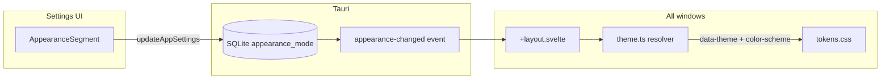

# Appearance — Light / Dark / Automatic theme

**Status: backlog.** Native macOS appearance support: light palette, dark palette, and system sync.

**Related:** [audit-hig.md](audit-hig.md) item 7 (dark-only today) · backlog [features-backlog.md](features-backlog.md) · shared tokens [tokens.css](../../src/lib/styles/tokens.css)

---

## Why

Copyosity is **dark-only** today: semantic colors live in [`tokens.css`](../../src/lib/styles/tokens.css) with no `prefers-color-scheme: light` and no persisted appearance preference in [`AppSettings`](../../src-tauri/src/db.rs). **0.6.0** (from upstream v0.5.1) ships an **emerald accent** (`#10b981` / `#34d399`) — separate from Light / Dark / Automatic system theme work below.

## Goal

Ship a **macOS System Settings–style Appearance** control:

- Three modes: **Light**, **Dark**, **Automatic** (follow system)
- Default: **Automatic**
- Light palette: **cool blue-gray**, mirroring the current dark family (not warm latte)
- Global apply across clipboard overlay, voice HUD, settings, and command palette — live switch without restart



---

## Where the control lives (HIG)

### Primary — Settings sidebar → new **Appearance** pane (or section under History)

Placement: global preference — add an **Appearance** sidebar entry or a dedicated section in the **History** pane (alongside vertical board and keyboard shortcuts).

| Element   | Spec                                                                                                                                                                                                                                                              |
| --------- | ----------------------------------------------------------------------------------------------------------------------------------------------------------------------------------------------------------------------------------------------------------------- |
| Title     | `Appearance` + `SectionIcon` stroke icon (new `SectionIconName: "appearance"`)                                                                                                                                                                                    |
| Body      | `inset-list` + `form-pref-row` (same rhythm as keyboard shortcuts in History)                                                                                                                                                                                     |
| Control   | Segmented control — **not** `<select>`                                                                                                                                                                                                                            |
| Component | [`AppearanceSegment.svelte`](../../src/lib/components/AppearanceSegment.svelte) — pattern from [`ContentKindSegment.svelte`](../../src/lib/components/ContentKindSegment.svelte), styled for Settings (`width: 100%`, `.settings-segment` in `form-controls.css`) |
| ARIA      | `role="radiogroup"` `aria-label="Appearance"`; each segment `role="radio"` `aria-checked`                                                                                                                                                                         |
| Labels    | Light · Dark · Automatic                                                                                                                                                                                                                                          |
| Hint      | “Match the system appearance, or choose Light or Dark.”                                                                                                                                                                                                           |

### Explicitly out of v1

| Location        | Decision         | HIG rationale                                                                                |
| --------------- | ---------------- | -------------------------------------------------------------------------------------------- |
| Tray menu       | No theme submenu | Tray stays minimal: Open / Settings / Quit ([`build_tray_menu`](../../src-tauri/src/lib.rs)) |
| Overlay header  | No toggle        | Header is dense; global prefs belong in Settings                                             |
| Separate window | Not needed       | Standard macOS preferences pattern                                                           |

---

## Runtime architecture

### Type and persistence

```ts
// src/lib/types.ts
export type AppearanceMode = "system" | "light" | "dark";
```

- `AppSettings.appearance_mode: AppearanceMode`, default `"system"`
- SQLite key `appearance_mode` — no migration; `get_setting` with fallback like other keys in [`db.rs`](../../src-tauri/src/db.rs)
- Rust validation: only `system` \| `light` \| `dark`

### `src/lib/theme.ts`

1. **`resolveEffectiveTheme(mode, systemPref)`** → `"light" | "dark"`
2. **`applyTheme(mode)`** on `<html>`:
   - `data-theme="light" | "dark"` when explicit
   - `data-theme="system"` when Automatic (CSS media query resolves)
   - `style.colorScheme = resolved` (WebKit scrollbars / native form chrome)
3. **`initTheme()`** in [`+layout.svelte`](../../src/routes/+layout.svelte):
   - `getAppSettings()` → `applyTheme`
   - `matchMedia("(prefers-color-scheme: dark)")` listener when mode is `system`
   - `listen("appearance-changed")` for instant cross-window update

Theme applies via **layout** (shared by `/`, `/settings`, `/overlay`, `/palette`) — no separate sync in overlay store.

### Backend event

In [`update_app_settings`](../../src-tauri/src/commands.rs): when `appearance_mode` changes → `app.emit("appearance-changed", mode)`.

---

## CSS token strategy

### Step A — elevation tint refactor

Introduce `--rgb-elevation-tint`:

| Theme          | Value         | Usage                                          |
| -------------- | ------------- | ---------------------------------------------- |
| Dark (default) | `255 255 255` | Current `rgb(white / X%)` surfaces and borders |
| Light          | `0 0 0`       | Mirrored `rgb(black / X%)`                     |

Rewrite `--surface-1…15`, `--border-*`, `--surface-control*`, `--surface-search*`, `--scrollbar-thumb`, `--spinner-track` to use `var(--rgb-elevation-tint)`.

### Step B — theme blocks

```css
[data-theme="light"] {
  /* light RGB + text + semantic overrides */
}

[data-theme="dark"] {
  /* optional explicit dark; :root already dark */
}

@media (prefers-color-scheme: light) {
  :root:not([data-theme="dark"]) {
    /* same light overrides for Automatic */
  }
}
```

`:root` stays **dark by default** — no flash regression before JS loads.

Add `color-scheme: light dark` on `html`.

---

## Light palette (cool blue-gray)

Same semantic roles as dark; inverted elevation tint; accent slightly deeper for contrast on white.

### RGB backgrounds

| Token                     | Dark (current) | Light (new)   |
| ------------------------- | -------------- | ------------- |
| `--rgb-overlay`           | `20 20 26`     | `248 249 252` |
| `--rgb-settings-bg`       | `30 30 36`     | `242 244 248` |
| `--rgb-voice-bg`          | `18 18 24`     | `250 251 254` |
| `--rgb-app-bg-top`        | `44 44 50`     | `255 255 255` |
| `--rgb-app-bg-bottom`     | `24 24 30`     | `245 247 251` |
| `--rgb-card-top`          | `58 58 66`     | `255 255 255` |
| `--rgb-card-bottom`       | `36 36 44`     | `248 249 253` |
| `--rgb-card-hover-top`    | `66 66 76`     | `252 253 255` |
| `--rgb-card-hover-bottom` | `42 42 50`     | `244 246 250` |
| `--rgb-elevation-tint`    | `255 255 255`  | `0 0 0`       |

### Text

| Token                      | Dark      | Light     |
| -------------------------- | --------- | --------- |
| `--color-text-primary`     | `#edf1f8` | `#1c1e26` |
| `--color-text-secondary`   | `#d8dce6` | `#2e3340` |
| `--color-text-tertiary`    | `#97a0b4` | `#5c6578` |
| `--color-text-label`       | `#8f97aa` | `#4a5366` |
| `--color-text-subtle`      | `#8a9199` | `#6b7385` |
| `--color-text-faint`       | `#757d8a` | `#8a919f` |
| `--color-text-code`        | `#c8cee0` | `#3d4558` |
| `--color-text-placeholder` | white 35% | black 42% |

### Accent and semantic (light)

| Token                  | Light value  | Note                          |
| ---------------------- | ------------ | ----------------------------- |
| `--rgb-accent`         | `58 110 220` | Deeper than dark `96 134 230` |
| `--rgb-accent-focus`   | `48 100 210` | Focus rings                   |
| `--color-accent-link`  | `#2b6de8`    | Near macOS systemBlue         |
| `--color-accent-text`  | `#1e4fad`    | Text on light surfaces        |
| `--color-danger`       | `#d64545`    | WCAG on white                 |
| `--color-success`      | `#2d8a5c`    | Sage family                   |
| `--color-warning-text` | `#c93400`    | systemOrange-aligned          |

### Materials and shadows (light)

| Token                      | Light adjustment                                           |
| -------------------------- | ---------------------------------------------------------- |
| `--surface-overlay`        | `rgb(248 249 252 / 82%)` — denser for vibrancy readability |
| `--surface-search`         | black 6% → hover 8% → focus 10%                            |
| `--surface-page`           | `rgb(242 244 248 / 98%)`                                   |
| `--shadow-elevated`        | `0 18px 50px rgb(0 0 0 / 12%)`                             |
| `--shadow-inset-highlight` | `inset 0 1px 0 rgb(255 255 255 / 60%)`                     |
| `--selection-bg`           | `rgb(58 110 220 / 28%)`                                    |
| `--selection-text`         | `#1c1e26`                                                  |

### Hardcoded colors → tokens

| Current                                                                                               | Target                                                                     |
| ----------------------------------------------------------------------------------------------------- | -------------------------------------------------------------------------- |
| `--surface-select-option`, `--surface-menu-hover`, `--surface-menu-hover-destructive` in `tokens.css` | Theme-aware semantic tokens                                                |
| `#000` scroll masks in [`TagFilterBar.svelte`](../../src/lib/components/TagFilterBar.svelte)          | `--scroll-fade-color`                                                      |
| `rgb(0 0 0 / 45%)` scrim in [`ConfirmDialog.svelte`](../../src/lib/components/ConfirmDialog.svelte)   | `--scrim-backdrop` (light: 28%)                                            |
| Native `<select>` chevron in `tokens.css`                                                             | Theme-aware `--icon-chevron-down` data URI or shared `ChevronDown` pattern |

### Accessibility media queries

Extend existing blocks:

- `prefers-contrast: more` — light-specific subtle text and border boosts
- `prefers-reduced-transparency` — opaque fallbacks for both themes (already partial for dark)

---

## Vibrancy (item 7)

v1 keeps **CSS `backdrop-filter`** (overlay 34px, voice 12px) — no native `window-vibrancy` required if alpha tokens are correct.

| Surface   | Dark                 | Light                  | Reduce transparency    |
| --------- | -------------------- | ---------------------- | ---------------------- |
| Overlay   | gradient + blur      | light gradient + blur  | `--surface-app-opaque` |
| Voice HUD | `--surface-voice`    | light `--rgb-voice-bg` | opaque fallback        |
| Settings  | `--surface-page` 96% | 98%                    | already near-opaque    |
| Cards     | gradient             | white → off-white      | no blur                |

**Follow-up (P4+):** `NSVisualEffectView` via `window-vibrancy`; `NSAppearance` sync for settings title bar.

---

## Settings UI sketch

```svelte
<section class="form-section">
  <div class="form-section-title form-section-title--with-icon">
    <SectionIcon name="appearance" />
    Appearance
  </div>
  <div class="form-section-body">
    <div class="inset-list">
      <div class="form-pref-row form-pref-row--stacked">
        <div class="form-pref-copy">
          <span class="form-pref-label">Theme</span>
          <span class="form-pref-hint">Match the system, or choose Light or Dark.</span>
        </div>
        <AppearanceSegment
          value={settings.appearance_mode}
          onchange={(mode) => void handleAppearanceChange(mode)}
        />
      </div>
    </div>
  </div>
</section>
```

`handleAppearanceChange`: optimistic UI → `updateAppSettings` → `applyTheme` → rollback on error (same pattern as shortcut hints toggle).

---

## Implementation phases

### Phase 1 — Tokens

1. `--rgb-elevation-tint` refactor in [`tokens.css`](../../src/lib/styles/tokens.css)
2. Full light block (`[data-theme="light"]` + `@media (prefers-color-scheme: light)`)
3. Tokenize menu surfaces, scroll fade, scrim
4. Light overrides inside `prefers-contrast` / `prefers-reduced-transparency`

### Phase 2 — Runtime

5. [`src/lib/theme.ts`](../../src/lib/theme.ts)
6. `initTheme()` in [`+layout.svelte`](../../src/routes/+layout.svelte)
7. `color-scheme` on `html`

### Phase 3 — Settings + persistence

8. `appearance_mode` in db / commands / api / types
9. `AppearanceSegment.svelte` + Settings section (sidebar pane or History subsection)
10. `appearance` key in [`SectionIcon.svelte`](../../src/lib/components/SectionIcon.svelte)

### Phase 4 — Polish

11. Visual pass: overlay, cards, search, tabs, voice HUD, palette, dialogs, ActionMenu
12. Close [audit-hig.md](audit-hig.md) item 7

---

## Files to touch

| Area       | Files                                                                                                                                                                                                           |
| ---------- | --------------------------------------------------------------------------------------------------------------------------------------------------------------------------------------------------------------- |
| Tokens     | [`src/lib/styles/tokens.css`](../../src/lib/styles/tokens.css), [`form-controls.css`](../../src/lib/styles/form-controls.css)                                                                                   |
| Runtime    | `src/lib/theme.ts`, [`+layout.svelte`](../../src/routes/+layout.svelte)                                                                                                                                         |
| Settings   | [`settings/+page.svelte`](../../src/routes/settings/+page.svelte), `AppearanceSegment.svelte`                                                                                                                   |
| Backend    | [`db.rs`](../../src-tauri/src/db.rs), [`commands.rs`](../../src-tauri/src/commands.rs)                                                                                                                          |
| API        | [`types.ts`](../../src/lib/types.ts), [`api.ts`](../../src/lib/api.ts)                                                                                                                                          |
| Components | [`TagFilterBar.svelte`](../../src/lib/components/TagFilterBar.svelte), [`ConfirmDialog.svelte`](../../src/lib/components/ConfirmDialog.svelte), [`palette/+page.svelte`](../../src/routes/palette/+page.svelte) |

---

## Verification

```bash
make fix-frontend && make check-frontend
make fix-backend && make check-backend
```

**Manual (macOS):**

- [ ] Automatic follows System Settings → Appearance
- [ ] Light / Dark apply instantly in Settings, overlay, voice HUD, and palette
- [ ] Overlay search readable on blur in light mode
- [ ] Tabs, filter chips, card selection — sufficient contrast in both themes
- [ ] `prefers-reduced-transparency` — opaque surfaces in both themes
- [ ] `prefers-contrast: more` — subtle text strengthened in light
- [ ] `<select>` chevron visible in light
- [ ] ConfirmDialog scrim not too heavy in light

---

## Out of scope (v1)

- Native `NSVisualEffectView` / `window-vibrancy`
- `NSAppearance` for settings title bar
- Tray menu appearance submenu
- Dynamic Type rem follow-up (shared with audit item 34)

---

## HIG references

- [Materials](https://developer.apple.com/design/human-interface-guidelines/materials)
- [Dark Mode](https://developer.apple.com/design/human-interface-guidelines/dark-mode)
- [Accessibility — Contrast](https://developer.apple.com/design/human-interface-guidelines/accessibility)
